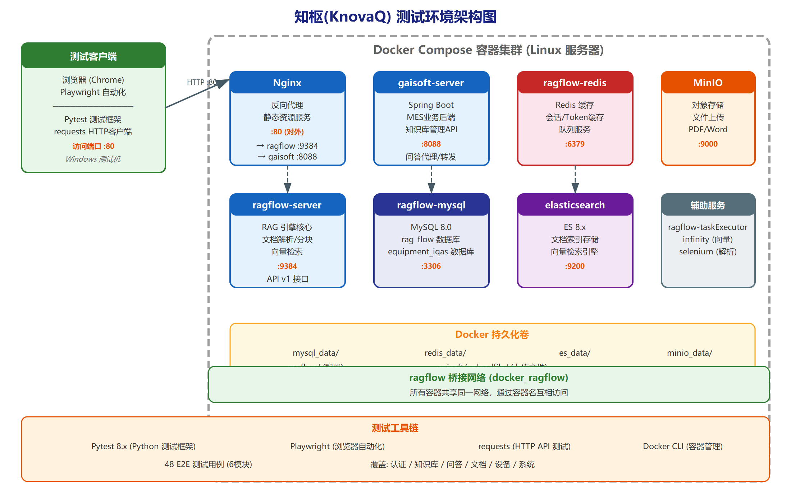

# DARPA智能问答服务工具 — 系统测试大纲

| 项目 | 值 |
|-----|---|
| 标识 | DARPA-IQAS-SSTP |
| 版本号 | V1.0 |
| 编制 | |
| 审核 | |
| 批准 | |

---

## 文档修改记录

| 版本号 | 修改日期 | 修改人 | 摘要 | 备注 |
|-------|---------|-------|------|------|
| V1.0 | 2026-06-04 | | 初始版本 | 合并测试计划与测试说明 |

---

## 1 范围

### 1.1 标识

本文档适用的系统为：

a) 名称：DARPA智能问答服务工具

b) 标识：DARPA-IQAS

c) 简称：DARPA问答工具

d) 版本号：V1.0

本系统属于研究内容四"DARPA智能问答服务工具开发"，联合军事科学院军事科学信息研究中心共同开展。系统基于"外挂知识库—RAG检索增强—交互式提示"三级架构设计，融合结构化知识管理与检索增强生成技术，打造具备高精度领域适应能力的离线智能问答系统。

### 1.2 系统概述

DARPA智能问答服务工具是面向军事科研人员的离线智能问答系统，核心目标为突破多源异构数据整合瓶颈，实现军事文档的深度加工、精准检索和智能问答。系统采用三级架构设计：

- **第一级——外挂知识库模块（M1）**：对非结构化军事文档进行解析、智能分块、元数据标注，支持PDF/Word/Excel/TXT/图片等多格式文档管理；
- **第二级——RAG文档检索增强模块（M2）**：基于ragflow v0.18.0成熟框架领域适配，构建向量搜索、混合检索、语义重排序、知识图谱等多维度检索能力；
- **第三级——交互式提示词工程模块（M3）**：通过动态模板引擎与结构化约束机制，实现聊天助手管理、多轮上下文对话、流式响应、引用溯源等能力。

技术栈包括：Spring Boot后端、Vue 3前端、ragflow v0.18.0 RAG引擎、智谱GLM-9B本地部署LLM、MySQL 8.0、Elasticsearch 8.11.3、MinIO对象存储、Redis/Valkey缓存。部署模式为Docker Compose容器化离线部署，无外网依赖。

### 1.3 文档概述

本文档是测试计划与测试说明的合并版，包含以下内容：

a) 测试环境、测试标识、测试准备等计划性内容（第2-5章）；

b) 按三级架构组织的48条测试用例详细说明（第6章，核心章节）；

c) 测试进度、需求可追踪性等管理性内容（第7-9章）。

本文档用于指导系统测试的执行，为《系统测试报告》提供依据。

---

## 2 引用文档

| 序号 | 文档标识 | 文档名称 | 版本 | 来源 |
|-----|---------|---------|------|------|
| 1 | | DARPA智能问答服务工具-软件需求规格说明书 | V1.0 | 本项目 |
| 2 | | DARPA智能问答服务工具-软件设计说明书 | V1.0 | 本项目 |
| 3 | | ragflow v0.18.0 官方API文档 | v0.18.0 | infiniflow |
| 4 | GJB 438B | 军用软件文档通用要求 | | 国军标 |
| 5 | | pytest官方文档 | 8.x | pytest.org |
| 6 | | Playwright官方文档 | 1.x | playwright.dev |

---

## 3 软件测试环境

### 3.1 软件项

测试环境使用的软件项如下表所示：

| 序号 | 名称 | 版本标识 | 用途 | 备注 |
|-----|------|---------|------|------|
| 1 | ragflow | v0.18.0 | RAG引擎核心 | Docker镜像 |
| 2 | Spring Boot (gaisoft-mes) | 2.x | 应用服务后端 | Docker镜像 |
| 3 | Vue 3 (gaisoft-ui) | 3.x | 前端展示 | Docker镜像 |
| 4 | MySQL | 8.0.39 | 关系数据库 | Docker镜像 |
| 5 | Elasticsearch | 8.11.3 | 向量索引+全文检索 | Docker镜像 |
| 6 | MinIO | latest | 文档对象存储 | Docker镜像 |
| 7 | Redis/Valkey | 8 | 缓存服务 | Docker镜像 |
| 8 | 智谱GLM-9B | - | 本地部署LLM | 离线模型 |
| 9 | Docker Engine | 24+ | 容器运行时 | 宿主机安装 |
| 10 | Docker Compose | v2 | 服务编排 | 宿主机安装 |
| 11 | pytest | 8.x | 测试执行框架 | test-runner容器 |
| 12 | Playwright | 1.x | UI自动化测试 | test-runner容器 |

### 3.2 硬件及固件项

| 序号 | 设备类型 | 名称 | 型号 | 用途 | 使用时间 |
|-----|---------|------|------|------|---------|
| 1 | 服务器 | 测试服务器 | 8核CPU/16GB内存/500GB硬盘 | 承载全部Docker服务 | 测试全程 |
| 2 | 客户端 | 测试PC | 4核/8GB | 浏览器访问前端界面 | UI测试阶段 |

### 3.3 其它材料

| 其他材料 | 名称 | 用途 | 备注 |
|---------|------|------|------|
| 军事文档样本 | 雷达系统技术评估报告等 | 知识库测试数据 | 中文军事技术文档 |
| 英文技术报告 | DARPA雷达信号处理技术报告 | 跨语言检索测试数据 | 英文DARPA文档 |
| 装备参数规范表 | XLSX格式装备参数 | 表格解析测试数据 | 含10条装备参数 |
| 测试数据生成器 | test_data_factory.py | 自动生成多格式测试文档 | PDF/DOCX/XLSX/TXT/MD |
| QA评估对 | 20组标准问答对 | 检索准确率评估 | 覆盖雷达、通信、维护等领域 |

### 3.4 特定性质、需方权利与许可证

| 元素名称 | 特定性质 | 需方权利 | 许可证 |
|---------|---------|---------|-------|
| ragflow v0.18.0 | 开源RAG框架 | Apache 2.0 | 开源许可 |
| 智谱GLM-9B | 本地部署LLM | 授权使用 | 模型许可 |

### 3.5 安装、测试与控制

a) 通过`start.sh/ps1 <project>`启动测试环境全部Docker服务；

b) test-runner容器内置pytest框架，执行`pytest --alluredir=allure-results`自动运行全部48条测试用例；

c) 测试结果通过Allure报告展示，支持按模块、级别、标记筛选查看。

### 3.6 参与组织

| 组织名 | 角色 | 职责 |
|-------|------|------|
| 开发方 | 开发与测试执行 | 系统开发、测试用例设计、测试执行、缺陷修复 |
| 军事科学院军事科学信息研究中心 | 需方/验收方 | 需求确认、验收评审 |

### 3.7 人员

| 人员数量 | 数量 | 技能水平 | 要求培训和持续时间 | 特殊要求 |
|---------|------|---------|------------------|---------|
| 测试负责人 | 1 | 高级 | 1天 | 熟悉三级架构与RAG技术 |
| 自动化测试工程师 | 1 | 中高级 | 1天 | 熟悉pytest/Playwright |
| 系统测试人员 | 2 | 中级 | 2天 | 熟悉Docker与Web测试 |

### 3.8 定向计划

测试前需完成以下培训：测试环境搭建培训、测试用例执行培训、Allure报告解读培训。

---

## 4 测试标识

### 4.1 一般信息

#### 4.1.1 测试级

| 测试级名称 | 测试级描述 |
|-----------|----------|
| 系统测试 | 对DARPA智能问答服务工具进行全面的功能测试、接口测试和端到端测试，验证系统是否满足需求规格说明书规定的全部要求 |

#### 4.1.2 测试类别

| 测试类别名称 | 测试类别描述 |
|------------|------------|
| 功能测试 | 验证三大模块（M1/M2/M3）的功能正确性，共38条用例 |
| 性能测试 | 验证检索响应时间、并发能力等性能指标，含基准测试 |
| 接口测试 | 验证ragflow API及应用服务API的接口正确性 |
| UI测试 | 验证前端界面的功能可用性和交互正确性，共4条用例 |
| 端到端测试 | 验证完整业务流程的正确性，共4条用例 |

#### 4.1.3 一般测试条件

a) 测试环境为离线Docker Compose部署，所有服务通过`ragflow`桥接网络互联；

b) 测试数据使用DARPA军事文档样本（中文雷达报告、通信装备手册、英文技术报告、装备参数规范表等）；

c) 智谱GLM-9B模型本地部署运行，无外网访问；

d) 测试执行前需确保所有Docker服务健康就绪（健康检查通过）；

e) 每条测试用例使用独立的测试数据集，互不干扰。

#### 4.1.4 测试进程

测试按pytest自动化流程执行：

a) **环境初始化**：启动所有Docker服务，等待健康检查通过（ragflow 120秒超时）；

b) **会话级Fixture准备**：创建全局测试数据集、上传并解析测试文档、创建测试聊天助手和会话；

c) **按模块执行**：pytest按module1→module2→module3→module4→ui→e2e顺序执行；

d) **结果收集**：Allure框架自动收集测试结果和度量数据。

#### 4.1.5 数据记录、归约和分析

a) 测试结果通过Allure框架自动记录，包括通过/失败/跳过状态；

b) 性能基准测试记录响应延迟数据，计算平均值和P95值；

c) 检索准确率测试记录命中率，计算Recall指标；

d) 所有度量数据自动归档至Allure报告。

### 4.2 计划执行的测试

#### 4.2.1 功能测试

功能测试共44条用例，按三级架构组织如下：

| 测试范围 | 测试级 | 测试类型 | 对应需求 | 数据记录 |
|---------|-------|---------|---------|---------|
| M1外挂知识库 | 系统测试 | 功能测试 | M1-REQ-001~008 | 文档ID、分块数、解析状态 |
| M2 RAG检索增强 | 系统测试 | 功能测试 | M2-REQ-001~008 | 检索结果、相似度、延迟 |
| M3交互式提示 | 系统测试 | 功能测试 | M3-REQ-001~008 | 回答内容、引用信息、流式数据 |
| 集成验证 | 系统测试 | 功能+接口测试 | INT-REQ-001~004 | 会话数据、SSE流、认证Token |
| UI界面 | 系统测试 | 功能测试 | M1~M3 UI需求 | 页面元素、交互结果 |
| 端到端 | 系统测试 | 功能+性能测试 | INT-REQ-005~010 | 全流程数据 |

#### 4.2.2 性能测试

| 测试名称 | 测试目的 | 对应需求 |
|---------|---------|---------|
| 检索性能基准 | 100次检索请求，P95延迟<5s | 3.10.4 有效性 |
| 阈值调节性能 | 不同相似度阈值的检索效率 | M2-REQ-003 |

#### 4.2.3 接口测试

| 测试名称 | 测试目的 | 对应需求 |
|---------|---------|---------|
| ragflow REST API | 知识库/文档/对话接口正确性 | 3.3.2 |
| 应用服务 REST API | 知识管理/聊天/认证接口 | 3.3.3 |
| OpenAI兼容接口 | /chats_openai端点兼容性 | M3-REQ-007 |
| Stream Proxy | SSE流式代理转发正确性 | INT-REQ-003 |

---

## 5 测试准备

### 5.1 硬件准备

| 序号 | 硬件项目 | 硬件要求 | 说明 |
|-----|---------|---------|------|
| 1 | 测试服务器 | 8核CPU/16GB内存/500GB硬盘 | 离线环境Linux服务器 |
| 2 | 网络环境 | 局域网TCP/IP | 无需外网接入 |

### 5.2 软件准备

| 序号 | 软件项目 | 软件要求 | 说明 |
|-----|---------|---------|------|
| 1 | Docker Engine | 24+ | 容器运行时 |
| 2 | Docker Compose | v2 | 服务编排 |
| 3 | 离线镜像包 | 全部服务镜像 | 通过offline-load加载 |
| 4 | 智谱GLM-9B模型 | 本地部署 | LLM推理服务 |

### 5.3 其它测试前准备

a) 配置测试环境变量：`RAGFLOW_BASE_URL`、`RAGFLOW_API_KEY`、`GAISOFT_API_URL`、`GAISOFT_FRONTEND_URL`；

b) 准备测试账号：gaisoft登录用户名/密码；

c) 准备军事文档测试样本：雷达报告、通信手册、装备规范表等；

d) 确认智谱GLM-9B模型加载完成。

### 5.4 测试环境组成

测试环境架构图如下：



图 1 展示了DARPA智能问答服务工具的测试环境架构。测试客户端为Windows测试机，运行Pytest测试框架、Playwright浏览器自动化和requests HTTP客户端，通过HTTP :80端口访问目标系统。目标系统部署在Linux服务器的Docker Compose容器集群中，包含Nginx（反向代理）、ragflow-server（RAG引擎核心）、gaisoft-server（Spring Boot业务后端）、MySQL 8.0（双库存储）、Redis（缓存）、Elasticsearch 8.x（向量检索）、MinIO（对象存储）等容器服务。所有容器共享ragflow桥接网络，通过容器名互相访问。测试工具链包含48个E2E测试用例，覆盖认证、知识库、问答、文档、设备和系统6个功能模块。

```
┌─────────────────────────────────────────────────────┐
│                 测试服务器 (Docker Compose)            │
│                                                       │
│  ┌──────────┐  ┌──────────┐  ┌──────────┐           │
│  │ gaisoft  │  │ gaisoft  │  │ ragflow  │           │
│  │ -server  │  │ -frontend│  │ v0.18.0  │           │
│  │ :8088    │  │ :8899    │  │          │           │
│  └────┬─────┘  └──────────┘  └────┬─────┘           │
│       │        (nginx)            │                   │
│       │                           │                   │
│  ┌────▼───────────────────────────▼─────┐            │
│  │           ragflow 桥接网络             │            │
│  └──┬────────┬────────┬────────┬────────┘            │
│     │        │        │        │                      │
│  ┌──▼──┐ ┌──▼──┐ ┌───▼──┐ ┌──▼───┐ ┌──────────┐    │
│  │MySQL│ │  ES │ │MinIO │ │Redis │ │GLM-9B    │    │
│  │:3306│ │:9200│ │:9000 │ │:6379 │ │(本地LLM) │    │
│  └─────┘ └─────┘ └──────┘ └──────┘ └──────────┘    │
│                                                       │
│  ┌─────────────────────────────────────────┐         │
│  │         test-runner (pytest+Playwright)  │         │
│  │         自动执行48条测试用例               │         │
│  └─────────────────────────────────────────┘         │
└─────────────────────────────────────────────────────┘
```

---

## 6 测试说明

> 本章为核心章节，按三级架构组织48条测试用例，每条用例描述测试目的、前置条件、测试步骤和预期结果。

---

### 6.1 第一级——外挂知识库功能测试（M1模块，18条）

本节测试第一级"外挂知识库模块"的功能，涵盖知识库CRUD、文档上传、文档解析、分块管理和元数据过滤。

#### 6.1.1 知识库CRUD测试

##### TC-M1-001 创建知识库

| 项目 | 说明 |
|------|------|
| 测试目的 | 验证通过ragflow API创建知识库，返回有效的知识库ID和名称 |
| 前置条件 | ragflow服务运行正常，API可访问 |
| 测试步骤 | 1. 调用`POST /api/v1/datasets`创建知识库，参数：name="darpa_test_xxx"，chunk_method="naive"<br>2. 检查返回数据中包含有效的id字段<br>3. 验证返回的name与请求一致 |
| 预期结果 | 创建成功，返回的dataset对象包含有效id，name字段与请求一致 |
| 需求追踪 | M1-REQ-001 |

##### TC-M1-002 指定嵌入模型创建知识库

| 项目 | 说明 |
|------|------|
| 测试目的 | 验证创建知识库时指定嵌入模型（BAAI/bge-large-zh-v1.5） |
| 前置条件 | ragflow服务运行正常 |
| 测试步骤 | 1. 调用`POST /api/v1/datasets`，参数：name="darpa_emb_xxx"，embedding_model="BAAI/bge-large-zh-v1.5"<br>2. 检查返回的dataset id |
| 预期结果 | 创建成功，返回有效id |
| 需求追踪 | M1-REQ-001 |

##### TC-M1-003 列出知识库

| 项目 | 说明 |
|------|------|
| 测试目的 | 验证列出所有知识库返回有效的列表结构 |
| 前置条件 | ragflow服务运行正常 |
| 测试步骤 | 1. 调用`GET /api/v1/datasets`<br>2. 验证返回值为list类型 |
| 预期结果 | 返回有效的知识库列表（list类型） |
| 需求追踪 | M1-REQ-001 |

##### TC-M1-004 级联删除知识库

| 项目 | 说明 |
|------|------|
| 测试目的 | 验证删除知识库时级联删除其下所有文档和分块 |
| 前置条件 | 知识库已创建，已上传文档并完成解析 |
| 测试步骤 | 1. 创建知识库cascade_test_xxx<br>2. 上传并解析文档，等待解析完成<br>3. 验证文档存在（list_documents返回非空）<br>4. 调用`DELETE /api/v1/datasets`删除知识库<br>5. 列出所有知识库，验证已删除的知识库不在列表中 |
| 预期结果 | 删除后知识库不再出现在列表中，关联文档和分块被级联删除 |
| 需求追踪 | M1-REQ-001 |

#### 6.1.2 文档上传测试

##### TC-M1-005 上传PDF文档

| 项目 | 说明 |
|------|------|
| 测试目的 | 验证上传PDF格式文档到知识库，返回有效的文档ID |
| 前置条件 | 知识库已创建 |
| 测试步骤 | 1. 生成PDF格式的雷达系统技术评估报告<br>2. 调用`POST /api/v1/datasets/{id}/documents`上传PDF<br>3. 检查返回的文档id |
| 预期结果 | 上传成功，返回有效的文档ID |
| 需求追踪 | M1-REQ-002 |

##### TC-M1-006 上传DOCX文档

| 项目 | 说明 |
|------|------|
| 测试目的 | 验证上传Word格式（.docx）文档到知识库 |
| 前置条件 | 知识库已创建 |
| 测试步骤 | 1. 生成DOCX格式的通信装备操作手册<br>2. 上传到知识库<br>3. 检查返回的文档id |
| 预期结果 | 上传成功，返回有效文档ID |
| 需求追踪 | M1-REQ-002 |

##### TC-M1-007 上传XLSX文档

| 项目 | 说明 |
|------|------|
| 测试目的 | 验证上传Excel格式（.xlsx）装备参数规范表 |
| 前置条件 | 知识库已创建 |
| 测试步骤 | 1. 生成XLSX格式的装备参数规范表（含10条装备参数）<br>2. 上传到知识库<br>3. 检查返回的文档id |
| 预期结果 | 上传成功，返回有效文档ID |
| 需求追踪 | M1-REQ-002 |

##### TC-M1-008 上传TXT文档

| 项目 | 说明 |
|------|------|
| 测试目的 | 验证上传纯文本格式（.txt）野战维护指南 |
| 前置条件 | 知识库已创建 |
| 测试步骤 | 1. 生成TXT格式的野战维护指南<br>2. 上传到知识库 |
| 预期结果 | 上传成功，返回有效文档ID |
| 需求追踪 | M1-REQ-002 |

##### TC-M1-009 上传MD文档

| 项目 | 说明 |
|------|------|
| 测试目的 | 验证上传Markdown格式（.md）军事装备管理条例 |
| 前置条件 | 知识库已创建 |
| 测试步骤 | 1. 生成MD格式的军事装备管理条例<br>2. 上传到知识库 |
| 预期结果 | 上传成功，返回有效文档ID |
| 需求追踪 | M1-REQ-002 |

##### TC-M1-010 大文件上传

| 项目 | 说明 |
|------|------|
| 测试目的 | 验证上传大文件（约5MB，模拟军事装备测试数据）可正常处理 |
| 前置条件 | 知识库已创建 |
| 测试步骤 | 1. 生成约5MB的大文本文件（军事装备测试数据重复5000行）<br>2. 上传到知识库<br>3. 检查返回的文档id |
| 预期结果 | 大文件上传成功，返回有效文档ID |
| 需求追踪 | M1-REQ-002 |

##### TC-M1-011 批量文档上传

| 项目 | 说明 |
|------|------|
| 测试目的 | 验证一次批量上传20个文档 |
| 前置条件 | 知识库已创建 |
| 测试步骤 | 1. 生成20个测试文档（批量测试文档#0~#19）<br>2. 调用批量上传接口上传全部20个文档<br>3. 验证返回文档数量 |
| 预期结果 | 批量上传成功，返回20个文档记录 |
| 需求追踪 | M1-REQ-002 |

#### 6.1.3 文档解析测试

##### TC-M1-012 通用分块解析（naive）

| 项目 | 说明 |
|------|------|
| 测试目的 | 验证使用naive分块方法解析文档，按固定token数分块（chunk_token_num=512） |
| 前置条件 | 知识库已创建（chunk_method="naive"），文档已上传 |
| 测试步骤 | 1. 创建naive分块方法的知识库<br>2. 上传野战维护指南TXT文档<br>3. 调用解析接口触发解析<br>4. 等待解析完成（最长300秒超时）<br>5. 验证chunk_num > 0 |
| 预期结果 | 解析完成，生成有效分块（chunk_num > 0） |
| 需求追踪 | M1-REQ-003, M1-REQ-004 |

##### TC-M1-013 书籍分块解析（book）

| 项目 | 说明 |
|------|------|
| 测试目的 | 验证使用book分块方法解析文档，保留章节结构 |
| 前置条件 | 知识库已创建（chunk_method="book"） |
| 测试步骤 | 1. 创建book分块方法的知识库<br>2. 上传通信装备操作手册DOCX文档<br>3. 触发解析并等待完成 |
| 预期结果 | 书籍解析完成，保留章节结构 |
| 需求追踪 | M1-REQ-003, M1-REQ-004 |

##### TC-M1-014 表格分块解析（table）

| 项目 | 说明 |
|------|------|
| 测试目的 | 验证使用table分块方法解析XLSX，保留表格结构 |
| 前置条件 | 知识库已创建（chunk_method="table"） |
| 测试步骤 | 1. 创建table分块方法的知识库<br>2. 上传装备参数规范表XLSX<br>3. 触发解析并等待完成 |
| 预期结果 | 表格解析完成，保留表格行列结构 |
| 需求追踪 | M1-REQ-003, M1-REQ-004 |

##### TC-M1-015 论文分块解析（paper）

| 项目 | 说明 |
|------|------|
| 测试目的 | 验证使用paper分块方法解析学术论文，分离摘要/正文/参考文献 |
| 前置条件 | 知识库已创建（chunk_method="paper"） |
| 测试步骤 | 1. 创建paper分块方法的知识库<br>2. 上传DARPA雷达信号处理论文TXT<br>3. 触发解析并等待完成 |
| 预期结果 | 论文解析完成，正确分离论文结构（摘要、方法、结果、结论、参考文献） |
| 需求追踪 | M1-REQ-003, M1-REQ-004 |

##### TC-M1-016 多源异构数据整合

| 项目 | 说明 |
|------|------|
| 测试目的 | 验证同一知识库中同时导入中文文档、英文文档和表格数据无冲突 |
| 前置条件 | 知识库已创建（chunk_method="naive"） |
| 测试步骤 | 1. 创建知识库<br>2. 同时上传中文雷达报告（TXT）、英文技术报告（TXT）、装备参数规范表（XLSX）<br>3. 触发全部文档解析<br>4. 等待解析完成 |
| 预期结果 | 全部文档解析成功，无冲突错误 |
| 需求追踪 | M1-REQ-008 |

#### 6.1.4 分块管理测试

##### TC-M1-017 手动添加分块

| 项目 | 说明 |
|------|------|
| 测试目的 | 验证手动添加新分块到文档中，含关键词标注 |
| 前置条件 | 知识库已创建，文档已解析完成 |
| 测试步骤 | 1. 调用`POST /api/v1/datasets/{id}/documents/{doc_id}/chunks`<br>2. 参数：content="手动添加的测试分块：装备编号EQ-9999"，important_keywords=["装备","测试"]<br>3. 验证返回包含chunk或id字段 |
| 预期结果 | 分块创建成功，返回包含chunk_id或id |
| 需求追踪 | M1-REQ-005 |

##### TC-M1-018 列出文档分块

| 项目 | 说明 |
|------|------|
| 测试目的 | 验证列出文档中的所有分块 |
| 前置条件 | 文档已完成解析 |
| 测试步骤 | 1. 调用`GET /api/v1/datasets/{id}/documents/{doc_id}/chunks`<br>2. 获取chunks列表<br>3. 验证列表非空 |
| 预期结果 | 返回分块列表，数量大于0 |
| 需求追踪 | M1-REQ-005 |

##### TC-M1-019 更新分块内容

| 项目 | 说明 |
|------|------|
| 测试目的 | 验证修改已有分块的内容 |
| 前置条件 | 分块已存在 |
| 测试步骤 | 1. 先手动添加一个分块（content="原始内容待更新"）<br>2. 调用`PUT .../chunks/{chunk_id}`更新内容为"更新后的内容：装备维护规程v2.0"<br>3. 验证返回非空 |
| 预期结果 | 更新成功，返回更新确认 |
| 需求追踪 | M1-REQ-005 |

##### TC-M1-020 删除分块

| 项目 | 说明 |
|------|------|
| 测试目的 | 验证删除指定分块 |
| 前置条件 | 分块已存在 |
| 测试步骤 | 1. 先手动添加一个分块（content="待删除的测试分块"）<br>2. 调用`DELETE .../chunks`删除该分块<br>3. 验证返回非空 |
| 预期结果 | 删除成功，返回确认信息 |
| 需求追踪 | M1-REQ-005 |

##### TC-M1-021 元数据过滤检索

| 项目 | 说明 |
|------|------|
| 测试目的 | 验证设置文档元数据后可通过元数据进行过滤检索 |
| 前置条件 | 知识库中已上传并解析多个文档（雷达报告+野战维护指南） |
| 测试步骤 | 1. 创建知识库，上传雷达报告和野战维护指南两个文档<br>2. 解析文档并等待完成<br>3. 调用retrieval接口查询"雷达维护周期"<br>4. 验证返回的分块数量大于0 |
| 预期结果 | 检索返回雷达相关的分块，数量>0 |
| 需求追踪 | M1-REQ-006 |

---

### 6.2 第二级——RAG检索增强功能测试（M2模块，13条）

本节测试第二级"RAG文档检索增强模块"的功能，涵盖向量搜索、混合检索、相似度阈值、重排序、知识图谱、跨语言检索和检索准确率。

#### 6.2.1 向量搜索测试

##### TC-M2-001 基础语义检索

| 项目 | 说明 |
|------|------|
| 测试目的 | 验证中文语义查询"雷达维护周期"返回雷达维护相关的分块，且相似度大于阈值 |
| 前置条件 | 测试数据集已创建，文档已上传并解析完成（prepared_dataset fixture） |
| 测试步骤 | 1. 调用`POST /api/v1/retrieval`，参数：question="雷达维护周期"，dataset_ids=[prepared_dataset_id]<br>2. 获取返回的chunks列表<br>3. 验证chunks数量 > 0<br>4. 验证首个分块的similarity >= 0.1 |
| 预期结果 | 返回至少1个分块，最高相似度 >= 0.1 |
| 需求追踪 | M2-REQ-001 |

##### TC-M2-002 装备参数查询

| 项目 | 说明 |
|------|------|
| 测试目的 | 验证查询装备参数"ZBD-2000通信系统频率范围"返回相关结果 |
| 前置条件 | 测试数据集已准备 |
| 测试步骤 | 1. 检索"ZBD-2000通信系统频率范围"<br>2. 验证返回分块数量 > 0 |
| 预期结果 | 返回与通信系统频率相关的分块 |
| 需求追踪 | M2-REQ-001 |

##### TC-M2-003 无关查询低相似度

| 项目 | 说明 |
|------|------|
| 测试目的 | 验证与军事文档无关的查询（如"今天天气怎么样"）返回低相似度或空结果 |
| 前置条件 | 测试数据集已准备 |
| 测试步骤 | 1. 检索"今天天气怎么样"，设置similarity_threshold=0.5<br>2. 若返回分块，验证首个分块similarity < 0.5 |
| 预期结果 | 无关查询返回空结果或低相似度（< 0.5） |
| 需求追踪 | M2-REQ-007 |

##### TC-M2-004 长查询检索

| 项目 | 说明 |
|------|------|
| 测试目的 | 验证200+字符的长查询仍能正确检索相关分块 |
| 前置条件 | 测试数据集已准备 |
| 测试步骤 | 1. 构造长查询："请问在野战环境下，当AN/TPQ-53雷达系统出现发射机功率不足的故障时，操作人员应该按照什么步骤进行排查和处理？需要检查哪些关键部件？是否有备用方案可以临时恢复系统运行？同时在这种情况下如何确保战场态势感知能力不中断？"<br>2. 执行检索<br>3. 验证返回分块 > 0 |
| 预期结果 | 长查询返回相关分块 |
| 需求追踪 | M2-REQ-001 |

#### 6.2.2 混合搜索测试

##### TC-M2-005 向量+关键词混合检索

| 项目 | 说明 |
|------|------|
| 测试目的 | 验证混合检索模式（vector_similarity_weight=0.5，keyword=true）返回有效结果 |
| 前置条件 | 测试数据集已准备 |
| 测试步骤 | 1. 调用retrieval接口，参数：question="雷达ERR-001故障"，vector_similarity_weight=0.5，keyword=true<br>2. 验证返回分块 > 0 |
| 预期结果 | 混合检索返回故障相关分块 |
| 需求追踪 | M2-REQ-002 |

##### TC-M2-006 top_k参数验证

| 项目 | 说明 |
|------|------|
| 测试目的 | 验证不同的top_k参数影响返回结果数量，top_k=50的结果数 >= top_k=10 |
| 前置条件 | 测试数据集已准备 |
| 测试步骤 | 1. 分别以top_k=10和top_k=50检索"装备维护"<br>2. 比较两次返回的分块数量 |
| 预期结果 | top_k=50返回的分块数 >= top_k=10 |
| 需求追踪 | M2-REQ-002 |

##### TC-M2-007 跨知识库检索

| 项目 | 说明 |
|------|------|
| 测试目的 | 验证跨多个知识库检索，能返回不同知识库中的相关结果 |
| 前置条件 | 两个独立知识库，分别包含雷达报告和野战维护指南 |
| 测试步骤 | 1. 创建两个知识库ds1、ds2<br>2. ds1上传雷达报告，ds2上传野战维护指南<br>3. 分别解析等待完成<br>4. 以dataset_ids=[ds1_id, ds2_id]检索"装备维护周期"<br>5. 验证返回分块 > 0 |
| 预期结果 | 跨库检索返回来自多个知识库的相关分块 |
| 需求追踪 | M2-REQ-002 |

#### 6.2.3 相似度阈值测试

##### TC-M2-008 阈值递增调节

| 项目 | 说明 |
|------|------|
| 测试目的 | 验证提高相似度阈值（0.1→0.7）后返回结果数量递减 |
| 前置条件 | 测试数据集已准备 |
| 测试步骤 | 1. 分别设置similarity_threshold为0.1、0.3、0.5、0.7<br>2. 对每个阈值执行检索"雷达维护"<br>3. 记录每个阈值返回的分块数量 |
| 预期结果 | 阈值0.1的结果数 >= 阈值0.7的结果数，呈递减趋势 |
| 需求追踪 | M2-REQ-003 |

##### TC-M2-009 极高阈值验证

| 项目 | 说明 |
|------|------|
| 测试目的 | 验证极高阈值（0.9）仅返回极少量高相似度结果 |
| 前置条件 | 测试数据集已准备 |
| 测试步骤 | 1. 设置similarity_threshold=0.9<br>2. 检索"装备检查" |
| 预期结果 | 返回分块数 <= 3 |
| 需求追踪 | M2-REQ-003 |

#### 6.2.4 重排序测试

##### TC-M2-010 重排序效果验证

| 项目 | 说明 |
|------|------|
| 测试目的 | 验证重排序参数可正常传递，对比有无重排序的检索结果 |
| 前置条件 | 测试数据集已准备 |
| 测试步骤 | 1. 不启用重排序，检索"装备故障诊断方法"<br>2. 启用重排序（rerank_id=""），检索相同问题<br>3. 验证两次均返回有效结果 |
| 预期结果 | 两次检索均返回有效分块 |
| 需求追踪 | M2-REQ-004 |

#### 6.2.5 知识图谱测试

##### TC-M2-011 GraphRAG检索

| 项目 | 说明 |
|------|------|
| 测试目的 | 验证GraphRAG构建知识图谱后，可通过图谱进行关联检索 |
| 前置条件 | 知识库已创建并解析完成 |
| 测试步骤 | 1. 创建知识库并上传雷达报告<br>2. 解析文档并等待完成<br>3. 调用`POST /api/v1/datasets/{id}/run_graphrag`构建图谱<br>4. 等待图谱构建（10秒）<br>5. 以use_kg=true检索"雷达和通信装备有什么关联？"<br>6. 验证返回分块 > 0 |
| 预期结果 | 知识图谱检索返回关联分块（如GraphRAG未配置则跳过） |
| 需求追踪 | M2-REQ-005 |

#### 6.2.6 跨语言检索测试

##### TC-M2-012 中文查询英文文档

| 项目 | 说明 |
|------|------|
| 测试目的 | 验证中文查询"雷达信号处理算法"可通过cross_languages参数找到英文技术报告 |
| 前置条件 | 双语知识库已创建（含中英文文档），文档已解析完成 |
| 测试步骤 | 1. 创建含中文雷达报告和英文DARPA技术报告的双语知识库<br>2. 解析完成<br>3. 以cross_languages=true检索"雷达信号处理算法"<br>4. 验证返回分块 > 0 |
| 预期结果 | 中文查询返回包含英文文档内容的相关分块 |
| 需求追踪 | M2-REQ-006 |

##### TC-M2-013 英文查询中文文档

| 项目 | 说明 |
|------|------|
| 测试目的 | 验证英文查询"radar maintenance interval hours"可找到中文雷达维护文档 |
| 前置条件 | 双语知识库已准备 |
| 测试步骤 | 1. 以cross_languages=true检索"radar maintenance interval hours"<br>2. 验证返回分块 > 0 |
| 预期结果 | 英文查询返回中文文档相关分块 |
| 需求追踪 | M2-REQ-006 |

#### 6.2.7 检索准确率测试

##### TC-M2-014 检索精确率/召回率评估

| 项目 | 说明 |
|------|------|
| 测试目的 | 使用20组标准QA对评估检索的召回率（Recall >= 60%） |
| 前置条件 | 测试数据集已准备，20组QA对已定义 |
| 测试步骤 | 1. 对每组QA对，以question检索top-5分块<br>2. 检查top-5分块是否包含answer或keywords<br>3. 计算命中率hits/total |
| 预期结果 | Recall >= 60%（hits/total >= 0.6） |
| 需求追踪 | M2-REQ-007 |

##### TC-M2-015 检索性能基准测试

| 项目 | 说明 |
|------|------|
| 测试目的 | 执行100次检索请求，验证P95延迟 < 5秒 |
| 前置条件 | 测试数据集已准备 |
| 测试步骤 | 1. 循环执行100次检索请求（查询"装备测试查询0~9"循环）<br>2. 记录每次请求延迟<br>3. 计算平均值和P95延迟 |
| 预期结果 | P95延迟 < 5秒 |
| 需求追踪 | 3.10.4 有效性 |

---

### 6.3 第三级——交互式提示功能测试（M3模块，10条）

本节测试第三级"交互式提示词工程模块"的功能，涵盖聊天助手管理、系统提示词、多轮对话、流式响应、引用溯源和提示模板。

#### 6.3.1 聊天助手测试

##### TC-M3-001 创建聊天助手并绑定知识库

| 项目 | 说明 |
|------|------|
| 测试目的 | 验证创建聊天助手并绑定数据集，尝试配置系统提示词 |
| 前置条件 | 测试数据集已创建（prepared_dataset） |
| 测试步骤 | 1. 调用`POST /api/v1/chats`创建聊天助手，绑定dataset_ids<br>2. 验证返回有效id，name以"test_chat_"开头<br>3. 尝试调用`PUT /api/v1/chats/{id}`设置prompt_config（系统提示词、空回复消息） |
| 预期结果 | 聊天助手创建成功，id有效，name正确 |
| 需求追踪 | M3-REQ-001 |

##### TC-M3-002 单轮问答

| 项目 | 说明 |
|------|------|
| 测试目的 | 验证单轮问答返回非空答案和引用信息 |
| 前置条件 | 测试聊天助手已创建，会话已创建 |
| 测试步骤 | 1. 调用`POST /api/v1/chats/{id}/completions`，question="AN/TPQ-53雷达的探测距离是多少？"，stream=false<br>2. 验证answer长度 > 0<br>3. 验证reference非空 |
| 预期结果 | 返回非空答案，包含引用信息 |
| 需求追踪 | M3-REQ-001 |

##### TC-M3-003 会话CRUD管理

| 项目 | 说明 |
|------|------|
| 测试目的 | 验证会话的创建、列表查询和删除全流程 |
| 前置条件 | 聊天助手已创建 |
| 测试步骤 | 1. 调用`POST /api/v1/chats/{id}/sessions`创建会话<br>2. 验证返回有效session id<br>3. 调用`GET /api/v1/chats/{id}/sessions`列出会话<br>4. 验证返回list类型<br>5. 调用`DELETE .../sessions`删除会话 |
| 预期结果 | 会话CRUD操作全部成功 |
| 需求追踪 | M3-REQ-001 |

#### 6.3.2 系统提示词测试

##### TC-M3-004 领域约束提示词

| 项目 | 说明 |
|------|------|
| 测试目的 | 验证设置军事装备领域约束的提示词后，系统拒绝回答无关问题 |
| 前置条件 | 测试数据集已准备 |
| 测试步骤 | 1. 创建聊天助手并尝试设置系统提示词"你是DARPA装备分析专家。仅回答与军事装备技术相关的问题，拒绝无关问题。"<br>2. 创建会话，提问"推荐一部好看的电影"<br>3. 检查回答中包含拒绝关键词（"无法"/"不能"/"不回答"/"抱歉"/"军事"/"装备"）或回答很短 |
| 预期结果 | 系统对无关问题给出拒绝回复或极短回复（< 50字符） |
| 需求追踪 | M3-REQ-002 |

##### TC-M3-005 知识变量注入

| 项目 | 说明 |
|------|------|
| 测试目的 | 验证提示词中的{knowledge}变量被替换为检索结果，答案包含知识库内容 |
| 前置条件 | 测试聊天助手和会话已创建 |
| 测试步骤 | 1. 提问"雷达系统技术参数有哪些？"<br>2. 验证回答长度 > 20字符 |
| 预期结果 | 回答包含来自知识库的雷达参数信息 |
| 需求追踪 | M3-REQ-006 |

##### TC-M3-006 结构化JSON输出

| 项目 | 说明 |
|------|------|
| 测试目的 | 验证通过提示词约束LLM输出JSON格式 |
| 前置条件 | 测试数据集已准备 |
| 测试步骤 | 1. 创建聊天助手，设置系统提示词要求JSON格式输出<br>2. 提问"雷达探测距离是多少？请用JSON格式回答。"<br>3. 尝试从回答中提取JSON片段并解析 |
| 预期结果 | 回答中包含可解析的JSON片段 |
| 需求追踪 | M3-REQ-007 |

#### 6.3.3 多轮对话测试

##### TC-M3-007 多轮上下文对话

| 项目 | 说明 |
|------|------|
| 测试目的 | 验证4轮对话中，第4轮能引用第1轮的上下文 |
| 前置条件 | 测试数据集已准备 |
| 测试步骤 | 1. 创建聊天助手和会话<br>2. 第1轮："AN/TPQ-53雷达的工作频段是什么？" → 验证回答非空<br>3. 第2轮："它的探测距离呢？" → 验证回答非空<br>4. 第3轮："故障代码ERR-001怎么处理？" → 验证回答非空<br>5. 第4轮："刚才说的那个频段的雷达，维护周期是多久？" → 验证回答非空 |
| 预期结果 | 4轮对话均有有效回答，第4轮能引用第1轮的"频段"上下文 |
| 需求追踪 | M3-REQ-003 |

##### TC-M3-008 温度参数效果

| 项目 | 说明 |
|------|------|
| 测试目的 | 验证不同temperature参数（0.0 vs 1.0）产生不同输出 |
| 前置条件 | 测试数据集已准备 |
| 测试步骤 | 1. 创建temperature=0.0的聊天助手chat_low<br>2. 创建temperature=1.0的聊天助手chat_high<br>3. 分别提问"请简述雷达维护规程"<br>4. 验证两者均返回非空回答 |
| 预期结果 | 两个不同温度的助手均返回有效回答 |
| 需求追踪 | M3-REQ-007 |

#### 6.3.4 流式响应测试

##### TC-M3-009 SSE流式输出

| 项目 | 说明 |
|------|------|
| 测试目的 | 验证stream=true时返回SSE数据块，且流正确终止 |
| 前置条件 | 测试聊天助手和会话已创建 |
| 测试步骤 | 1. 调用completions接口，stream=true，提问"请简述雷达系统的日常维护步骤"<br>2. 收集所有SSE chunks<br>3. 验证chunks数量 > 0<br>4. 验证流中包含终止标记（[DONE]或message_end） |
| 预期结果 | 返回多个SSE数据块，流正确终止 |
| 需求追踪 | M3-REQ-004 |

#### 6.3.5 引用溯源测试

##### TC-M3-010 引用信息验证

| 项目 | 说明 |
|------|------|
| 测试目的 | 验证问答返回的引用信息包含chunk_id、similarity等必要字段 |
| 前置条件 | 测试聊天助手和会话已创建 |
| 测试步骤 | 1. 提问"雷达系统技术参数有哪些？"，stream=false<br>2. 获取返回的reference<br>3. 检查reference中的chunks数组<br>4. 验证首个引用包含chunk_id（或id）和similarity字段 |
| 预期结果 | 引用信息包含chunk_id和similarity字段 |
| 需求追踪 | M3-REQ-005 |

##### TC-M3-011 空知识库响应

| 项目 | 说明 |
|------|------|
| 测试目的 | 验证对完全无关的问题（量子纠缠星际旅行）返回有效响应结构 |
| 前置条件 | 至少一个知识库存在并已解析 |
| 测试步骤 | 1. 创建聊天助手绑定已有知识库<br>2. 提问"量子纠缠在星际旅行中的应用前景如何？请详细描述。"<br>3. 验证answer为字符串类型 |
| 预期结果 | 返回有效的字符串类型回答 |
| 需求追踪 | M3-REQ-002 |

#### 6.3.6 提示模板测试

##### TC-M3-012 OpenAI兼容接口

| 项目 | 说明 |
|------|------|
| 测试目的 | 验证通过OpenAI兼容API端点调用聊天，返回符合OpenAI格式的响应 |
| 前置条件 | 测试聊天助手已创建 |
| 测试步骤 | 1. 调用`POST /api/v1/chats_openai/{id}/chat/completions`<br>2. 参数：messages=[{"role":"user","content":"雷达维护周期是多少？"}]，stream=false<br>3. 验证返回包含"choices"或"data"字段 |
| 预期结果 | 返回符合OpenAI格式的响应（包含choices字段） |
| 需求追踪 | M3-REQ-006 |

---

### 6.4 集成验证测试（4条）

本节测试跨模块集成功能，包括知识库-会话绑定、知识库聊天、流式代理和认证集成。

#### 6.4.1 知识库会话绑定

##### TC-INT-001 会话持久化

| 项目 | 说明 |
|------|------|
| 测试目的 | 验证通过gaisoft-mes API创建的知识库会话可持久保存并在列表中查询 |
| 前置条件 | gaisoft-mes服务运行正常 |
| 测试步骤 | 1. 调用`GET /aftersales/session/list`获取当前会话列表<br>2. 调用`POST /aftersales/session`创建新会话<br>3. 再次调用list接口验证新会话出现 |
| 预期结果 | 会话创建后可在列表中查到 |
| 需求追踪 | INT-REQ-001 |

##### TC-INT-002 多用户会话隔离

| 项目 | 说明 |
|------|------|
| 测试目的 | 验证两个聊天助手的会话相互独立，互不干扰 |
| 前置条件 | 测试数据集已准备 |
| 测试步骤 | 1. 创建聊天助手chat1（user_a_chat）和chat2（user_b_chat），绑定同一数据集<br>2. 分别创建独立会话sess1、sess2<br>3. chat1提问"雷达探测距离"，chat2提问"通信装备频率"<br>4. 验证两个回答不同（话题不同）或均非空 |
| 预期结果 | 两个会话的回答互不干扰 |
| 需求追踪 | INT-REQ-001 |

#### 6.4.2 知识库聊天

##### TC-INT-003 知识库聊天记录

| 项目 | 说明 |
|------|------|
| 测试目的 | 验证通过gaisoft-mes API查询知识库聊天记录和会话记录 |
| 前置条件 | gaisoft-mes服务运行正常 |
| 测试步骤 | 1. 调用`GET /aftersales/chat/list`查询聊天记录<br>2. 验证返回结果非空且包含有效数据结构（code=200或含rows/data字段）<br>3. 调用`GET /aftersales/session/list`查询会话记录<br>4. 验证返回结果非空 |
| 预期结果 | 聊天和会话列表接口均返回有效数据 |
| 需求追踪 | INT-REQ-002 |

#### 6.4.3 流式代理

##### TC-INT-004 SSE流代理转发

| 项目 | 说明 |
|------|------|
| 测试目的 | 验证gaisoft-mes StreamProxyController正确转发ragflow的SSE流 |
| 前置条件 | ragflow和gaisoft-mes服务均运行正常，测试聊天助手和会话已创建 |
| 测试步骤 | 1. 调用gaisoft `POST /proxy/stream`，参数：url="/api/v1/chats/{id}/completions"，question="请简述雷达维护规程"，stream=true<br>2. 收集SSE chunks<br>3. 验证chunks数量 > 0<br>4. 验证chunks中包含"data"事件 |
| 预期结果 | 流代理正确转发SSE数据块，数量 > 0，包含data事件 |
| 需求追踪 | INT-REQ-003 |

#### 6.4.4 认证集成

##### TC-INT-005 认证Token缓存

| 项目 | 说明 |
|------|------|
| 测试目的 | 验证gaisoft-mes缓存ragflow认证Token，连续请求复用Token |
| 前置条件 | gaisoft-mes服务运行正常 |
| 测试步骤 | 1. 调用`POST /ragflow/common`代理访问ragflow healthz<br>2. 再次调用相同请求<br>3. 验证两次均返回非空结果 |
| 预期结果 | 两次请求均成功（Token缓存复用） |
| 需求追踪 | INT-REQ-004 |

##### TC-INT-006 用户登录验证

| 项目 | 说明 |
|------|------|
| 测试目的 | 验证gaisoft-mes登录返回有效Token和用户信息 |
| 前置条件 | gaisoft-mes服务运行正常 |
| 测试步骤 | 1. 调用`GET /getInfo`获取用户信息<br>2. 验证返回code=200或包含user字段 |
| 预期结果 | 返回有效的用户数据（code=200或含user字段） |
| 需求追踪 | INT-REQ-004 |

---

### 6.5 UI界面测试（4条）

本节测试基于Playwright的前端界面功能，包括知识管理、文档上传、聊天交互和RAG测试界面。

#### 6.5.1 知识管理界面

##### TC-UI-001 知识库页面导航与渲染

| 项目 | 说明 |
|------|------|
| 测试目的 | 验证登录后导航到知识库管理页面，页面正常渲染 |
| 前置条件 | 前端服务运行正常，已通过Playwright登录 |
| 测试步骤 | 1. 在已登录页面中查找知识库相关导航链接（"知识库"/"知识管理"/"KB"等）<br>2. 点击导航链接或直接访问"/#/kb"<br>3. 等待页面加载完成<br>4. 验证body元素可见 |
| 预期结果 | 知识库管理页面正常渲染，body可见 |
| 需求追踪 | M1-REQ-001 |

##### TC-UI-002 知识库页面元素验证

| 项目 | 说明 |
|------|------|
| 测试目的 | 验证知识库页面包含预期的UI元素 |
| 前置条件 | 知识库页面已加载 |
| 测试步骤 | 1. 获取页面HTML内容<br>2. 验证内容长度 > 100字符 |
| 预期结果 | 页面包含渲染内容（HTML长度 > 100字符） |
| 需求追踪 | M1-REQ-001 |

#### 6.5.2 文档上传界面

##### TC-UI-003 文档上传UI元素

| 项目 | 说明 |
|------|------|
| 测试目的 | 验证知识库页面存在上传按钮或上传区域 |
| 前置条件 | 已登录并导航到知识库页面 |
| 测试步骤 | 1. 导航到"/#/kb"页面<br>2. 查找上传相关UI元素：上传按钮、file input、upload-area、导入按钮<br>3. 验证至少存在一种上传UI元素 |
| 预期结果 | 页面上存在上传相关的UI元素 |
| 需求追踪 | M1-REQ-002 |

#### 6.5.3 聊天交互界面

##### TC-UI-004 聊天交互与流式响应

| 项目 | 说明 |
|------|------|
| 测试目的 | 验证聊天界面可输入问题并发送，系统返回流式响应 |
| 前置条件 | 已登录 |
| 测试步骤 | 1. 查找并点击"对话"/"智能问答"/"问答"等导航链接<br>2. 在聊天输入框中输入"雷达探测距离是多少？"<br>3. 点击发送按钮<br>4. 等待10秒<br>5. 验证页面未崩溃（body可见） |
| 预期结果 | 聊天界面正常交互，页面稳定运行 |
| 需求追踪 | M3-REQ-001, M3-REQ-004 |

#### 6.5.4 RAG测试界面

##### TC-UI-005 RAG检索测试页面

| 项目 | 说明 |
|------|------|
| 测试目的 | 验证RAG检索测试页面可正常渲染 |
| 前置条件 | 已登录 |
| 测试步骤 | 1. 查找并点击"检索测试"/"RAG"/"知识测试"等导航链接<br>2. 或直接访问"/#/ragTest"<br>3. 等待页面加载<br>4. 验证页面内容长度 > 100字符 |
| 预期结果 | RAG测试页面正常渲染 |
| 需求追踪 | M2-REQ-007 |

---

### 6.6 端到端验证测试（4条）

本节测试完整的端到端业务流程，验证从知识入库到智能问答的全链路。

#### 6.6.1 知识→答案全流程

##### TC-E2E-001 完整知识到答案流程

| 项目 | 说明 |
|------|------|
| 测试目的 | 验证完整流程：创建知识库→上传文档→解析→创建助手→提问→验证答案 |
| 前置条件 | ragflow服务运行正常 |
| 测试步骤 | 1. 创建知识库"e2e_pipe_xxx"<br>2. 上传中文雷达报告TXT<br>3. 触发解析，等待完成<br>4. 创建聊天助手绑定该知识库<br>5. 创建会话，提问"AN/TPQ-53雷达的探测距离是多少？"<br>6. 验证回答非空<br>7. 验证回答包含"60"或"公里"或"探测"关键词 |
| 预期结果 | 全流程成功，回答包含雷达探测距离信息（60公里） |
| 需求追踪 | INT-REQ-007 |

#### 6.6.2 多文档推理

##### TC-E2E-002 跨文档联合推理

| 项目 | 说明 |
|------|------|
| 测试目的 | 验证需要多个文档信息的跨文档推理能力 |
| 前置条件 | ragflow服务运行正常 |
| 测试步骤 | 1. 创建知识库，同时上传雷达报告（TXT）、通信装备手册（DOCX）和装备参数规范表（XLSX）<br>2. 解析全部文档<br>3. 创建聊天助手<br>4. 提问"请对比AN/TPQ-53雷达和ZBD-2000通信系统的维护要求"<br>5. 验证回答长度 > 30字符 |
| 预期结果 | 回答内容充实（>30字符），包含两种装备的维护信息 |
| 需求追踪 | INT-REQ-008 |

#### 6.6.3 离线部署验证

##### TC-E2E-003 离线无外网依赖验证

| 项目 | 说明 |
|------|------|
| 测试目的 | 验证所有核心服务在离线环境下可正常运行，无外网依赖 |
| 前置条件 | 系统在离线Docker Compose环境中运行 |
| 测试步骤 | 1. 调用ragflow健康检查（通过dataset listing验证），验证ragflow可达<br>2. 调用gaisoft-mes `/getInfo`，验证应用服务可达<br>3. 调用ragflow dataset listing，验证内部检索服务正常 |
| 预期结果 | 全部服务在离线环境下可达且正常响应 |
| 需求追踪 | INT-REQ-005 |

#### 6.6.4 数据安全验证

##### TC-E2E-004 数据隔离验证

| 项目 | 说明 |
|------|------|
| 测试目的 | 验证知识库A的文档不会出现在知识库B中，数据严格隔离 |
| 前置条件 | ragflow服务运行正常 |
| 测试步骤 | 1. 创建知识库A（secure_a_xxx）和知识库B（secure_b_xxx）<br>2. 仅向知识库A上传雷达报告<br>3. 查询知识库B的文档列表<br>4. 验证知识库B文档数为0<br>5. 查询知识库A的文档列表<br>6. 验证知识库A文档数 > 0 |
| 预期结果 | 知识库A有文档，知识库B无文档，数据严格隔离 |
| 需求追踪 | INT-REQ-009 |

---

## 7 测试进度表

| 阶段 | 活动 | 预计耗时 | 说明 |
|-----|------|---------|------|
| 1 | 环境搭建与验证 | 0.5天 | Docker服务启动、健康检查、Fixture初始化 |
| 2 | M1外挂知识库测试（18条） | 1天 | 含文档上传和解析等待时间 |
| 3 | M2 RAG检索增强测试（13条） | 1天 | 含性能基准测试（100次检索） |
| 4 | M3交互式提示测试（10条） | 1天 | 含LLM响应等待时间 |
| 5 | 集成验证测试（6条） | 0.5天 | 跨模块集成 |
| 6 | UI界面测试（4条） | 0.5天 | Playwright自动化 |
| 7 | 端到端测试（4条） | 0.5天 | 含全链路等待时间 |
| 8 | 测试报告编写 | 1天 | 整理Allure结果、编写报告 |
| **总计** | | **6天** | |

---

## 8 需求的可追踪性

### 8.1 正向追踪：需求→测试用例

| 需求编号 | 需求名称 | 对应测试用例 |
|---------|---------|------------|
| M1-REQ-001 | 知识库创建/删除/修改/查询 | TC-M1-001, TC-M1-002, TC-M1-003, TC-M1-004 |
| M1-REQ-002 | 非结构化军事文档上传 | TC-M1-005, TC-M1-006, TC-M1-007, TC-M1-008, TC-M1-009, TC-M1-010, TC-M1-011 |
| M1-REQ-003 | 文档深度解析 | TC-M1-012, TC-M1-013, TC-M1-014, TC-M1-015, TC-M1-016 |
| M1-REQ-004 | 智能语义化分块 | TC-M1-012, TC-M1-013, TC-M1-014, TC-M1-015 |
| M1-REQ-005 | 分块管理与预览 | TC-M1-017, TC-M1-018, TC-M1-019, TC-M1-020 |
| M1-REQ-006 | 元数据标注与过滤 | TC-M1-021 |
| M1-REQ-008 | 多源异构数据整合 | TC-M1-016 |
| M2-REQ-001 | 向量语义检索 | TC-M2-001, TC-M2-002, TC-M2-004 |
| M2-REQ-002 | 混合检索 | TC-M2-005, TC-M2-006, TC-M2-007 |
| M2-REQ-003 | 相似度阈值动态调节 | TC-M2-008, TC-M2-009 |
| M2-REQ-004 | 检索结果重排序 | TC-M2-010 |
| M2-REQ-005 | 知识图谱辅助检索 | TC-M2-011 |
| M2-REQ-006 | 跨语言检索 | TC-M2-012, TC-M2-013 |
| M2-REQ-007 | 检索准确率度量 | TC-M2-003, TC-M2-014 |
| M3-REQ-001 | 聊天助手创建与管理 | TC-M3-001, TC-M3-002, TC-M3-003 |
| M3-REQ-002 | 系统提示词配置 | TC-M3-004, TC-M3-011 |
| M3-REQ-003 | 多轮上下文对话 | TC-M3-007 |
| M3-REQ-004 | 流式响应输出 | TC-M3-009 |
| M3-REQ-005 | 引用溯源 | TC-M3-010 |
| M3-REQ-006 | 动态提示模板引擎 | TC-M3-005, TC-M3-012 |
| M3-REQ-007 | 结构化约束机制 | TC-M3-006, TC-M3-008 |
| INT-REQ-001 | 知识库-会话绑定 | TC-INT-001, TC-INT-002 |
| INT-REQ-002 | 统一聊天接口 | TC-INT-003 |
| INT-REQ-003 | 流式代理转发 | TC-INT-004 |
| INT-REQ-004 | 用户认证集成 | TC-INT-005, TC-INT-006 |
| INT-REQ-005 | 离线容器化部署 | TC-E2E-003 |
| INT-REQ-007 | 端到端知识问答流程 | TC-E2E-001 |
| INT-REQ-008 | 多文档联合推理 | TC-E2E-002 |
| INT-REQ-009 | 数据安全隔离 | TC-E2E-004 |
| 3.10.4 | 有效性（检索响应时间） | TC-M2-015 |

### 8.2 逆向追踪：测试用例→需求

| 测试用例编号 | 测试用例名称 | 对应需求编号 |
|------------|------------|------------|
| TC-M1-001 | 创建知识库 | M1-REQ-001 |
| TC-M1-002 | 指定嵌入模型创建知识库 | M1-REQ-001 |
| TC-M1-003 | 列出知识库 | M1-REQ-001 |
| TC-M1-004 | 级联删除知识库 | M1-REQ-001 |
| TC-M1-005 | 上传PDF文档 | M1-REQ-002 |
| TC-M1-006 | 上传DOCX文档 | M1-REQ-002 |
| TC-M1-007 | 上传XLSX文档 | M1-REQ-002 |
| TC-M1-008 | 上传TXT文档 | M1-REQ-002 |
| TC-M1-009 | 上传MD文档 | M1-REQ-002 |
| TC-M1-010 | 大文件上传 | M1-REQ-002 |
| TC-M1-011 | 批量文档上传 | M1-REQ-002 |
| TC-M1-012 | 通用分块解析（naive） | M1-REQ-003, M1-REQ-004 |
| TC-M1-013 | 书籍分块解析（book） | M1-REQ-003, M1-REQ-004 |
| TC-M1-014 | 表格分块解析（table） | M1-REQ-003, M1-REQ-004 |
| TC-M1-015 | 论文分块解析（paper） | M1-REQ-003, M1-REQ-004 |
| TC-M1-016 | 多源异构数据整合 | M1-REQ-008 |
| TC-M1-017 | 手动添加分块 | M1-REQ-005 |
| TC-M1-018 | 列出文档分块 | M1-REQ-005 |
| TC-M1-019 | 更新分块内容 | M1-REQ-005 |
| TC-M1-020 | 删除分块 | M1-REQ-005 |
| TC-M1-021 | 元数据过滤检索 | M1-REQ-006 |
| TC-M2-001 | 基础语义检索 | M2-REQ-001 |
| TC-M2-002 | 装备参数查询 | M2-REQ-001 |
| TC-M2-003 | 无关查询低相似度 | M2-REQ-007 |
| TC-M2-004 | 长查询检索 | M2-REQ-001 |
| TC-M2-005 | 向量+关键词混合检索 | M2-REQ-002 |
| TC-M2-006 | top_k参数验证 | M2-REQ-002 |
| TC-M2-007 | 跨知识库检索 | M2-REQ-002 |
| TC-M2-008 | 阈值递增调节 | M2-REQ-003 |
| TC-M2-009 | 极高阈值验证 | M2-REQ-003 |
| TC-M2-010 | 重排序效果验证 | M2-REQ-004 |
| TC-M2-011 | GraphRAG检索 | M2-REQ-005 |
| TC-M2-012 | 中文查询英文文档 | M2-REQ-006 |
| TC-M2-013 | 英文查询中文文档 | M2-REQ-006 |
| TC-M2-014 | 检索精确率/召回率评估 | M2-REQ-007 |
| TC-M2-015 | 检索性能基准测试 | 3.10.4 |
| TC-M3-001 | 创建聊天助手并绑定知识库 | M3-REQ-001 |
| TC-M3-002 | 单轮问答 | M3-REQ-001 |
| TC-M3-003 | 会话CRUD管理 | M3-REQ-001 |
| TC-M3-004 | 领域约束提示词 | M3-REQ-002 |
| TC-M3-005 | 知识变量注入 | M3-REQ-006 |
| TC-M3-006 | 结构化JSON输出 | M3-REQ-007 |
| TC-M3-007 | 多轮上下文对话 | M3-REQ-003 |
| TC-M3-008 | 温度参数效果 | M3-REQ-007 |
| TC-M3-009 | SSE流式输出 | M3-REQ-004 |
| TC-M3-010 | 引用信息验证 | M3-REQ-005 |
| TC-M3-011 | 空知识库响应 | M3-REQ-002 |
| TC-M3-012 | OpenAI兼容接口 | M3-REQ-006 |
| TC-INT-001 | 会话持久化 | INT-REQ-001 |
| TC-INT-002 | 多用户会话隔离 | INT-REQ-001 |
| TC-INT-003 | 知识库聊天记录 | INT-REQ-002 |
| TC-INT-004 | SSE流代理转发 | INT-REQ-003 |
| TC-INT-005 | 认证Token缓存 | INT-REQ-004 |
| TC-INT-006 | 用户登录验证 | INT-REQ-004 |
| TC-UI-001 | 知识库页面导航与渲染 | M1-REQ-001 |
| TC-UI-002 | 知识库页面元素验证 | M1-REQ-001 |
| TC-UI-003 | 文档上传UI元素 | M1-REQ-002 |
| TC-UI-004 | 聊天交互与流式响应 | M3-REQ-001, M3-REQ-004 |
| TC-UI-005 | RAG检索测试页面 | M2-REQ-007 |
| TC-E2E-001 | 完整知识到答案流程 | INT-REQ-007 |
| TC-E2E-002 | 跨文档联合推理 | INT-REQ-008 |
| TC-E2E-003 | 离线无外网依赖验证 | INT-REQ-005 |
| TC-E2E-004 | 数据隔离验证 | INT-REQ-009 |

---

## 9 注解

### 术语表

| 术语 | 定义 |
|------|------|
| RAG | 检索增强生成（Retrieval-Augmented Generation），结合检索与生成的AI技术 |
| LLM | 大语言模型（Large Language Model），本系统使用智谱GLM-9B |
| SSE | 服务器发送事件（Server-Sent Events），用于流式响应 |
| CRUD | 创建（Create）、读取（Read）、更新（Update）、删除（Delete） |
| GraphRAG | 基于知识图谱的检索增强生成 |
| STAP | 空时自适应处理（Space-Time Adaptive Processing） |
| MTBF | 平均无故障时间（Mean Time Between Failures） |
| MTTR | 平均修复时间（Mean Time To Repair） |
| BIT | 内置测试（Built-In Test） |
| Fixture | pytest中的测试夹具，用于测试前准备和测试后清理 |
| Playwright | 微软开发的浏览器自动化测试框架 |
| Allure | 测试报告框架，支持丰富的测试结果展示 |
