# DARPA智能问答服务工具 软件用户手册

| 项目 | 值 |
|------|------|
| 系统标识 | DARPA-IQAS |
| 系统名称 | DARPA智能问答服务工具 |
| 版本号 | V1.0 |
| 研究内容 | 研究内容四——DARPA智能问答服务工具开发 |
| 合作单位 | 军事科学院军事科学信息研究中心 |

---

## 文档修改记录

| 版本 | 日期 | 修改内容 | 作者 |
|------|------|---------|------|
| V1.0 | 2026-06-04 | 初始版本 | 开发团队 |

---

## 1 范围

### 1.1 标识

本文档适用的系统为DARPA智能问答服务工具（DARPA-IQAS），版本号V1.0。

该系统是"研究内容四——DARPA智能问答服务工具开发"的研究成果，由开发方联合军事科学院军事科学信息研究中心共同研制。

### 1.2 系统概述

DARPA智能问答服务工具是一套面向军事科研人员的**离线智能问答系统**。系统围绕DARPA相关军事文档，突破多源异构数据整合瓶颈，融合结构化知识管理与检索增强生成（RAG）技术，为用户提供高精度、领域适应的智能问答服务。

系统核心特性：

- **离线运行**：基于Docker容器化部署，完全在局域网内运行，无外网依赖
- **本地大模型**：采用智谱GLM-9B本地部署，数据不出服务器
- **三级架构**：外挂知识库—RAG检索增强—交互式提示词工程
- **多格式支持**：支持PDF、Word、Excel、TXT、图片等军事文档格式
- **混合检索**：向量语义检索与关键词检索多特征融合

系统采用**"外挂知识库—RAG检索增强—交互式提示"三级架构**设计：

```
┌─────────────────────────────────────────────────────────────┐
│                    第三级：交互式提示词工程                    │
│   动态模板引擎 · 结构化约束机制 · 用户意图对齐 · 行为习惯适配  │
│         实现：用户意图/提问方式/行为习惯 ←→ DARPA文档知识      │
└────────────────────────────┬────────────────────────────────┘
                             │ 精准提示 + 检索结果
┌────────────────────────────▼────────────────────────────────┐
│                    第二级：RAG文档检索增强                     │
│     基于成熟框架领域适配 · 多文本特征融合 · 混合检索体系       │
│         向量检索 + 关键词检索 + 语义重排序 + 知识图谱          │
└────────────────────────────┬────────────────────────────────┘
                             │ 结构化知识片段
┌────────────────────────────▼────────────────────────────────┐
│                    第一级：外挂知识库                          │
│     非结构化军事文档 → 深度加工 → 语义化重构                   │
│     文档解析 · 智能分块 · 元数据标注 · 知识图谱构建            │
└─────────────────────────────────────────────────────────────┘
```

三大核心模块：

| 模块编号 | 模块名称 | 核心能力 |
|---------|---------|---------|
| M1 | 外挂知识库模块 | 军事文档解析、智能分块、元数据标注、知识库管理 |
| M2 | RAG文档检索增强模块 | 向量检索、混合检索、重排序、知识图谱辅助检索 |
| M3 | 交互式提示词工程模块 | 聊天助手管理、系统提示词配置、多轮对话、引用溯源 |

### 1.3 文档概述

本文档主要供以下人员使用：系统管理员（负责部署维护）、知识工程师（负责知识库管理与检索调优）、普通用户（进行智能问答交互）。

本文档详细描述DARPA智能问答服务工具的安装部署、配置启动和操作使用全过程，帮助用户全面了解系统的使用方法、操作规范和维护流程。本文档组织如下：

- 第1章：范围——系统标识、概述与文档定位
- 第2章：软件综述——软件清单、运行环境、功能组织
- 第3章：软件入门——部署安装与启动停止
- 第4章：软件使用指南——三大模块详细操作说明（核心章节）
- 第5章：典型业务流程——完整操作流程示例

---

## 2 软件综述

### 2.1 软件应用

DARPA智能问答服务工具主要应用于以下场景：

a）**DARPA军事文档知识管理**：对大量非结构化军事科研文档进行统一管理、深度解析与语义化加工，构建可检索的领域知识库。

b）**军事科研智能问答**：面向军事科研人员，基于已构建的知识库，提供精准的文档检索与智能问答服务，辅助科研决策。

c）**离线环境知识服务**：在无外网连接的保密网络环境中，提供完整的智能问答服务，所有数据处理和模型推理均在本地完成。

### 2.2 软件清单

系统由以下Docker镜像组成，通过Docker Compose统一编排：

表1 软件清单

| 序号 | 组件 | 镜像 | 版本 | 用途 |
|------|------|------|------|------|
| 1 | RAG引擎 | infiniflow/ragflow | v0.18.0 | 文档解析、向量索引、混合检索、LLM对话核心 |
| 2 | 应用服务 | gaisoftmes | — | Spring Boot后端，业务逻辑与API服务 |
| 3 | 前端界面 | nginx | 1.27-alpine | Vue 3前端静态资源托管与反向代理 |
| 4 | 搜索引擎 | elasticsearch | 8.11.3 | 向量索引与全文检索 |
| 5 | 数据库 | mysql | 8.0.39 | 结构化数据存储（rag_flow + darpa_iqas） |
| 6 | 缓存 | valkey/valkey | 8 | 会话缓存与检索缓存 |
| 7 | 对象存储 | minio | RELEASE.2023-12-20 | 文档文件对象存储 |

### 2.3 软件环境

#### 2.3.1 硬件要求

表2 硬件要求

| 项目 | 最低配置 | 推荐配置 |
|------|---------|---------|
| CPU | 4核 | 8核及以上 |
| 内存 | 16GB | 32GB及以上 |
| 硬盘 | 200GB可用空间 | 500GB及以上（SSD优先） |
| 网络 | 局域网（无需外网） | 千兆局域网 |
| 显卡 | 无（CPU推理） | 可选NVIDIA GPU（加速LLM推理） |

> **说明**：Elasticsearch默认分配8GB内存。运行LLM本地推理（智谱GLM-9B）需额外显存/内存，建议总内存不低于32GB以获得流畅体验。

#### 2.3.2 软件要求

表3 软件要求

| 项目 | 要求 |
|------|------|
| 操作系统 | Linux（推荐Ubuntu 20.04/22.04、CentOS 7/8）或 Windows Server 2019+ |
| 容器引擎 | Docker 24.0 及以上 |
| 编排工具 | Docker Compose V2（docker compose 插件） |
| 浏览器 | Chrome 90+、Firefox 88+、Edge 90+（推荐Chrome最新版） |
| 离线镜像包 | 由开发方提供的完整离线镜像tar包 |

### 2.4 软件组织和操作概述

DARPA智能问答服务工具按三级架构组织，功能组织如图 1所示。


图 1 展示了DARPA智能问答服务工具的功能组成。系统分为两大功能域：智能问答域（知识库管理、文档上传、检索配置、对话问答、提示词配置）提供核心RAG问答能力；系统管理域（用户权限、角色菜单、部门管理、系统配置）提供基础运维支撑。

```
┌───────────────────────────────────────────────────────────────┐
│                    DARPA智能问答服务工具 V1.0                    │
├───────────────┬──────────────────┬────────────────────────────┤
│  M1 外挂知识库  │  M2 RAG检索增强   │    M3 交互式提示词工程      │
├───────────────┼──────────────────┼────────────────────────────┤
│ · 知识库管理    │ · 向量语义检索    │ · 聊天助手创建/管理         │
│ · 文档上传     │ · 混合检索        │ · 系统提示词配置            │
│ · 文档解析     │ · 相似度阈值调节   │ · 多轮上下文对话            │
│ · 智能分块     │ · 检索结果重排序   │ · 流式响应输出              │
│ · 元数据标注   │ · 知识图谱辅助    │ · 引用溯源查看              │
│ · 分块预览     │ · 跨语言检索      │ · 提示模板定制              │
└───────────────┴──────────────────┴────────────────────────────┘
```

系统三大模块的用途和操作概要如表4所示。

表4 模块用途与操作概要

| 模块 | 用途 | 关键操作 |
|------|------|---------|
| M1 外挂知识库 | 将军事文档加工为可检索的结构化知识 | 创建知识库、上传文档、监控解析、管理分块 |
| M2 RAG检索增强 | 从知识库中精准检索相关知识片段 | 配置检索策略、调节相似度阈值、验证检索效果 |
| M3 交互式提示 | 基于检索结果生成精准回答 | 创建助手、配置提示词、开展对话、查看引用 |

### 2.5 保密性和私密性

a）**离线部署安全**：系统采用完全离线部署模式，所有服务运行在封闭的Docker容器网络内，无外网连接，杜绝数据外泄风险。

b）**用户认证**：系统提供基于JWT的用户登录认证机制，用户需输入账号密码方可使用。

c）**数据隔离**：不同客户项目的数据通过独立的项目目录和数据库实例隔离，互不可见。

d）**本地模型**：大语言模型（智谱GLM-9B）本地部署运行，所有问答推理均在服务器本地完成，不向外部发送任何数据。

e）**访问控制**：系统API接口需通过认证令牌访问，未授权请求将被拒绝。

### 2.6 帮助和问题报告

使用本系统过程中如遇问题，可通过以下方式联系技术支持：

a）技术支持电话：由部署方提供

b）技术支持负责人联系方式：
  1. 联系电话：由部署方提供
  2. 联系单位：开发方技术支持团队
  3. 联系人：由部署方指定
  4. 通信地址：由部署方提供
  5. 邮编：由部署方提供

---

## 3 软件入门

### 3.1 首次用户

#### 3.1.1 熟悉设备

使用本系统前，请确认以下硬件已就绪：

a）服务器已按表2硬件要求配置完毕，电源和网络线缆连接正常。

b）服务器已安装Docker 24.0+和Docker Compose V2，可通过以下命令验证：

```bash
docker --version
docker compose version
```

c）浏览器可正常访问服务器IP地址（端口8899为前端界面，端口8070为RAG引擎管理界面）。

#### 3.1.2 获取授权

系统部署前需获取以下授权信息：

a）离线镜像包：由开发方提供的包含全部Docker镜像的tar文件包。

b）项目配置：客户专属的`.env`文件和nginx配置文件，由开发方按项目定制。

c）登录凭据：系统管理员账号密码，初始为admin/admin123，首次登录后请立即修改。

### 3.2 安装与启动

#### 3.2.1 安装前准备

**Step 1** 将离线交付包传输到目标服务器。

将开发方提供的离线交付包（包含`docker/`完整目录）复制到服务器指定位置，例如`/opt/knovaq/`。

**Step 2** 确认Docker环境可用。

```bash
docker --version        # 确认版本 >= 24.0
docker compose version  # 确认 Compose V2 已安装
```

**Step 3** 确认目录结构完整。

```bash
ls /opt/knovaq/docker/
# 应包含：docker-compose.yml  .env  images/  scripts/  init/  nginx/  gaisoft/
```

#### 3.2.2 离线镜像加载

> **关键步骤**：离线环境无需联网下载镜像，通过以下命令从本地tar文件加载。

**Linux/macOS：**

```bash
cd /opt/knovaq/docker
bash scripts/offline-load.sh
```

**Windows (PowerShell)：**

```powershell
cd E:\knovaq\docker
.\scripts\offline-load.ps1
```

脚本会自动扫描`docker/images/`目录下所有`.tar`文件并逐一加载。加载完成后显示：

```
✓ All images loaded
Now run: .\scripts\start.ps1 <project>
```

#### 3.2.3 启动系统

**Linux/macOS：**

```bash
cd /opt/knovaq/docker
bash scripts/start.sh <项目名>
```

**Windows (PowerShell)：**

```powershell
cd E:\knovaq\docker
.\scripts\start.ps1 <项目名>
```

其中`<项目名>`为`docker/projects/`目录下的客户项目文件夹名称（如`demo`）。如果使用默认配置，可省略项目名参数。

启动过程约需1-3分钟（首次启动较慢），脚本会依次完成以下操作：

1. 读取全局`.env`配置和项目专属`.env`配置
2. 复制项目对应的nginx配置文件
3. 启动所有Docker容器（MySQL → Elasticsearch → Redis → MinIO → ragflow → gaisoft-server → gaisoft-frontend）

启动成功后显示：

```
✓ KnovaQ started for project: <项目名>
```

#### 3.2.4 安装验证

系统启动后，等待约1分钟让所有服务完成初始化，然后通过浏览器访问：

| 服务 | 地址 | 说明 |
|------|------|------|
| 前端主界面 | `http://<服务器IP>:8899` | 用户操作界面 |
| RAG引擎管理 | `http://<服务器IP>:8070` | ragflow管理后台（知识库、助手配置） |

a）访问前端主界面`http://<服务器IP>:8899`，应显示登录页面。

b）使用初始管理员账号登录：
- 用户名：`admin`
- 密码：`admin123`

c）登录成功后进入系统主界面，表示安装验证通过。

#### 3.2.5 配置

如需修改系统配置（如端口、密码），编辑以下文件后重新启动：

a）全局配置：`docker/.env`——修改端口号、数据库密码等。

b）项目配置：`docker/projects/<项目名>/.env`——覆盖全局配置中的特定参数。

关键配置参数说明：

| 参数 | 默认值 | 说明 |
|------|--------|------|
| `GAISOFT_FRONTEND_PORT` | 8899 | 前端界面端口 |
| `GAISOFT_SERVER_PORT` | 8088 | 后端服务端口 |
| `RAGFLOW_HTTP_PORT` | 8070 | RAG引擎Web端口 |
| `MYSQL_PASSWORD` | infini_rag_flow | MySQL root密码 |
| `REDIS_PASSWORD` | infini_rag_flow | Redis密码 |

> **注意**：修改端口或密码后需重启系统才能生效。修改MySQL密码会丢失已有数据（需删除volume重建）。

系统启动成功后，在浏览器中访问 `http://<服务器IP>:8899` 即可看到登录页面。


图 2 DARPA智能问答服务工具登录页面。输入管理员账号密码后点击"登录"按钮进入系统主界面。

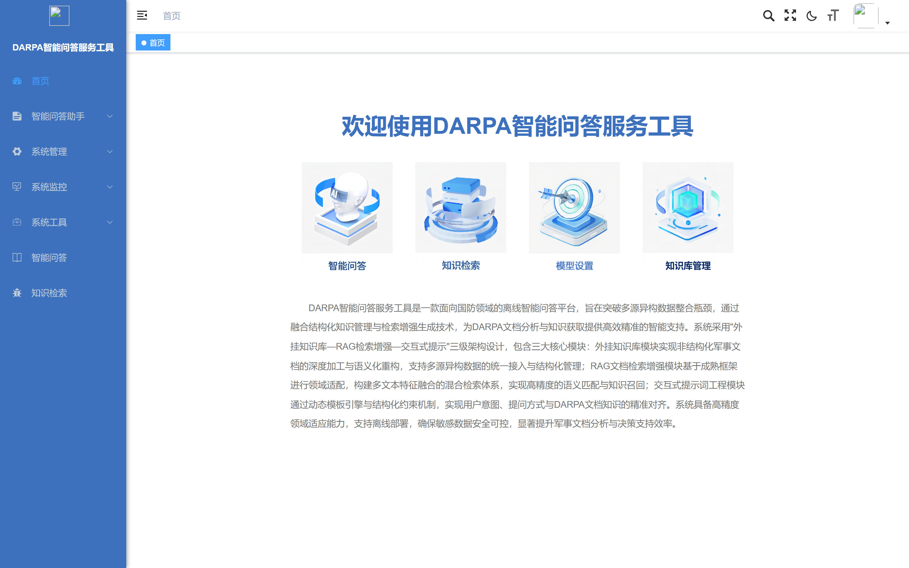

图 3 登录成功后的系统首页主界面。左侧为功能导航菜单，顶部显示当前用户和系统信息，主区域展示欢迎页面。

### 3.3 停止和挂起

**Linux/macOS：**

```bash
cd /opt/knovaq/docker
bash scripts/stop.sh
```

**Windows (PowerShell)：**

```powershell
cd E:\knovaq\docker
.\scripts\stop.ps1
```

执行后系统将优雅停止所有服务容器，显示`✓ KnovaQ stopped`。

> **说明**：停止不会删除数据。再次执行`start`命令即可恢复运行，所有数据保持不变。

### 3.4 卸载

如需完全卸载系统并清除所有数据：

```bash
cd /opt/knovaq/docker
docker compose down -v
```

> **警告**：`down -v`会删除所有Docker卷（包括MySQL数据、ES索引、上传文件等），此操作**不可恢复**。执行前请确认已备份重要数据。

仅停止服务但保留数据：

```bash
docker compose down    # 不加 -v，数据保留
```

---

## 4 软件使用指南

### 4.1 能力

DARPA智能问答服务工具提供三大核心能力模块，模块间的协作关系如下：

```
用户提问 ──→ M3交互式提示 ──→ M2检索增强 ──→ M1外挂知识库
    │              │                │               │
    │          构建提示          检索知识片段      返回相关分块
    │              │                │               │
    │          ←──── 精准答案 + 引用溯源 ←────────────┘
    │
    └──← 智能问答结果
```

**M1 外挂知识库模块**提供知识库全生命周期管理能力：创建/删除/修改知识库，上传PDF/Word/Excel/TXT/图片等多格式军事文档，自动进行文档深度解析（表格提取、图文识别、版面分析）、智能语义化分块（按段落/章节/语义边界切分）、元数据标注与过滤、文档解析状态监控。

**M2 RAG文档检索增强模块**提供多维度检索能力：向量语义检索、混合检索（向量+关键词多特征融合）、相似度阈值动态调节、检索结果重排序（Reranking）、知识图谱辅助检索、跨语言检索（中英文DARPA文档）。

**M3 交互式提示词工程模块**提供智能对话能力：聊天助手创建与管理、系统提示词配置（领域角色设定）、多轮上下文对话、流式响应输出、引用溯源（答案→源文档定位）、动态提示模板引擎。

### 4.2 约定

在使用本系统时，请注意以下操作约定：

a）**浏览器要求**：推荐使用Chrome浏览器最新版，分辨率建议1920×1080及以上。

b）**用户角色**：
  - **系统管理员**：负责系统部署、维护、用户管理
  - **知识工程师**：负责知识库创建、文档上传、检索调优
  - **普通用户**：使用智能问答功能进行知识检索和对话

c）**界面约定**：
  - 菜单项统一位于页面顶部导航栏或左侧菜单栏
  - 操作按钮统一位于对应功能区域上方或右侧
  - 列表页面支持翻页浏览，每页默认显示20条记录
  - 必填字段以红色星号（*）标识

d）**操作术语**：
  - "点击"——鼠标左键单击
  - "右键"——鼠标右键单击弹出上下文菜单
  - "输入"——在文本框中键入内容
  - "选择"——在下拉列表或单选框中选取选项
  - "勾选"——在复选框中打勾

### 4.3 处理过程

#### 4.3.1 智能问答

智能问答是系统核心功能。用户在对话界面中输入自然语言问题，系统自动从知识库检索相关文档片段，由大语言模型生成精准回答。

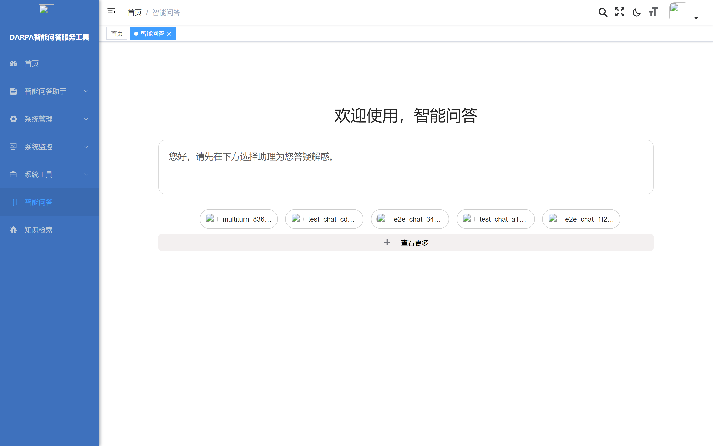

图 4 智能问答主界面。页面顶部显示当前助手名称，中间区域展示对话历史，底部为问题输入框。用户在输入框中输入问题后点击"发送"按钮或按Enter键提交。

**操作步骤**：

**Step 1** 点击顶部导航菜单中的"智能问答"进入问答界面。

**Step 2** 在底部输入框中输入问题，例如"什么是知识库？"。

**Step 3** 点击"发送"按钮或按Enter键提交问题。

**Step 4** 系统开始处理，回答以流式方式逐字显示。回答中包含引用标记[1]、[2]等，点击可查看引用来源的原始文档和位置。

**Step 5** 可继续在同一对话中提问，系统保持上下文连贯。点击"新建对话"可开始全新会话。

#### 4.3.2 知识检索

知识检索功能允许用户对知识库中的文档进行关键词和语义检索，快速定位所需信息。

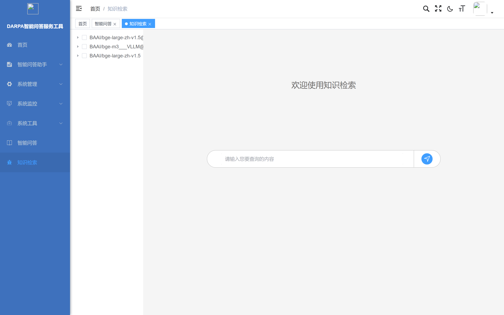

图 5 知识检索界面。页面提供检索输入框，用户输入关键词后系统返回匹配的文档片段列表，每条结果显示相似度分数和来源文档。

**操作步骤**：

**Step 1** 点击顶部导航菜单中的"知识检索"。

**Step 2** 在检索输入框中输入关键词或描述性语句。

**Step 3** 点击"搜索"按钮，系统返回匹配结果列表。

**Step 4** 每条结果显示文档名称、匹配片段预览和相似度分数，点击可查看完整内容。

#### 4.3.3 配置助理

配置助理功能用于创建和管理智能问答助手。每个助手可绑定不同知识库、配置不同提示词，实现特定领域的精准问答。

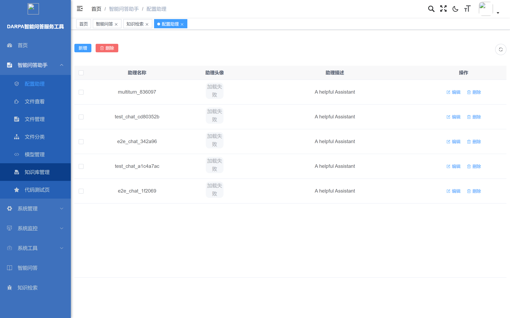

图 6 配置助理列表页面。展示所有已创建的问答助手，显示名称、关联知识库、模型等关键信息。支持新增、编辑、删除操作。

**新增助理操作**：

**Step 1** 点击列表上方"新增"按钮，弹出新增助理配置对话框。


图 7 新增助理配置弹窗。在表单中填写助手名称、选择LLM模型、编写系统提示词、勾选关联知识库，点击"确定"完成创建。

**Step 2** 在弹窗中填写助手名称（如"DARPA项目问答助手"）。

**Step 3** 选择LLM模型（推荐使用系统内置的本地模型）。

**Step 4** 在"系统提示词"区域编写助手的角色定义和回答规范。

**Step 5** 勾选需要关联的知识库，点击"确定"保存。

#### 4.3.4 文件查看

文件查看功能展示知识库中已上传的全部文件资源，支持按条件筛选浏览。


图 8 文件查看列表页面。展示知识库中的全部文件，显示文件名、类型、大小、上传时间、解析状态等信息。支持按文件名、类型、上传时间筛选。

**操作步骤**：

**Step 1** 在左侧菜单"智能问答助手"下点击"文件查看"。

**Step 2** 使用顶部筛选条件过滤文件列表。

**Step 3** 点击文件记录可查看文件详情和解析结果。


图 9 文件详情页面。展示文件的解析状态、分块数量等信息，可进一步查看分块内容。

#### 4.3.5 文件管理

文件管理功能提供知识库文件的增删改操作，包括上传新文件、创建文件夹、文件解析控制等。

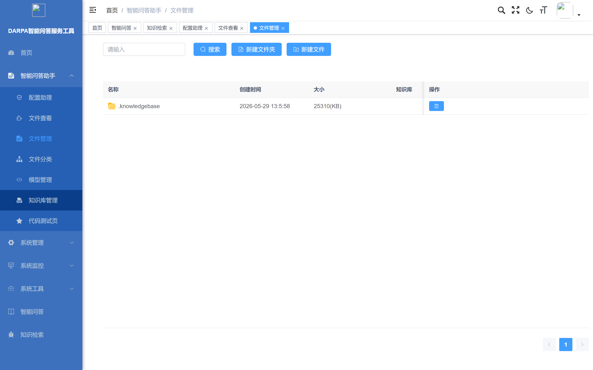

图 10 文件管理列表页面。展示当前知识库下的所有文件和文件夹，支持上传、解析、重命名、删除等操作。每条记录显示文件名、大小、状态和操作按钮。

**新建文件夹操作**：

**Step 1** 点击"新建文件夹"按钮，弹出创建对话框。

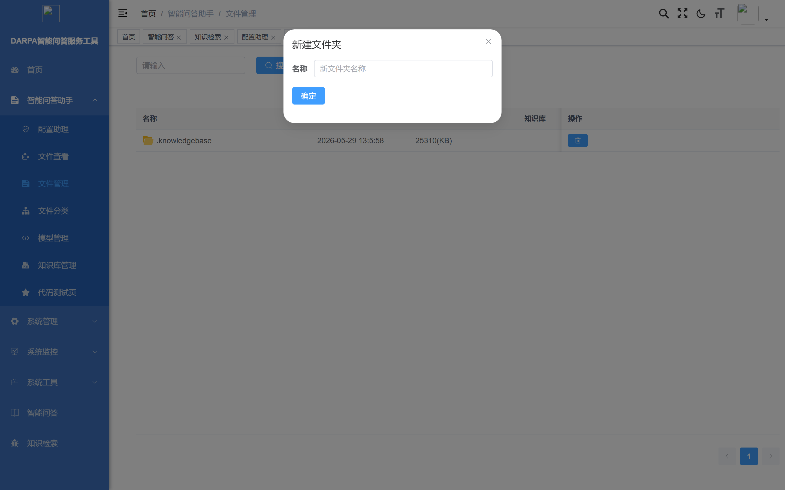

图 11 新建文件夹弹窗。输入文件夹名称后点击"确定"创建，用于按分类组织知识库文件。

**文件上传操作**：

**Step 1** 进入目标知识库的文件管理页面。

**Step 2** 点击"上传文件"按钮，在文件选择对话框中选择待上传文档（支持PDF/Word/Excel/TXT/图片格式）。

**Step 3** 文件上传后自动进入解析队列，状态列显示解析进度。

**Step 4** 解析完成后文件变为可检索状态，可在智能问答中使用。

#### 4.3.6 文件分类

文件分类功能支持创建多级分类目录，按主题或类型组织知识库文档。


图 12 文件分类管理页面。左侧显示分类树结构，右侧显示当前分类下的文件列表。支持新增、编辑、删除分类节点。

**新增分类操作**：

**Step 1** 选中父级分类节点，点击"新增"按钮。


图 13 新增分类弹窗。填写分类名称（如"产品文档"、"技术规范"、"项目资料"），选择上级分类，点击"确定"创建。

**Step 2** 创建完成后，可在文件管理中将文件分配到对应分类。

#### 4.3.7 模型管理

模型管理功能用于配置系统可用的LLM推理模型和嵌入模型，支持添加多种模型提供商。

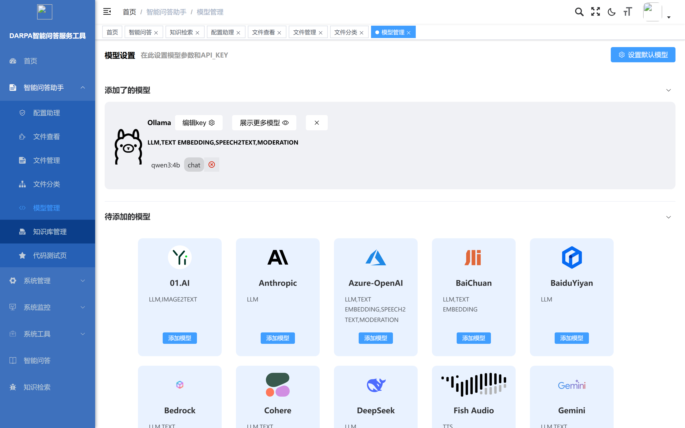

图 14 模型管理列表页面。按模型类型（LLM、嵌入、图像转文本、重排序等）分组展示已配置的模型。每个模型显示名称、类型、API配置和操作按钮。

**设置默认模型**：

**Step 1** 点击"设置默认模型"按钮，弹出默认模型配置对话框。


图 15 设置默认模型弹窗。为每种模型类型（LLM对话、嵌入向量、重排序等）指定默认使用的模型。系统各功能模块将使用此处指定的默认模型。

**Step 2** 在每种模型类型的下拉列表中选择要使用的默认模型。

**Step 3** 点击"确定"保存设置。修改默认模型后，已有助手的配置不受影响。

#### 4.3.8 知识库管理

知识库管理功能是系统的核心管理入口，用于创建、配置和监控知识库。


图 16 知识库管理列表页面。以卡片形式展示所有知识库，显示名称、文档数量、解析状态概要。每个知识库卡片提供配置、数据集管理和删除操作。

**新增知识库操作**：

**Step 1** 点击列表上方"新增"按钮，弹出创建对话框。


图 17 新增知识库弹窗。填写知识库名称（如"DARPA 2024年度项目文档"）、描述信息，选择分块方法（推荐"自动"）和嵌入模型，点击"确定"创建。

**Step 2** 创建完成后进入知识库配置页面，可上传文档、管理数据集。


图 18 知识库配置详情页面。展示知识库的配置信息、文档列表和分块统计。可在此页面上传文档、查看解析状态、调整分块参数。

#### 4.3.9 知识库创建与军事文档上传

**功能说明**：创建知识库是使用系统的第一步。知识库是管理军事文档和知识片段的容器，所有文档必须归属于某个知识库。

**操作步骤**：

**Step 1** 打开浏览器，访问RAG引擎管理界面`http://<服务器IP>:8070`。

**Step 2** 使用管理员账号登录系统。首次使用需注册：
- 点击页面顶部"注册"链接
- 输入邮箱地址（如`admin@darpa.local`）和密码
- 点击"注册"按钮完成注册
- 使用注册的邮箱和密码登录

**Step 3** 进入知识库管理页面。
- 登录后，点击页面顶部导航栏中的"知识库"菜单项
- 进入知识库列表页面，显示已创建的所有知识库

**Step 4** 创建新知识库。
- 点击知识库列表页面右上角的"创建知识库"按钮
- 在弹出的创建表单中填写以下信息：
  - **知识库名称**：输入知识库的名称，如"DARPA项目文档库"
  - **知识库描述**（可选）：输入简要描述，如"DARPA相关军事科研项目文档集合"
  - **分块方法**：选择文档分块策略，推荐选择"自动"（系统根据文档结构自动选择最佳分块方式）
  - **嵌入模型**：选择向量化模型，默认使用系统内置模型
- 点击"确定"或"提交"按钮，完成知识库创建

**Step 5** 上传军事文档。
- 在知识库列表中，点击刚创建的知识库名称，进入知识库详情页
- 点击"上传文件"或"添加文件"按钮
- 在文件选择对话框中，选择需要上传的军事文档文件
  - 支持的格式：PDF（.pdf）、Word（.doc/.docx）、Excel（.xls/.xlsx）、纯文本（.txt）、图片（.jpg/.png等）
  - 可一次选择多个文件批量上传
- 点击"上传"按钮开始上传
- 上传进度条显示上传状态，上传完成后文件出现在文档列表中

**Step 6** 查看上传结果。
- 文档上传后自动进入解析队列
- 文档列表中"状态"列显示当前解析状态

#### 4.3.10 文档解析状态监控

**功能说明**：上传的文档需要经过自动解析才能被检索使用。解析过程包括：文档内容提取、表格识别、图片处理、文本分块、向量化。大型文档解析可能需要数分钟。

**操作步骤**：

**Step 1** 进入知识库详情页。
- 在知识库列表中，点击目标知识库名称

**Step 2** 查看文档状态。
- 文档列表中每条记录的"状态"列显示解析状态：
  - **排队中**（黄色）：文档在解析队列中等待
  - **解析中**（蓝色）：文档正在被处理，可能显示进度百分比
  - **已完成**（绿色）：文档解析成功，知识分块已入库，可被检索
  - **失败**（红色）：文档解析出错，需检查文件是否损坏

**Step 3** 处理解析失败的文档。
- 点击状态为"失败"的文档记录
- 查看失败原因提示信息
- 常见原因及处理方法：
  - 文件格式不支持：确认文件为支持的格式（PDF/Word/Excel/TXT/图片）
  - 文件内容为空：检查文件是否损坏或加密
  - 文件过大：尝试拆分为多个较小文件后重新上传
- 处理完成后，点击"重新解析"按钮重新尝试

**Step 4** 手动触发解析（如需要）。
- 对于状态为"排队中"的文档，系统会自动按队列顺序处理
- 如需手动触发，选中目标文档，点击"开始解析"按钮

#### 4.3.11 分块预览与元数据管理

**功能说明**：文档解析完成后被切分为多个知识分块（chunk）。每个分块是检索和问答的基本单元。用户可预览分块内容、编辑元数据，以优化检索效果。

**操作步骤**：

**Step 1** 进入分块管理页面。
- 在知识库详情页中，点击已解析完成的文档名称
- 或点击文档操作栏中的"分块"按钮
- 进入该文档的分块列表页面

**Step 2** 浏览分块内容。
- 分块列表展示文档被切分后的每个知识片段
- 每个分块显示：分块编号、文本内容摘要、所属页码/章节、字符数
- 点击分块可展开查看完整文本内容

**Step 3** 编辑分块元数据。
- 点击目标分块右侧的"编辑"按钮
- 可修改以下元数据信息：
  - **分块内容**：直接编辑分块文本
  - **标签/关键词**：为分块添加关键词标签，便于检索过滤
  - **知识类型**：标注分块内容类型（如定义、数据、结论、方法等）
- 点击"保存"确认修改

**Step 4** 分块过滤与管理。
- 使用页面顶部的过滤条件筛选分块：
  - 按关键词过滤：输入关键词搜索分块内容
  - 按状态过滤：选择分块状态（启用/禁用）
  - 按元数据过滤：选择标签或知识类型
- 可批量操作：勾选多个分块，执行批量启用/禁用/删除
- 禁用的分块不会被检索到，但不删除原始数据

#### 4.3.12 检索参数配置（向量/混合/阈值）

**功能说明**：检索参数决定了系统从知识库中查找相关内容的策略和精度。合理配置检索参数可以显著提升问答质量。

**操作步骤**：

**Step 1** 进入助手配置页面（参见4.3.10创建助手后）。

**Step 2** 配置检索策略。
- 在助手的"检索设置"或"知识库绑定"配置区域中，找到检索参数设置
- 主要配置项：

| 参数 | 说明 | 推荐值 |
|------|------|--------|
| **检索方式** | 选择"向量检索"或"混合检索" | 混合检索（兼顾语义和关键词） |
| **相似度阈值** | 检索结果最低相似度分数，低于此值的结果被过滤 | 0.2（初始值，可根据效果调整） |
| **返回结果数** | 每次检索返回的最大知识分块数 | 6-10 |
| **重排序** | 是否对检索结果进行二次精排 | 开启（提高精度） |
| **检索权重** | 混合检索中向量检索与关键词检索的权重比例 | 0.7:0.3（偏重语义） |

**Step 3** 调节相似度阈值。
- 相似度阈值范围：0.0 ~ 1.0
- **阈值越高**（如0.5）：返回结果越少但越精确，可能遗漏相关知识
- **阈值越低**（如0.1）：返回结果越多但可能包含不相关内容
- 建议初始设为0.2，根据问答效果逐步调整

**Step 4** 验证检索效果。
- 在助手的"检索测试"功能中输入测试问题
- 查看检索到的知识分块列表及其相似度分数
- 根据测试结果微调参数

#### 4.3.13 创建问答助手与系统提示词配置

**功能说明**：问答助手（Chat Assistant）是用户进行智能问答的入口。每个助手绑定特定知识库，并可通过系统提示词（System Prompt）定义其角色和行为。

**操作步骤**：

**Step 1** 进入助手管理页面。
- 在RAG引擎管理界面顶部导航栏，点击"助手"或"对话"菜单项
- 进入助手列表页面，显示已创建的所有问答助手

**Step 2** 创建新助手。
- 点击页面右上角的"创建助手"按钮
- 在创建表单中填写以下信息：
  - **助手名称**：输入名称，如"DARPA项目问答助手"
  - **助手描述**（可选）：输入用途描述
  - **LLM模型**：选择智谱GLM-9B（本地部署模型）
  - **知识库**：勾选需要绑定的知识库（可多选，从4.3.6创建的知识库中选择）

**Step 3** 配置系统提示词。
- 在助手创建/编辑页面的"系统提示词"（System Prompt）文本区域中，输入助手的角色定义和行为规范
- 系统提示词示例：

```
你是一个专业的DARPA军事科研项目问答助手。你的职责如下：

1. 基于提供的知识库内容回答用户关于DARPA项目的问题
2. 回答必须基于检索到的文档内容，不得自行编造信息
3. 如果知识库中没有相关内容，明确告知用户"根据当前知识库未找到相关信息"
4. 回答时引用具体的文档来源和章节
5. 使用专业、准确的语言，避免模糊表述
6. 对于数据类问题，提供具体的数值和单位
```

- 提示词编写要点：
  - 明确定义助手的角色和职责边界
  - 指定回答的格式和风格要求
  - 规定信息溯源要求（引用来源）
  - 说明无法回答时的处理方式

**Step 4** 绑定知识库。
- 在助手设置中找到"关联知识库"配置区域
- 勾选需要绑定的知识库（至少绑定一个）
- 可同时绑定多个知识库，系统会在所有已绑定知识库中检索

**Step 5** 保存助手配置。
- 点击"保存"或"确定"按钮完成创建
- 助手出现在助手列表中，状态为"已启用"

#### 4.3.14 智能问答对话操作

**功能说明**：智能问答是系统的核心使用场景。用户通过自然语言提问，系统自动从知识库检索相关内容，由大语言模型生成精准回答。

**操作步骤**：

**Step 1** 进入对话页面。
- 在RAG引擎管理界面或前端主界面中，点击目标助手名称进入对话页面
- 或在前端主界面的助手列表中，点击"开始对话"按钮

**Step 2** 发起提问。
- 在页面底部的输入框中输入问题，例如：
  - "DARPA XXX项目的关键技术指标是什么？"
  - "请列出与XXX相关的所有项目名称"
  - "XXX技术的最新进展是什么？"
- 点击"发送"按钮或按Enter键提交问题

**Step 3** 查看回答。
- 系统开始处理后，回答内容以流式方式逐字显示（类似打字效果）
- 回答内容由以下部分组成：
  - **正文回答**：基于知识库内容生成的结构化回答
  - **引用标记**：回答中的引用处显示引用编号（如[1]、[2]）
  - **引用来源**：回答下方列出引用的原始文档和分块信息

**Step 4** 查看引用溯源。
- 在回答区域下方，点击引用编号或"查看引用"链接
- 弹出引用详情面板，显示：
  - 引用的原始文档名称
  - 引用内容在原文中的位置（页码/章节）
  - 引用内容的完整文本
  - 相似度分数

**Step 5** 继续提问。
- 在同一对话中继续输入下一个问题，系统保持上下文连贯
- 也可以点击"新建对话"开始全新的对话（清除上下文）

#### 4.3.15 多轮对话与上下文管理

**功能说明**：系统支持多轮对话，即用户可以在一个对话中连续提问，系统会结合之前的问答上下文理解当前问题。

**操作步骤**：

**Step 1** 在现有对话中继续提问。
- 无需新建对话，直接在输入框中输入后续问题
- 系统自动关联同一对话中的历史问答

**Step 2** 上下文相关问题示例。
- 第一轮："DARPA XXX项目有哪些参与单位？"
- 第二轮（系统理解"XXX项目"的上下文）："该项目的预算是多少？"
- 第三轮（继续深入）："项目启动时间是什么时候？"

**Step 3** 管理对话历史。
- 对话列表显示在页面左侧或导航区域
- 点击历史对话可查看完整问答记录
- 点击"删除"可删除不需要的对话记录

**Step 4** 新建对话（清除上下文）。
- 点击"新建对话"或"新建会话"按钮
- 开始全新的对话，不携带之前对话的上下文

#### 4.3.16 引用溯源查看

**功能说明**：引用溯源功能让用户验证回答的可靠性，每个回答中的信息都可以追溯到源文档的具体位置。

**操作步骤**：

**Step 1** 查看回答中的引用标记。
- 每个回答中，基于知识库生成的语句后方标注引用编号，如"[1]"、"[2]"
- 引用编号对应回答下方引用列表中的条目

**Step 2** 点击引用编号。
- 点击回答中的引用编号，跳转到引用详情
- 或点击回答区域下方的引用列表展开查看

**Step 3** 查看引用详情。
- 引用详情展示：
  - **来源文档**：引用内容所在的原始文档名称
  - **内容预览**：引用的原文片段，关键词高亮显示
  - **相似度**：该片段与用户问题的语义相似度分数
  - **位置信息**：原文中的页码或章节位置

**Step 4** 评估回答可靠性。
- 通过检查引用来源判断回答的准确性和完整性
- 如果引用内容与回答不符，说明可能存在"幻觉"，应以引用原文为准
- 如果所有引用的相似度都很低，说明知识库中可能缺乏相关知识

#### 4.3.17 提示模板定制

**功能说明**：提示模板允许知识工程师为不同场景定制问答助手的回答风格和行为规范，实现用户意图与知识精准对齐。

**操作步骤**：

**Step 1** 编辑助手配置。
- 在助手列表中，点击目标助手右侧的"编辑"或"设置"按钮

**Step 2** 修改系统提示词。
- 在"系统提示词"文本区域修改内容
- 可根据不同场景定制不同风格的提示词

- **场景示例1——数据查询型**：
```
你是一个精确的数据查询助手。回答要求：
1. 只提供知识库中明确记载的数据
2. 所有数据必须附带来源引用
3. 以表格形式展示对比数据
4. 不确定的数据标注"[待确认]"
```

- **场景示例2——分析报告型**：
```
你是一个军事科研分析助手。回答要求：
1. 对多个相关项目进行横向对比分析
2. 按技术指标、预算、进展等维度组织回答
3. 给出总结性判断和建议
4. 标注信息来源和时效性
```

**Step 3** 调整模型参数。
- 在助手设置中可调整LLM模型参数：
  - **温度（Temperature）**：控制回答的创造性，0为最确定，1为最随机。推荐0.1-0.3（偏精确）
  - **最大输出长度**：控制回答的最大token数
  - **Top-P**：控制候选词范围，推荐0.9

**Step 4** 保存并测试。
- 点击"保存"保存配置
- 发送测试问题验证提示词效果
- 根据回答质量反复调整提示词内容

#### 4.3.18 用户管理

用户管理功能供系统管理员管理系统用户账号，包括新增、编辑、删除用户和分配角色权限。

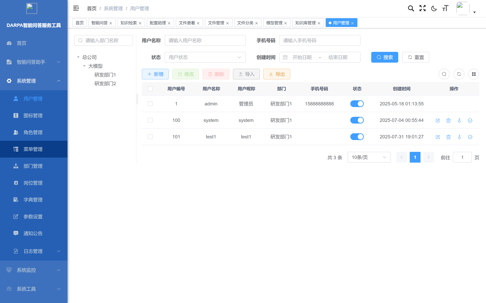

图 19 系统用户管理列表页面。展示所有系统用户，显示用户名、昵称、部门、角色、状态等信息。支持按用户名、手机号、状态筛选。提供新增、修改、删除、导入、导出操作。

**新增用户操作**：

**Step 1** 点击列表上方"新增"按钮，弹出新增用户对话框。

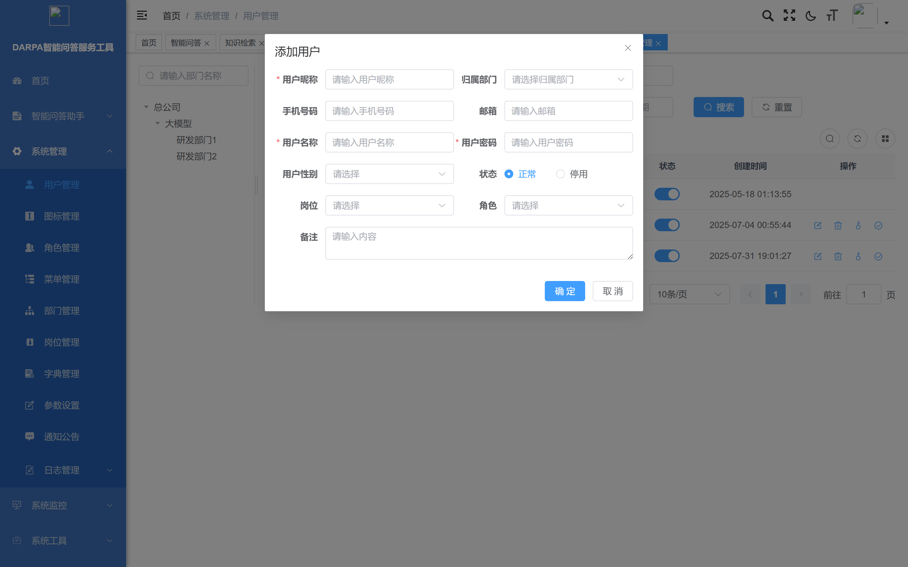

图 20 新增用户弹窗。填写用户名、昵称、密码、手机号、邮箱，选择所属部门和角色，设置用户状态，点击"确定"创建用户。

**Step 2** 在弹窗表单中填写必填信息（红色星号标注）。

**Step 3** 选择用户角色和所属部门。

**Step 4** 点击"确定"完成用户创建。新用户可使用设置的账号密码登录系统。

#### 4.3.19 角色管理

角色管理功能用于定义系统角色和权限策略，控制不同用户的功能访问范围。

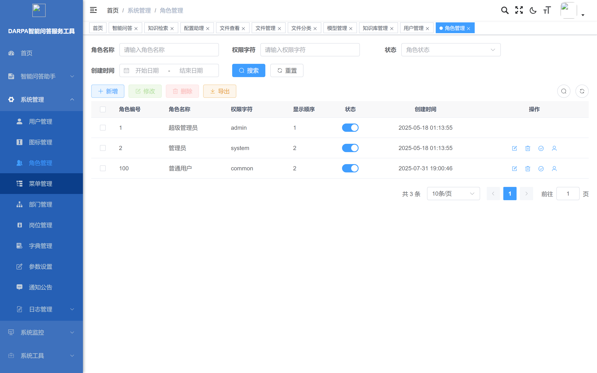

图 21 角色管理列表页面。展示所有系统角色，显示角色名称、权限标识、排序、状态等信息。

**新增角色操作**：

**Step 1** 点击"新增"按钮，弹出角色配置对话框。

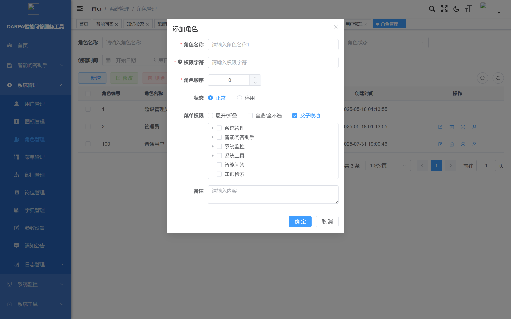

图 22 新增角色弹窗。填写角色名称、权限标识、排序，勾选角色可访问的菜单权限树，点击"确定"创建角色。

#### 4.3.20 菜单管理

菜单管理功能用于配置系统导航菜单结构，控制各角色可见的功能模块。


图 23 菜单管理列表页面。以树形结构展示系统菜单层级关系，显示菜单名称、图标、排序、路由地址等信息。支持新增、编辑、删除菜单项。

#### 4.3.21 参数设置

参数设置功能用于管理系统运行参数和配置项。

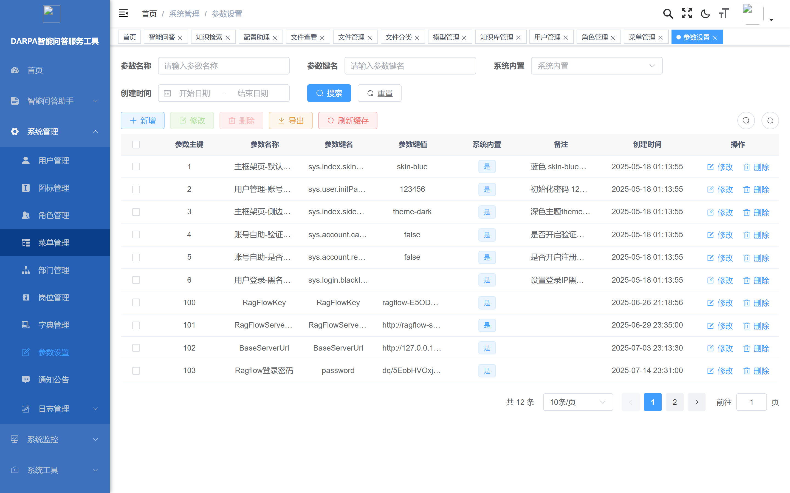

图 24 系统参数设置列表页面。以表格形式展示所有系统配置参数，显示参数名称、参数键名、参数值、系统内置标识。支持按参数名称和键名搜索，可编辑参数值。

#### 4.3.22 在线用户监控

在线用户监控功能展示当前系统中处于登录状态的用户会话信息。

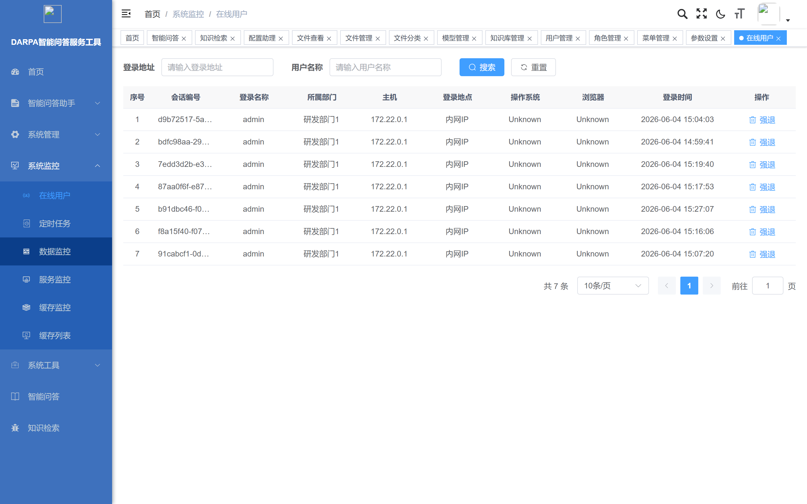

图 25 在线用户监控页面。展示当前所有在线用户的会话信息，包括用户名、登录IP、浏览器、操作系统、登录时间。管理员可强制下线指定用户。

#### 4.3.23 服务器监控

服务器监控功能展示系统运行环境的实时状态信息。


图 26 服务器状态监控页面。以仪表盘形式展示服务器CPU使用率、内存占用、JVM堆内存、磁盘空间、系统运行时间等关键指标。管理员可据此判断系统负载情况。

#### 4.3.24 操作日志

操作日志功能记录系统中所有用户的关键操作行为，用于审计追溯。

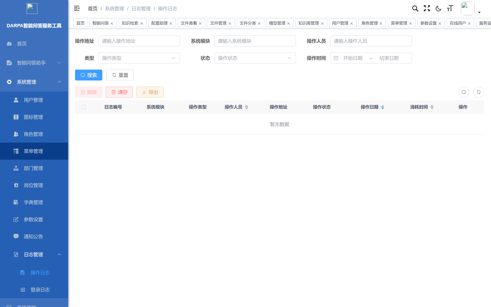

图 27 操作日志列表页面。按时间倒序展示操作记录，显示操作模块、操作类型、操作人、操作时间、操作IP等信息。支持按模块、操作人、时间范围筛选。

### 4.4 有关的处理

以下处理过程不直接面向普通用户，由系统管理员在服务器命令行操作。

#### 4.4.1 后端服务更新

当Spring Boot后端需要更新时（如修复bug、增加功能），执行以下操作：

**Linux/macOS：**

```bash
cd /opt/knovaq/docker
bash scripts/build-mes.sh <项目名>
```

**Windows (PowerShell)：**

```powershell
cd E:\knovaq\docker
.\scripts\build-mes.ps1 <项目名>
```

脚本自动完成：复制最新jar包到`docker/gaisoft/jar/`目录 → 重启gaisoft-server容器。

#### 4.4.2 前端界面更新

当Vue 3前端需要更新时，执行以下操作：

**Linux/macOS：**

```bash
cd /opt/knovaq/docker
bash scripts/build-ui.sh <项目名>
```

**Windows (PowerShell)：**

```powershell
cd E:\knovaq\docker
.\scripts\build-ui.ps1 <项目名>
```

脚本自动完成：清除旧前端文件 → 复制最新构建产物 → 重新加载nginx。

#### 4.4.3 离线镜像包制作

在联网环境中制作离线交付包，供离线环境加载使用：

**Linux/macOS：**

```bash
cd /opt/knovaq/docker
bash scripts/offline-save.sh
```

**Windows (PowerShell)：**

```powershell
cd E:\knovaq\docker
.\scripts\offline-save.ps1
```

脚本将所有Docker镜像导出为`.tar`文件到`docker/images/`目录，然后打包整个`docker/`目录：

```powershell
Compress-Archive -Path docker -DestinationPath knovaq-offline.zip
```

将`knovaq-offline.zip`复制到目标离线服务器即可。

### 4.5 数据备份

#### 4.5.1 MySQL数据备份

```bash
# 备份rag_flow数据库（ragflow引擎元数据）
docker exec ragflow-mysql mysqldump -uroot -p<密码> rag_flow > rag_flow_backup.sql

# 备份darpa_iqas数据库（业务数据）
docker exec ragflow-mysql mysqldump -uroot -p<密码> darpa_iqas > darpa_iqas_backup.sql
```

#### 4.5.2 Elasticsearch数据备份

```bash
# 创建快照仓库
curl -X PUT "http://localhost:1200/_snapshot/backup" -H 'Content-Type: application/json' -d'{
  "type": "fs",
  "settings": { "location": "/usr/share/elasticsearch/data/backup" }
}'

# 创建快照
curl -X PUT "http://localhost:1200/_snapshot/backup/snapshot_$(date +%Y%m%d)?wait_for_completion=true"
```

#### 4.5.3 上传文件备份

上传文件存储在MinIO对象存储中，对应Docker卷`minio_data`：

```bash
# 备份MinIO数据卷
docker run --rm -v minio_data:/data -v $(pwd):/backup alpine tar czf /backup/minio_backup.tar.gz /data
```

### 4.6 错误恢复和故障发生时的恢复

#### 4.6.1 常见故障及处理

表5 常见故障排查

| 故障现象 | 可能原因 | 处理方法 |
|---------|---------|---------|
| 浏览器无法访问系统 | 服务未启动或端口被占 | 1. 执行`docker ps`查看容器状态 2. 检查端口是否被占用 3. 重新执行start命令 |
| 前端页面白屏 | nginx配置缺失 | 确认通过start脚本启动（不是直接docker compose up） |
| 文档解析失败 | 文件格式损坏或不支持 | 检查文件完整性，确认为支持的格式 |
| 问答无响应 | LLM模型未加载 | 检查ragflow容器日志：`docker logs ragflow-server` |
| 问答回答质量差 | 检索参数不当 | 调节相似度阈值、更换检索策略、优化提示词 |
| 检索不到内容 | 知识库未绑定或分块未完成 | 确认助手绑定了知识库，文档解析状态为"已完成" |
| 服务频繁重启 | 内存不足 | 检查服务器内存，ES默认占用8GB |

#### 4.6.2 服务健康检查

```bash
# 查看所有服务状态
docker compose ps

# 查看特定服务日志
docker logs ragflow-server --tail 100
docker logs equipment-server --tail 100

# 检查MySQL健康
docker exec ragflow-mysql mysqladmin ping -uroot -p<密码>

# 检查Redis健康
docker exec ragflow-redis valkey-cli -a <密码> ping
```

#### 4.6.3 数据恢复

```bash
# 恢复MySQL数据
docker exec -i ragflow-mysql mysql -uroot -p<密码> rag_flow < rag_flow_backup.sql

# 恢复MinIO数据
docker run --rm -v minio_data:/data -v $(pwd):/backup alpine tar xzf /backup/minio_backup.tar.gz -C /
```

### 4.7 消息

系统运行过程中可能显示以下提示信息：

表6 消息列表

| 消息内容 | 类型 | 说明 | 处理方法 |
|---------|------|------|---------|
| "登录成功" | 提示 | 用户认证通过 | 正常，进入主界面 |
| "用户名或密码错误" | 错误 | 登录凭据不正确 | 检查输入，联系管理员重置 |
| "文件上传成功" | 提示 | 文档已上传到知识库 | 等待系统自动解析 |
| "文档解析完成" | 提示 | 文档已成功解析为知识分块 | 可开始检索和问答 |
| "文档解析失败" | 错误 | 文档解析出错 | 查看4.6.1故障排查 |
| "未找到相关知识" | 警告 | 检索未命中知识库内容 | 检查知识库是否已绑定，文档是否已解析 |
| "会话已过期" | 警告 | JWT令牌过期 | 重新登录 |
| "网络连接异常" | 错误 | 浏览器与服务器断开 | 检查网络连接 |
| "服务启动中，请稍候" | 提示 | 系统正在初始化 | 等待1-2分钟后刷新页面 |

### 4.8 快速引用指南

表7 常用操作速查表

| 任务 | 操作路径 | 关键步骤 |
|------|---------|---------|
| 登录系统 | 浏览器访问`http://IP:8899` | 输入admin/admin123 → 登录 |
| 创建知识库 | RAG管理→知识库→创建 | 填写名称/描述 → 选择分块方法 → 确定 |
| 上传文档 | 知识库详情→上传文件 | 选择文件 → 上传 → 等待解析 |
| 查看解析状态 | 知识库详情→文档列表 | 查看状态列（排队/解析中/已完成/失败） |
| 预览分块 | 文档详情→分块列表 | 浏览/编辑分块内容和元数据 |
| 创建问答助手 | RAG管理→助手→创建 | 填写名称 → 绑定知识库 → 配置提示词 |
| 配置检索参数 | 助手设置→检索配置 | 选择检索方式 → 设置阈值 → 开启重排序 |
| 开始问答 | 助手列表→开始对话 | 输入问题 → 查看回答和引用 |
| 查看引用 | 回答下方引用列表 | 点击引用编号 → 查看源文档 |
| 新建对话 | 对话页面→新建对话 | 点击"新建" → 开始新会话 |
| 启动系统 | 命令行 | `./scripts/start.sh <项目名>` |
| 停止系统 | 命令行 | `./scripts/stop.sh` |
| 更新后端 | 命令行 | `./scripts/build-mes.sh <项目名>` |
| 更新前端 | 命令行 | `./scripts/build-ui.sh <项目名>` |
| 查看服务状态 | 命令行 | `docker compose ps` |
| 查看服务日志 | 命令行 | `docker logs <容器名> --tail 100` |

---

## 5 典型业务流程

### 5.1 流程1：军事文档知识入库

本流程描述从创建知识库到验证知识入库的完整过程。

**适用角色**：知识工程师

**前置条件**：系统已部署启动，用户已登录

**操作流程**：

```
创建知识库 → 配置分块策略 → 上传军事文档 → 等待自动解析 → 检查解析状态 → 预览分块 → 确认入库
```

**详细步骤**：

**Step 1** 访问RAG引擎管理界面（`http://<服务器IP>:8070`），登录后进入"知识库"页面。

**Step 2** 点击"创建知识库"，输入名称（如"DARPA 2024年度项目文档"），选择分块方法为"自动"，点击"确定"。

**Step 3** 进入新建的知识库，点击"上传文件"，选择待处理的军事文档（支持PDF/Word/Excel/TXT/图片），点击"上传"。

**Step 4** 等待系统自动解析。大型PDF文档可能需要2-5分钟。在文档列表中查看状态：
  - 状态变为"已完成"（绿色）表示解析成功
  - 状态变为"失败"（红色）需根据错误信息排查

**Step 5** 解析完成后，点击文档名称进入分块列表，逐一检查分块质量：
  - 分块大小是否合理（过大的分块可能跨越多个主题）
  - 分块内容是否完整（表格、图表是否正确提取）
  - 关键信息是否被正确识别

**Step 6** 对质量不佳的分块进行编辑调整，或重新上传优化后的文档。

**Step 7** 知识入库完成，可进入流程2配置检索或流程3进行问答。

### 5.2 流程2：领域问答调优

本流程描述如何通过配置提示词和检索参数优化问答质量。

**适用角色**：知识工程师

**前置条件**：知识库已创建且文档解析完成

**操作流程**：

```
创建助手 → 配置系统提示词 → 绑定知识库 → 配置检索参数 → 测试问答 → 评估效果 → 调整参数 → 反复迭代
```

**详细步骤**：

**Step 1** 进入"助手"页面，点击"创建助手"，输入助手名称，选择LLM模型（智谱GLM-9B）。

**Step 2** 在"系统提示词"区域，根据应用场景编写提示词。参考4.3.14中的模板示例，明确助手的角色、回答规范、引用要求。

**Step 3** 在"关联知识库"区域勾选需要绑定的知识库。

**Step 4** 配置检索参数：
  - 检索方式选择"混合检索"
  - 相似度阈值初始设为0.2
  - 开启重排序
  - 返回结果数设为8

**Step 5** 保存助手配置后，进入对话页面。

**Step 6** 使用典型问题进行测试，评估回答质量：
  - **准确性**：回答内容是否正确、是否与原文一致
  - **完整性**：是否覆盖了问题涉及的所有方面
  - **引用性**：是否有准确的引用溯源
  - **语言质量**：表述是否清晰专业

**Step 7** 根据测试结果调整参数：
  - 回答包含无关内容 → 提高相似度阈值（如0.2→0.3）
  - 回答信息不足 → 降低阈值（如0.2→0.1）或增加返回结果数
  - 回答格式不规范 → 优化系统提示词
  - 关键文档未被检索到 → 检查分块质量或切换检索策略

**Step 8** 反复测试和调优，直到问答质量满足要求。

### 5.3 流程3：离线环境部署

本流程描述在无外网的离线环境中部署系统的完整过程。

**适用角色**：系统管理员

**前置条件**：目标服务器已安装Docker和Docker Compose，离线交付包已准备

**操作流程**：

```
传输交付包 → 加载离线镜像 → 配置环境 → 启动系统 → 验证运行
```

**详细步骤**：

**Step 1** 将离线交付包（`knovaq-offline.zip`或`docker/`目录）通过U盘或内网传输到目标服务器。

**Step 2** 解压交付包到目标目录：

```bash
# Linux
unzip knovaq-offline.zip -d /opt/knovaq

# Windows
Expand-Archive -Path knovaq-offline.zip -DestinationPath E:\knovaq
```

**Step 3** 加载Docker离线镜像：

```bash
cd /opt/knovaq/docker
bash scripts/offline-load.sh
```

等待镜像加载完成，显示`✓ All images loaded`。

**Step 4** 检查/修改环境配置：

```bash
# 查看全局配置
cat .env

# 如需修改端口或密码，编辑.env文件
vi .env
```

**Step 5** 启动系统：

```bash
bash scripts/start.sh <项目名>
```

首次启动需等待2-3分钟（MySQL初始化、ES索引创建、ragflow服务启动）。

**Step 6** 验证系统运行：

```bash
# 检查所有容器状态（应全部为 Up/healthy）
docker compose ps

# 检查关键服务日志
docker logs ragflow-server --tail 20
docker logs equipment-server --tail 20
```

**Step 7** 浏览器验证：

- 访问`http://<服务器IP>:8899`，确认前端界面正常
- 使用admin/admin123登录，确认可正常操作
- 访问`http://<服务器IP>:8070`，确认RAG引擎管理界面正常

**Step 8** 部署完成。系统在离线环境下持续运行，无需外网连接。

---

> **文档结束**
>
> DARPA智能问答服务工具 软件用户手册 V1.0
>
> 研究内容四——DARPA智能问答服务工具开发
>
> 联合军事科学院军事科学信息研究中心
