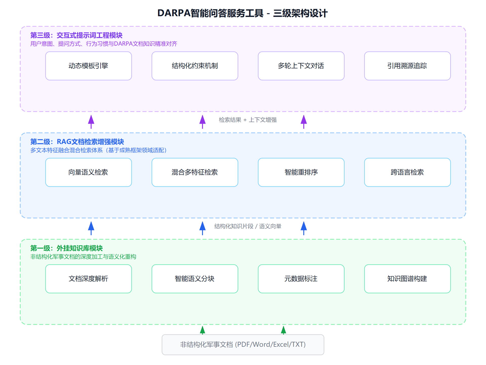
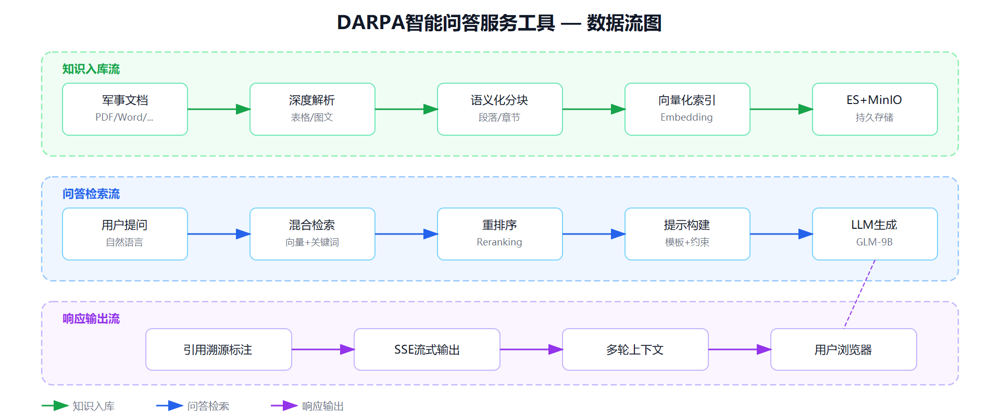
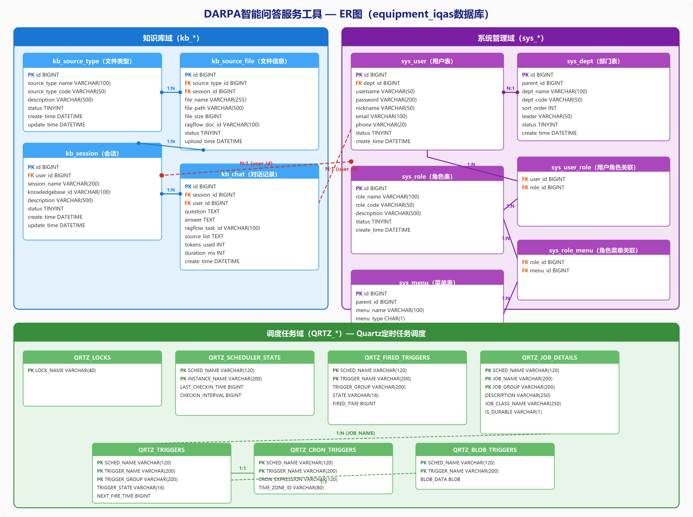
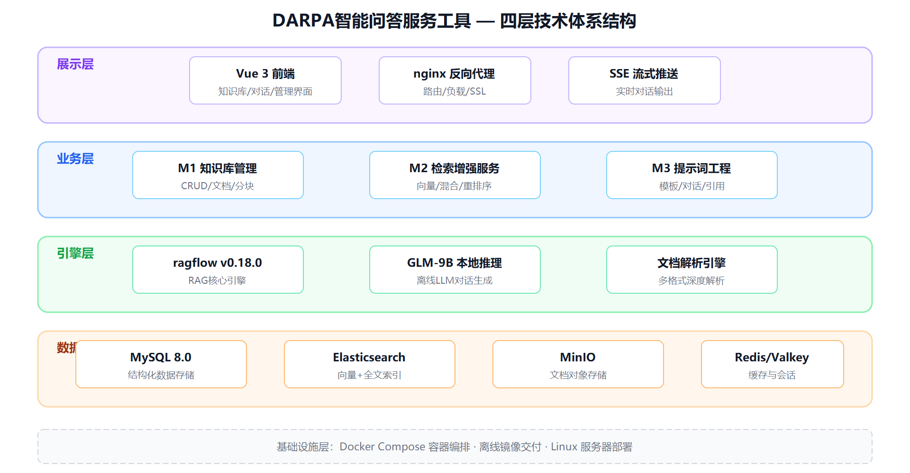
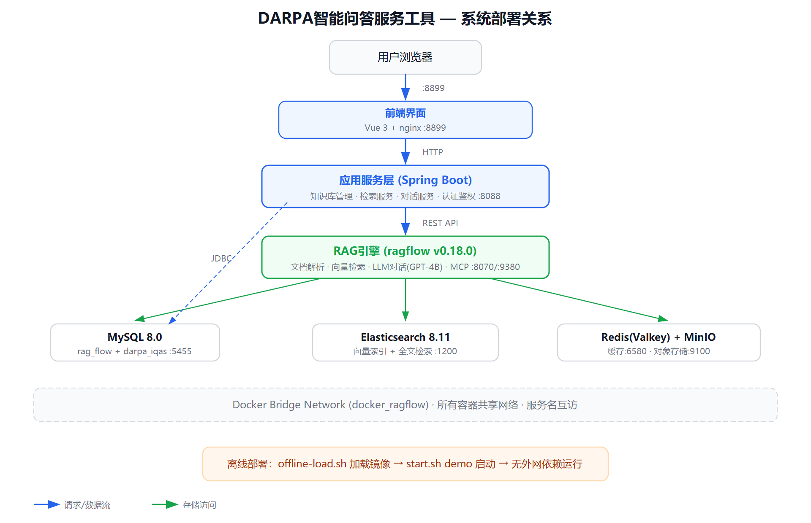
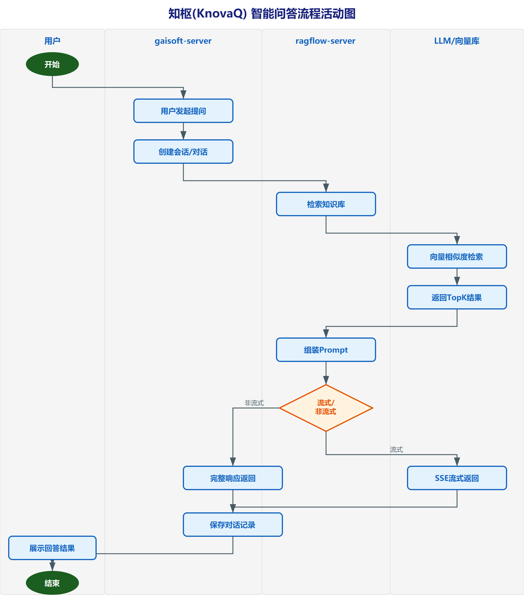
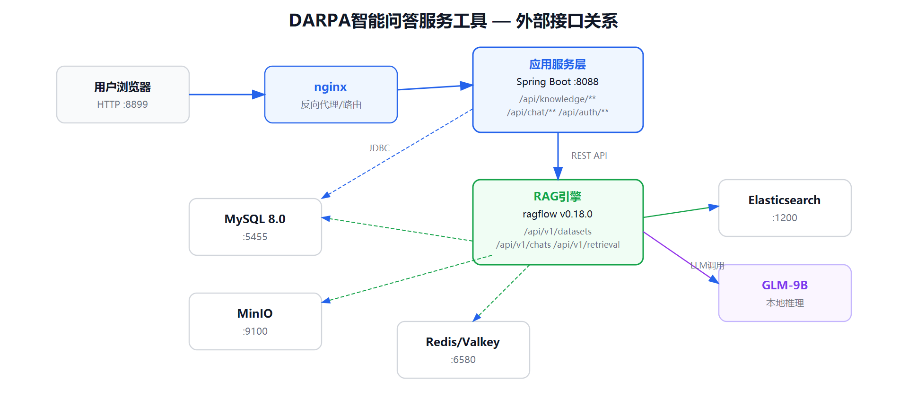
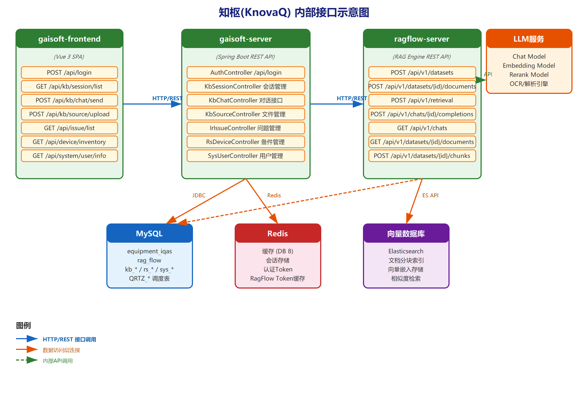

# 软件设计说明书

## DARPA智能问答服务工具

| 项目 | 值 |
|-----|---|
| 系统名称 | DARPA智能问答服务工具 |
| 系统标识 | DARPA-IQAS |
| 版本号 | V1.0 |
| 密级 | 内部 |

---

## 文档修改记录

| 版本 | 日期 | 修改人 | 修改内容 |
|------|------|--------|----------|
| V1.0 | 2026-06-04 | 编写组 | 初始版本 |

---

## 目录

- 1 范围
  - 1.1 标识
  - 1.2 系统概述
  - 1.3 文档概述
- 2 引用文档
- 3 设计决策
  - 3.1 技术设计决策
  - 3.2 输入/输出设计决策
  - 3.3 数据库/数据文件决策
  - 3.4 其它设计决策
- 4 体系结构设计
  - 4.1 CSCI部件
  - 4.2 执行方案
  - 4.3 接口设计
  - 4.4 技术体系结构
  - 4.5 部署关系
  - 4.6 部件组成
  - 4.7 信息流程
  - 4.8 执行概念
  - 4.9 性能设计
  - 4.10 接口设计
- 5 详细设计
  - 5.1 M1外挂知识库模块详细设计
  - 5.2 M2 RAG检索增强模块详细设计
  - 5.3 M3交互式提示词工程模块详细设计
- 6 需求可追踪性
- 7 注释

---

# 1 范围

## 1.1 标识

本文档适用的系统名称、标识号、简称、版本号和发射号如下：

- 名称：DARPA智能问答服务工具
- 标识号：DARPA-IQAS
- 简称：DARPA问答工具
- 版本号：V1.0
- 研究内容：研究内容四——DARPA智能问答服务工具开发
- 合作单位：军事科学院军事科学信息研究中心

## 1.2 系统概述

DARPA智能问答服务工具（DARPA-IQAS）是研究内容四的核心成果，联合军事科学院军事科学信息研究中心共同研发。系统围绕面向DARPA智能问答服务工具的开发需求，突破多源异构数据整合瓶颈，通过融合结构化知识管理与检索增强生成（RAG）技术，打造具备高精度领域适应能力的离线智能问答系统。

系统采用**"外挂知识库—RAG检索增强—交互式提示"三级架构**设计，三大核心模块分别为：

- **M1外挂知识库模块**：对非结构化军事文档进行深度解析、智能分块、元数据标注与知识图谱构建；
- **M2 RAG文档检索增强模块**：基于成熟开源框架（ragflow v0.18.0）进行领域适配，构建多维度混合检索能力；
- **M3交互式提示词工程模块**：通过动态模板引擎与结构化约束机制，实现用户意图与DARPA文档知识的精准对齐。

系统具备以下核心特性：

1. 完全离线运行，无外网依赖，满足涉密环境部署要求；
2. 基于Docker Compose容器化部署，支持离线镜像包交付；
3. LLM采用智谱GLM-9B本地部署，确保数据不外泄；
4. 支持PDF/Word/Excel/TXT/图片等多格式军事文档处理；
5. 48条自动化测试用例覆盖全链路功能验证。

当前版本为V1.0，已完成核心功能开发与系统测试，处于交付验收阶段。

## 1.3 文档概述

本文档是DARPA智能问答服务工具的软件设计说明书（SDD），用于阐述系统的设计决策、体系结构和详细设计方案。本文档的用途、内容和组织如下：

- **用途**：为系统实现、测试和维护提供设计依据，是编写详细设计、代码实现和测试用例的基础文件；
- **内容**：本文档涵盖CSCI设计决策、体系结构设计、接口设计和三大模块的详细设计方案；
- **组织**：
  - 第一章：范围，包括标识、系统概述和文档概述；
  - 第二章：引用文档；
  - 第三章：CSCI设计决策，阐述"为什么这样设计"；
  - 第四章：CSCI体系结构设计，阐述"系统怎么组织"；
  - 第五章：CSCI详细设计，阐述"具体怎么实现"；
  - 第六章：需求可追踪性；
  - 第七章：注释。

本文档基于《DARPA智能问答服务工具-软件需求规格说明书》中的需求定义，逐项给出设计方案，是后续编码、测试和用户手册编写的依据。

---

# 2 引用文档

本文档引用和参考的文件如下：

| 序号 | 文档编号 | 文档名称 | 版本 | 备注 |
|------|---------|---------|------|------|
| 1 | — | DARPA智能问答服务工具-软件需求规格说明书 | V1.0 | 本项目需求定义 |
| 2 | GJB 438B-2009 | 军用软件开发文档通用要求 | — | 军用软件文档标准 |
| 3 | GJB 450A-2004 | 装备可靠性工作通用要求 | — | 可靠性设计依据 |
| 4 | GJB 368B-2009 | 装备维修性工作通用要求 | — | 维修性设计依据 |
| 5 | GJB 2547A-2012 | 装备测试性工作通用要求 | — | 测试性设计依据 |
| 6 | GJB 900-90 | 系统安全性通用大纲 | — | 安全性设计依据 |
| 7 | GJB 4239-2001 | 装备环境适应性通用要求 | — | 环境适应性依据 |
| 8 | — | ragflow v0.18.0 官方文档 | v0.18.0 | RAG引擎技术参考 |
| 9 | — | Spring Boot 2.x 官方文档 | 2.x | 后端框架参考 |
| 10 | — | Vue 3 官方文档 | 3.x | 前端框架参考 |
| 11 | — | Elasticsearch 8.11 官方文档 | 8.11 | 搜索引擎参考 |
| 12 | — | Docker Compose 官方文档 | v2 | 容器编排参考 |

---

# 3 设计决策

本章阐述DARPA智能问答服务工具的CSCI设计决策，包括技术设计决策、输入/输出设计决策、数据库/数据文件决策和其它设计决策。重点回答"为什么这样设计"——阐述每个设计决策的动机、权衡和选择理由。

本CSCI设计决策遵循以下原则：

1. 采用三级架构分层解耦设计，确保各层独立演进；
2. 基于成熟框架（ragflow v0.18.0）进行领域适配，降低自研风险；
3. 全面容器化离线部署，满足涉密环境运行要求；
4. 安全性设计贯穿各层级，确保军事文档数据安全。

## 3.1 技术设计决策

### 3.1.1 三级架构分层解耦决策

**决策：采用"外挂知识库—RAG检索增强—交互式提示"三级架构。**

**决策理由：**

传统问答系统将知识管理、检索和生成耦合在统一管线中，存在以下问题：

1. 知识库变更影响检索逻辑，检索策略调整影响提示工程，任何层变化需要全局回归测试；
2. 无法针对特定层级进行独立优化（如仅优化检索策略而不影响知识库管理）；
3. 不同领域场景对三级能力的要求差异大，耦合设计无法灵活裁剪。

三级架构通过清晰的层级边界解决上述问题：

```
┌─────────────────────────────────────────────────────────────────┐
│                    第三级：交互式提示词工程                        │
│        动态模板引擎 · 结构化约束 · 用户意图对齐                    │
│        输入：用户查询 + 第二级检索结果                              │
│        输出：精准提示 → LLM生成 → 结构化回答                      │
├─────────────────────────────────────────────────────────────────┤
│                    第二级：RAG文档检索增强                         │
│        向量检索 + 关键词检索 + 语义重排序 + 知识图谱               │
│        输入：用户查询 + 第一级知识库                                │
│        输出：结构化知识片段 + 相关度评分                            │
├─────────────────────────────────────────────────────────────────┤
│                    第一级：外挂知识库                              │
│        文档解析 · 智能分块 · 元数据标注 · 知识图谱构建             │
│        输入：非结构化军事文档                                      │
│        输出：结构化知识块 + 向量索引 + 元数据                      │
└─────────────────────────────────────────────────────────────────┘
```

层级间通过标准化接口交互：

- 第一级→第二级：通过向量索引和元数据接口提供知识片段；
- 第二级→第三级：通过检索结果JSON提供结构化知识片段和相关度评分；
- 第三级→LLM：通过提示模板将用户意图与知识片段组装为结构化提示。

系统采用三级架构设计，如图 1 所示。顶层为用户交互层（Vue 3 SPA），中间层为应用服务层（gaisoft-server + ragflow-server），底层为数据存储层（MySQL + Redis + Elasticsearch + MinIO）。该架构实现了关注点分离，各层独立演进。



图 1 展示了DARPA智能问答服务工具的三级技术架构。用户交互层负责界面渲染和用户操作响应；应用服务层承载业务逻辑处理和RAG检索增强生成；数据存储层提供结构化存储、缓存加速、向量检索和文件对象存储四类数据服务。

**替代方案与权衡：**

| 方案 | 优点 | 缺点 | 选择理由 |
|------|------|------|----------|
| 三级架构（选中） | 层级解耦、独立演进、可替换组件 | 接口设计复杂度增加 | 灵活性和可维护性优势远超接口成本 |
| 两级架构（知识库+检索生成合一） | 简单 | 检索和生成耦合，无法独立优化提示 | 不满足提示词工程的精细调控需求 |
| 单体架构 | 开发快速 | 全局耦合，难以适应领域变化 | 不满足军事文档多场景适应性要求 |

### 3.1.2 基于ragflow成熟框架领域适配决策

**决策：基于ragflow v0.18.0开源框架进行领域适配，而非自研RAG引擎。**

**决策理由：**

1. **成熟度优势**：ragflow v0.18.0已在工业界广泛验证，内置文档解析引擎（支持PDF/Word/Excel/TXT等）、向量索引（Elasticsearch）、混合检索、重排序、MCP服务等核心能力，避免重复造轮子；
2. **军事文档适配需求**：军事文档格式多样（PDF、Word、Excel、图片），ragflow的深度文档解析能力（版面分析、表格提取、图文识别）直接满足需求；
3. **领域适配效率**：通过配置ragflow的知识库、解析策略、检索参数和LLM接入，可快速完成DARPA领域的适配工作，将研发精力集中在业务逻辑层；
4. **持续维护性**：ragflow社区活跃（v0.18.0为稳定版本），bug修复和功能迭代有保障。

**领域适配工作内容：**

- 配置智谱GLM-9B本地模型接入（替代默认OpenAI）；
- 定制军事文档解析策略（分块算法、元数据模式）；
- 开发应用服务层（Spring Boot），封装ragflow API并增加业务逻辑（认证、会话管理、知识库管理）；
- 开发前端界面（Vue 3），提供面向军事科研人员的操作界面。

### 3.1.3 离线Docker Compose容器化部署决策

**决策：采用Docker Compose容器化部署，支持完全离线运行。**

**决策理由：**

1. **涉密环境要求**：系统部署在无外网的涉密环境中，所有组件必须离线运行，Docker镜像打包为离线交付包（offline-save/load脚本）可满足要求；
2. **部署一致性**：容器化确保开发、测试、生产环境完全一致，消除"在我机器上能跑"的问题；
3. **服务编排**：Docker Compose定义7个服务的依赖关系、启动顺序、健康检查和网络拓扑，一键部署/启停；
4. **维护便捷**：通过build-mes/build-ui脚本可独立更新后端jar或前端html，无需重建全部镜像；
5. **多客户隔离**：通过`docker/projects/<customer>/`目录实现每客户独立配置（端口、密码、nginx路由）。

**离线部署链路：**

```
联网环境                     离线环境
┌──────────────┐           ┌──────────────┐
│ docker pull  │           │ offline-load │
│ offline-save │ ──USB──→  │ start <proj> │
│ 导出tar镜像包 │           │ 启动全部服务  │
└──────────────┘           └──────────────┘
```

### 3.1.4 Spring Boot + Vue 3前后端分离决策

**决策：后端采用Spring Boot，前端采用Vue 3，前后端分离架构。**

**决策理由：**

1. **技术栈成熟度**：Spring Boot 2.x和Vue 3均为业界主流框架，技术风险低，人才储备充足；
2. **ragflow API封装**：Spring Boot作为BFF（Backend For Frontend）层，封装ragflow REST API，增加认证鉴权、会话管理、知识库管理等业务逻辑；
3. **前后端解耦**：前端通过nginx独立部署，通过`/prod-api/`路径代理后端服务，前后端可独立更新和部署；
4. **gaisoft-mes复用**：应用服务层基于gaisoft-mes（若依框架）构建，复用用户管理、权限控制、字典管理等基础能力。

### 3.1.5 MySQL + Elasticsearch双存储决策

**决策：结构化数据存储在MySQL，向量和全文索引存储在Elasticsearch，文档文件存储在MinIO。**

**决策理由：**

1. **职责分离**：MySQL存储业务关系数据（用户、角色、会话、知识库元数据），ES存储向量索引和全文检索数据，MinIO存储原始文档文件，各存储引擎负责其最擅长的领域；
2. **ragflow架构要求**：ragflow v0.18.0内部使用MySQL存储元数据、ES存储向量索引、MinIO存储文档文件，这是ragflow的架构约束；
3. **业务数据独立管理**：应用服务层（equipment_iqas数据库）与ragflow引擎（rag_flow数据库）在同一个MySQL实例中共存但逻辑隔离，便于独立管理和备份。

## 3.2 输入/输出设计决策

### 3.2.1 输入/输出数据流图

DARPA智能问答服务工具的核心数据流如图 1 所示。

```
                    ┌────────────────────────────────────────────────────────────┐
                    │                    DARPA智能问答服务工具                     │
                    │                                                            │
军事文档 ──上传──→ │ ┌──────────┐    ┌──────────────┐    ┌───────────────┐       │
(PDF/Word/Excel    │ │ M1 外挂   │    │ M2 RAG       │    │ M3 交互式     │       │
 /TXT/图片)        │ │ 知识库    │──→ │ 检索增强     │──→ │ 提示词工程    │       │
                    │ │          │    │              │    │               │       │
用户提问 ──────────→│ │ 文档解析  │    │ 向量检索     │    │ 提示模板构建   │──┐    │
                    │ │ 智能分块  │    │ 混合检索     │    │ 用户意图对齐   │  │    │
                    │ │ 元数据标注│    │ 重排序       │    │ 结构化约束    │  │    │
                    │ └──────────┘    └──────────────┘    └───────────────┘  │    │
                    │                                                         │    │
                    │                              ┌─────────────┐           │    │
                    │                              │ GLM-9B LLM  │←──────────┘    │
                    │                              │ (本地部署)   │                │
                    │                              └──────┬──────┘                │
                    └─────────────────────────────────────┼───────────────────────┘
                                                          │
                                                          ▼
                                               结构化回答 + 引用溯源
```

图 1 DARPA智能问答服务工具输入/输出数据流示意图



图 2 展示了系统的主要数据流。用户提问经由gaisoft-server转发至ragflow-server，ragflow执行文档检索和向量相似度匹配后组装Prompt，调用本地LLM生成回答，最终通过SSE流式返回给用户。文档上传流程将文件存储至MinIO，经解析分块后写入Elasticsearch向量索引。

**数据流说明：**

1. **知识入库流**：军事文档 → 上传 → 文档解析 → 智能分块 → 向量化 → ES索引；
2. **问答交互流**：用户提问 → 意图识别 → 检索增强（从ES获取知识片段）→ 提示构建 → GLM-9B生成 → 结构化回答 + 引用溯源。

### 3.2.2 输入/输出说明

**输入数据：**

| 输入项 | 数据类型 | 格式 | 来源 | 说明 |
|--------|---------|------|------|------|
| 军事文档 | 文件 | PDF/DOCX/XLSX/TXT/PNG/JPG | 用户上传 | M1模块输入 |
| 用户提问 | 文本 | UTF-8字符串 | 用户输入 | M3模块输入 |
| 系统配置 | 键值对 | JSON | 管理员设置 | 系统参数 |
| 知识库配置 | 结构化数据 | JSON | 知识工程师 | 解析策略、分块参数 |
| 提示词模板 | 文本 | UTF-8字符串 | 知识工程师 | M3模块配置 |

**输出数据：**

| 输出项 | 数据类型 | 格式 | 目标 | 说明 |
|--------|---------|------|------|------|
| 结构化回答 | 文本+引用 | Markdown/SSE流 | 用户浏览器 | 问答结果 |
| 引用溯源 | 结构化数据 | JSON | 用户浏览器 | 答案来源定位 |
| 解析状态 | 状态数据 | JSON | 用户浏览器 | 文档处理进度 |
| 检索结果 | 结构化数据 | JSON | M3模块 | 知识片段+相关度 |

### 3.2.3 行为设计决策

**流式SSE输出决策：**

系统采用Server-Sent Events（SSE）协议实现流式响应输出。

决策理由：

1. LLM生成是逐步产出的，SSE可实时推送已生成的token，用户无需等待完整回答；
2. SSE基于HTTP长连接，无需额外协议支持，在nginx代理环境下兼容性好；
3. 相比WebSocket更轻量，单向推送（服务器→客户端）场景下是最佳选择。

**引用溯源机制决策：**

每个回答附带引用信息，标注答案来源的知识块、原文档和具体位置。

决策理由：

1. 军事文档问答场景要求答案可验证、可溯源，用户需确认回答基于哪些文档；
2. 引用信息包含文档名称、知识块内容和相关度评分，便于用户评估回答可信度。

## 3.3 数据库/数据文件决策

### 3.3.1 数据库逻辑设计

本系统采用MySQL存储结构化业务数据。数据库逻辑设计采用ER图表示核心实体及其关系。



图 3 展示了equipment_iqas数据库的核心实体关系。数据库分为三个业务域：知识库域（kb_session、kb_chat、kb_source_file、kb_source_type）管理会话和文件分类；系统管理域（sys_user、sys_dept、sys_role）提供用户权限支撑；调度任务域（QRTZ_*系列表）提供定时任务调度。

**核心实体关系图（ER图）：**

```
┌──────────────┐         ┌──────────────┐         ┌──────────────┐
│   sys_user   │         │   kb_session │         │    kb_chat   │
│──────────────│    1:N  │──────────────│    1:N  │──────────────│
│ user_id  PK  │────────→│ session_id   │────────→│ id        PK │
│ user_name    │         │ session_name │         │ message_id   │
│ dept_id  FK  │         │ chat_id      │         │ chat_id      │
│ role_id  FK  │         │ user_id  FK  │         │ session_id FK│
│ password     │         │ create_date  │         │ content      │
└──────┬───────┘         └──────┬───────┘         │ reference    │
       │                        │                  │ role         │
       │ N:1                    │                  └──────────────┘
┌──────▼───────┐         ┌──────▼───────┐
│   sys_dept   │         │ kb_source_   │
│──────────────│         │    type      │
│ dept_id  PK  │         │──────────────│
│ parent_id    │    1:N  │ id        PK │
│ dept_name    │────────→│ parent_id    │
│ ancestors    │         │ source_type  │
└──────────────┘         └──────┬───────┘
                                │ 1:N
                         ┌──────▼───────┐         ┌──────────────┐
                         │ kb_source_   │    N:1  │ kb_source_   │
                         │    file      │────────→│    dept      │
                         │──────────────│         │──────────────│
                         │ id        PK │         │ source_id FK │
                         │ name         │         │ dept_id  FK  │
                         │ type_id  FK  │         │ ancestors    │
                         │ size         │         └──────────────┘
                         │ type         │
                         └──────────────┘

    ┌──────────────────────────────────────────────────────┐
    │              rag_flow 数据库（ragflow引擎管理）         │
    │  knowledgebase │ document │ chunk │ conversation      │
    │  （ragflow内部表结构，由引擎自动管理）                    │
    └──────────────────────────────────────────────────────┘
```

图 2 DARPA智能问答服务工具ER图

**业务表说明（equipment_iqas数据库）：**

| 表名 | 说明 | 关键字段 |
|------|------|---------|
| kb_session | 知识库会话管理 | session_id, chat_id, user_id |
| kb_chat | 聊天记录同步 | message_id, session_id, content, reference |
| kb_source_type | 文件分类 | id, parent_id, source_type |
| kb_source_file | 知识源文件 | id, name, type_id, size |
| kb_source_dept | 知识源-部门关联 | source_id, dept_id |
| kb_icon | 图标管理 | id, icon, name |
| sys_user | 用户表 | user_id, user_name, dept_id, role_id |
| sys_role | 角色表 | role_id, role_name, role_key |
| sys_dept | 部门表 | dept_id, parent_id, dept_name |
| sys_menu | 菜单表 | menu_id, menu_name, parent_id |
| sys_config | 系统参数配置 | config_id, config_key, config_value |
| sys_dict_type | 字典类型 | dict_id, dict_type |
| sys_dict_data | 字典数据 | dict_code, dict_type, dict_value |
| sys_oper_log | 操作日志 | oper_id, title, business_type |
| sys_logininfor | 登录日志 | info_id, user_name, status |

**ragflow引擎表（rag_flow数据库）：**

rag_flow数据库由ragflow引擎内部管理，包含knowledgebase、document、chunk、conversation等核心表。应用服务层不直接操作这些表，而是通过ragflow REST API进行交互。

### 3.3.2 数据库物理设计

本系统采用多存储引擎协作的物理设计方案：

| 存储引擎 | 版本 | 存储内容 | 部署方式 |
|---------|------|---------|---------|
| MySQL | 8.0.39 | 结构化业务数据（equipment_iqas）+ ragflow元数据（rag_flow） | Docker容器，数据持久化至mysql_data卷 |
| Elasticsearch | 8.11.3 | 向量索引 + 全文检索索引 | Docker容器，数据持久化至esdata01卷，内存限制8GB |
| MinIO | RELEASE.2023-12-20 | 文档文件对象存储 | Docker容器，数据持久化至minio_data卷 |
| Valkey/Redis | 8 | 会话缓存 + 检索缓存 + ragflow运行缓存 | Docker容器，数据持久化至redis_data卷，内存限制128MB |

**MySQL数据库设计说明：**

- 字符集：utf8mb4，支持中文和特殊字符；
- 排序规则：utf8mb4_unicode_ci；
- 最大连接数：1000；
- init-file机制：每次启动执行ragflow-init.sql，确保rag_flow数据库存在；
- docker-entrypoint-initdb.d机制：首次启动执行equipment_iqas.sql，初始化业务数据。

**Elasticsearch设计说明：**

- 单节点模式（discovery.type=single-node）；
- 安全认证启用（xpack.security.enabled=true），SSL关闭（离线环境无需）；
- 内存限制8GB（MEM_LIMIT=8073741824）；
- 磁盘水位线：低5GB/高3GB/洪泛2GB。

**信息目录及系统/数据库注册注：**

| 数据库 | 字符集 | 表数量 | 说明 |
|--------|-------|--------|------|
| equipment_iqas | utf8mb4 | 30+ | 业务数据库，含kb_、sys_、QRTZ_前缀表 |
| rag_flow | utf8mb4 | 由ragflow管理 | ragflow引擎元数据库 |

## 3.4 其它设计决策

### 3.4.1 可靠性设计

依据GJB 450A-2004要求，本系统可靠性设计包含以下措施：

1. **服务健康检查**：所有核心服务配置Docker健康检查（healthcheck），包括：
   - ragflow：`curl -s http://localhost:9380`，15秒间隔，30次重试，60秒启动等待；
   - MySQL：`mysqladmin ping`，10秒间隔，3次重试；
   - Redis：`valkey-cli ping`，10秒间隔，3次重试；
   - ES：`curl http://localhost:9200`，10秒间隔，120次重试；

2. **自动恢复**：所有服务配置`restart: unless-stopped`，容器异常退出时自动重启；

3. **启动依赖链**：通过`depends_on`和`condition`确保服务按序启动：
   ```
   mysql(healthy) → ragflow(healthy) → gaisoft-server → gaisoft-frontend
   redis(healthy) ↗
   ```

4. **数据持久化**：所有数据存储使用Docker命名卷，容器重建不丢失数据：
   - mysql_data：MySQL数据文件
   - esdata01：Elasticsearch索引数据
   - minio_data：文档文件存储
   - redis_data：Redis持久化数据
   - ragflow_logs：ragflow日志
   - ragflow_upload：ragflow上传文件

5. **输入校验**：前端和后端双重输入校验，防止非法数据进入系统处理流程。

### 3.4.2 可维护性设计

依据GJB 368B-2009要求，本系统可维护性设计包含：

1. **Docker容器化**：所有服务运行在独立容器中，升级时可单独重建特定服务容器；
2. **脚本化管理**：提供标准化运维脚本：
   - `start.sh/ps1 <project>`：一键启动指定客户环境；
   - `stop.sh/ps1`：一键停止所有服务；
   - `build-mes.sh/ps1 <project>`：更新后端jar（仅替换gaisoft/jar/目录下的jar文件）；
   - `build-ui.sh/ps1 <project>`：更新前端html（仅替换gaisoft/nginx/html/目录下的文件）；
3. **日志挂载**：关键日志通过卷挂载到宿主机，便于排查问题：
   - gaisoft/nginx/logs/：前端nginx访问日志和错误日志；
4. **配置外置**：通过.env文件和环境变量管理所有配置，无需修改镜像即可调整参数。

### 3.4.3 保障性设计

依据GJB 3872-1999要求，本系统保障性设计包含：

1. **离线镜像包交付**：提供`offline-save.sh/ps1`脚本，将所有Docker镜像导出为tar包，通过USB介质交付到离线环境，目标环境通过`offline-load.sh/ps1`加载镜像；
2. **完整文档体系**：提供需求规格说明书、设计说明书、用户手册、系统测试大纲、系统测试报告共5份文档；
3. **多客户模板**：提供`docker/projects/_template/`模板目录，新增客户只需复制模板并修改配置；
4. **部署验证脚本**：test-runner容器提供自动化测试，可在部署后一键验证系统功能。

### 3.4.4 可测试性设计

依据GJB 2547A-2012要求，本系统可测试性设计包含：

1. **自动化测试框架**：基于pytest + Playwright构建48条自动化测试用例，覆盖三级架构全部模块；
2. **测试容器化**：test-runner容器在Docker Compose中定义，通过`--profile test`激活，与业务服务在同一网络中运行；
3. **测试分类组织**：
   - M1知识库测试（8条）：CRUD、文档上传、解析、分块、元数据；
   - M2检索测试（7条）：向量搜索、混合检索、阈值、重排序、知识图谱、跨语言、准确率；
   - M3提示测试（6条）：助手管理、提示词、多轮对话、流式、引用、模板；
   - 集成测试（4条）：会话绑定、聊天、流代理、认证；
   - UI测试（4条）：知识管理、文档上传、聊天、RAG测试界面；
   - E2E测试（4条）：知识到答案、多文档推理、离线部署、数据安全；
4. **环境变量驱动**：测试通过环境变量配置目标地址和认证信息，无需硬编码。

### 3.4.5 安全性设计

本系统安全性设计遵循GJB 900-90要求，涵盖以下方面：

1. **用户认证与鉴权**：
   - 基于Spring Security + JWT的用户认证机制；
   - 用户登录后获取JWT Token，后续请求携带Token进行身份验证；
   - 基于RBAC（角色-权限）模型控制菜单和API访问权限；

2. **数据安全隔离**：
   - ragflow API Key存储在sys_config表中，加密传输；
   - ragflow认证信息（邮箱/密码）加密存储；
   - 多客户环境通过project目录实现配置隔离；

3. **离线无外网泄露**：
   - 系统完全离线运行，所有组件在内网通信；
   - HF_ENDPOINT置空，不访问任何外部模型仓库；
   - GLM-9B模型本地部署，数据不出服务器；

4. **输入安全校验**：
   - 文件上传类型和大小限制（nginx配置client_max_body_size 1024M）；
   - SQL注入防护（MyBatis参数化查询）；
   - XSS防护（前端输入过滤和输出编码）；

5. **传输安全**：
   - 容器间通信通过Docker内网（ragflow bridge网络），不暴露到宿主机；
   - 仅nginx端口映射到宿主机，最小化攻击面。

### 3.4.6 环境适应性设计

依据GJB 4239-2001要求，本系统环境适应性设计包含：

1. **离线环境运行**：系统设计为零外网依赖，所有组件（LLM模型、向量索引、文档存储）均在本地运行；
2. **多客户project目录**：每个客户项目有独立`.env`文件（端口、密码）和`nginx/default.conf`（路由配置）；
3. **端口可配置**：所有服务端口通过.env环境变量管理，避免冲突；
4. **Linux/Windows双平台支持**：提供.sh（bash）和.ps1（PowerShell）双套运维脚本。

---

# 4 体系结构设计

本章阐述DARPA智能问答服务工具的CSCI体系结构设计，包括部件构成、执行方案、接口设计、技术架构、部署关系和信息流程。重点回答"系统怎么组织"——展示各部件的静态结构和动态协作关系。

## 4.1 CSCI部件

DARPA智能问答服务工具CSCI由以下四大部件构成：

| 部件编号 | 部件名称 | 功能描述 | 技术实现 | 开发状态 |
|---------|---------|---------|---------|---------|
| P1 | 应用服务层 | 用户认证、知识库管理、会话管理、聊天代理 | Spring Boot 2.x (gaisoft-mes) | 已完成 |
| P2 | 前端展示层 | 用户界面、知识库管理页面、问答对话界面 | Vue 3 + nginx 1.27 | 已完成 |
| P3 | RAG引擎层 | 文档解析、向量化、混合检索、LLM对话 | ragflow v0.18.0 | 已适配 |
| P4 | 测试框架 | 自动化功能测试、UI测试、E2E测试 | pytest + Playwright | 已完成 |

**部件资源需求：**

| 部件 | CPU | 内存 | 存储 | 网络 |
|------|-----|------|------|------|
| P1 应用服务 | ≤2核 | ≤2GB | jar+上传文件 | HTTP 8088 |
| P2 前端展示 | ≤0.5核 | ≤128MB | html静态文件 | HTTP 8899 |
| P3 RAG引擎 | ≤4核 | ≤8GB(ES) + 4GB(ragflow) | 向量索引+日志 | HTTP 9380/8070 |
| P4 测试框架 | ≤1核 | ≤1GB | 测试报告 | HTTP（测试期间） |

## 4.2 执行方案

DARPA智能问答服务工具通过Docker Compose编排7个服务容器，执行方案如下：

**服务编排定义：**

| 服务名 | 容器名 | 镜像 | 端口映射 | 依赖条件 |
|--------|-------|------|---------|---------|
| ragflow | ragflow-server | infiniflow/ragflow:v0.18.0 | 9380, 8070, 8443, 5678, 5679, 9382 | mysql(healthy) |
| es01 | ragflow-es-01 | elasticsearch:8.11.3 | 1200 | 无 |
| mysql | ragflow-mysql | mysql:8.0.39 | 5455 | 无 |
| minio | ragflow-minio | minio:RELEASE.2023-12-20 | 9000, 9002 | 无 |
| redis | ragflow-redis | valkey/valkey:8 | 6380 | 无 |
| gaisoft-server | equipment-server | gaisoftmes | 8088 | mysql(healthy), redis(healthy), ragflow(healthy) |
| gaisoft-frontend | equipment-front | nginx:1.27-alpine | 8899 | gaisoft-server |

**启动顺序（依赖链）：**

```
第一批（基础设施）：mysql → es01 → minio → redis（并行启动）
第二批（RAG引擎）：ragflow（等待mysql healthy后启动）
第三批（应用服务）：gaisoft-server（等待mysql/redis/ragflow healthy后启动）
第四批（前端展示）：gaisoft-frontend（等待gaisoft-server后启动）
```

所有服务配置`restart: unless-stopped`策略，确保异常退出后自动恢复。

## 4.3 接口设计

### 4.3.1 接口标识和接口图

系统接口分为以下类别：

```
┌─────────────────────────────────────────────────────────────────┐
│                        用户浏览器                                │
└───────────────┬─────────────────────────────────┬───────────────┘
                │ HTTP :8899                      │ HTTP :8070
                ▼                                 ▼
┌───────────────────────────┐     ┌───────────────────────────────┐
│   gaisoft-frontend        │     │   ragflow web UI              │
│   (nginx:1.27-alpine)     │     │   (ragflow内置nginx)           │
└───────────┬───────────────┘     └───────────────────────────────┘
            │ /prod-api/ → :8080              │ /v1/, /api/ → :9380
            ▼                                 ▼
┌───────────────────────────┐     ┌───────────────────────────────┐
│   gaisoft-server          │────→│   ragflow-server              │
│   (Spring Boot :8080)     │REST │   (ragflow API :9380)         │
└───────────┬───────────────┘     └───────┬───────────────────────┘
            │                             │
     ┌──────┼─────────┐          ┌────────┼────────┐
     ▼      ▼         ▼          ▼        ▼        ▼
  MySQL   Redis     上传目录   MySQL     ES      MinIO
 (:3306)  (:6379)   (/upload)  (:3306)  (:9200)  (:9000)
```

**接口标识：**

| 接口编号 | 接口名称 | 接口类型 | 协议 | 方向 |
|---------|---------|---------|------|------|
| IF-001 | 前端→后端代理 | HTTP REST | HTTP/HTTPS | 浏览器→nginx→Spring Boot |
| IF-002 | 后端→ragflow API | HTTP REST | HTTP | Spring Boot→ragflow |
| IF-003 | ragflow Web UI | HTTP | HTTP/HTTPS | 浏览器→ragflow |
| IF-004 | 后端→MySQL | JDBC | TCP | Spring Boot→MySQL |
| IF-005 | 后端→Redis | Redis协议 | TCP | Spring Boot→Redis |
| IF-006 | ragflow→MySQL | JDBC | TCP | ragflow→MySQL |
| IF-007 | ragflow→ES | REST | HTTP | ragflow→Elasticsearch |
| IF-008 | ragflow→MinIO | S3 | HTTP | ragflow→MinIO |
| IF-009 | ragflow→Redis | Redis协议 | TCP | ragflow→Redis |
| IF-010 | ragflow→GLM-9B | HTTP REST | HTTP | ragflow→LLM模型 |

### 4.3.2 IF-001 前端→后端代理接口

**接口描述：** gaisoft-frontend容器中的nginx将`/prod-api/`前缀的请求代理到gaisoft-server:8080。

**路由规则（nginx default.conf）：**

```nginx
location /prod-api/ {
    proxy_set_header Host $http_host;
    proxy_set_header X-Real-IP $remote_addr;
    proxy_set_header REMOTE-HOST $remote_addr;
    proxy_set_header X-Forwarded-For $proxy_add_x_forwarded_for;
    proxy_pass http://equipment-server:8080/;
}
```

**接口特性：**

| 属性 | 值 |
|------|---|
| 协议 | HTTP |
| 路径前缀 | /prod-api/ |
| 代理目标 | equipment-server:8080 |
| 超时 | nginx默认60s |

### 4.3.3 IF-002 后端→ragflow API接口

**接口描述：** gaisoft-server通过HTTP REST调用ragflow API，实现知识库管理、文档操作、对话等功能。

**ragflow API路由（ragflow.conf）：**

```nginx
location ~ ^/(v1|api) {
    proxy_pass http://ragflow:9380;
    include proxy.conf;
}
```

**代理配置（proxy.conf）：**

```nginx
proxy_set_header Host $host;
proxy_set_header X-Forwarded-For $proxy_add_x_forwarded_for;
proxy_set_header X-Forwarded-Proto $scheme;
proxy_http_version 1.1;
proxy_set_header Connection "";
proxy_buffering off;          # 支持SSE流式传输
proxy_read_timeout 3600s;     # 长连接超时
proxy_send_timeout 3600s;
```

**核心API端点：**

| API路径 | 方法 | 功能 | 说明 |
|---------|------|------|------|
| /api/v1/datasets | POST/GET/DELETE | 知识库CRUD | M1核心接口 |
| /api/v1/datasets/{id}/documents | POST/GET | 文档上传/查询 | M1核心接口 |
| /api/v1/datasets/{id}/documents/{doc_id} | GET/DELETE | 文档管理 | M1核心接口 |
| /api/v1/retrieval | POST | 知识检索 | M2核心接口 |
| /api/v1/chats | POST/GET | 对话创建/查询 | M3核心接口 |
| /api/v1/chats/{id}/completions | POST | 对话补全（SSE） | M3核心接口 |

## 4.4 技术体系结构

DARPA智能问答服务工具采用四层技术架构：

```
┌─────────────────────────────────────────────────────────────────────┐
│                         展示层（Presentation）                       │
│  ┌──────────────────────────┐  ┌──────────────────────────────┐    │
│  │  gaisoft-frontend (P2)   │  │  ragflow Web UI              │    │
│  │  Vue 3 + nginx           │  │  ragflow内置前端              │    │
│  │  端口: 8899              │  │  端口: 8070                  │    │
│  └──────────┬───────────────┘  └──────────┬───────────────────┘    │
├─────────────┼──────────────────────────────┼───────────────────────┤
│             │          业务层（Business）    │                       │
│  ┌──────────▼──────────────────────────────▼───────────────────┐   │
│  │              gaisoft-server (P1)                              │   │
│  │              Spring Boot 2.x + Spring Security               │   │
│  │              端口: 8088                                       │   │
│  │  ┌──────────┐ ┌──────────┐ ┌──────────┐ ┌──────────────┐   │   │
│  │  │ 用户认证  │ │ M1知识库  │ │ M2检索   │ │ M3对话提示   │   │   │
│  │  │ JWT/RBAC │ │ 管理服务  │ │ 代理服务  │ │ 管理服务     │   │   │
│  │  └──────────┘ └──────────┘ └──────────┘ └──────────────┘   │   │
│  └──────────┬────────────────────────────────┬─────────────────┘   │
├─────────────┼────────────────────────────────┼─────────────────────┤
│             │       引擎层（Engine）           │                     │
│  ┌──────────▼────────────────────────────────▼─────────────────┐   │
│  │                 ragflow-server (P3)                           │   │
│  │                 ragflow v0.18.0                               │   │
│  │  ┌──────────┐ ┌──────────┐ ┌──────────┐ ┌──────────────┐   │   │
│  │  │ 文档解析  │ │ 向量索引  │ │ 混合检索  │ │ LLM对话引擎  │   │   │
│  │  │ 引擎     │ │ 管理器   │ │ 器       │ │ (GLM-9B)    │   │   │
│  │  └──────────┘ └──────────┘ └──────────┘ └──────────────┘   │   │
│  │  ┌──────────┐ ┌──────────┐                                   │   │
│  │  │ 重排序器  │ │ MCP服务  │                                   │   │
│  │  └──────────┘ └──────────┘                                   │   │
│  └──────────┬───────────────────────────────────────────────────┘   │
├─────────────┼───────────────────────────────────────────────────────┤
│             │              数据层（Data）                             │
│  ┌──────────▼───────┐ ┌──────────────┐ ┌──────────┐ ┌──────────┐  │
│  │ MySQL 8.0.39     │ │ Elasticsearch│ │  MinIO   │ │  Valkey  │  │
│  │ rag_flow         │ │ 8.11.3       │ │ 对象存储  │ │ /Redis 8 │  │
│  │ equipment_iqas   │ │ 向量+全文索引 │ │ 文档文件  │ │ 缓存    │  │
│  │ 端口: 3306       │ │ 端口: 9200   │ │ 端口:9000│ │ 端口:6379│  │
│  └──────────────────┘ └──────────────┘ └──────────┘ └──────────┘  │
└─────────────────────────────────────────────────────────────────────┘
```

图 3 DARPA智能问答服务工具四层技术体系结构



图 4 展示了DARPA智能问答服务工具的四层技术体系结构。第一层为表现层（Vue 3 + Nginx），提供SPA前端和反向代理；第二层为应用层（Spring Boot + ragflow API），承载MES业务逻辑和RAG检索增强生成；第三层为引擎层（LLM推理 + Elasticsearch向量检索 + 文档解析），提供AI核心能力；第四层为基础设施层（MySQL + Redis + MinIO），提供持久化存储服务。

## 4.5 部署关系

DARPA智能问答服务工具部署在单一服务器上，通过Docker Compose编排所有服务。部署关系如图 4 所示。

```
┌──────────────────────────────────────────────────────────────────────┐
│                         物理服务器                                     │
│                   (Linux / Windows, 8核/16GB/500GB)                   │
│                                                                      │
│  ┌────────────────────────────────────────────────────────────────┐  │
│  │                  Docker Compose (knovaq)                       │  │
│  │                                                                │  │
│  │  ┌─────────────────┐  ┌─────────────────┐                     │  │
│  │  │ ragflow-server   │  │ ragflow-es-01   │                     │  │
│  │  │ :9380/:8070      │  │ :9200(内部)      │                     │  │
│  │  │ ragflow:v0.18.0  │  │ ES 8.11.3       │                     │  │
│  │  └────────┬─────────┘  └─────────────────┘                     │  │
│  │           │                                                     │  │
│  │  ┌────────▼─────────┐  ┌─────────────────┐                     │  │
│  │  │ ragflow-mysql     │  │ ragflow-redis   │                     │  │
│  │  │ :3306(内部)        │  │ :6379(内部)      │                     │  │
│  │  │ MySQL 8.0.39      │  │ Valkey 8        │                     │  │
│  │  └───────────────────┘  └─────────────────┘                     │  │
│  │                                                                │  │
│  │  ┌─────────────────┐  ┌─────────────────┐                     │  │
│  │  │ ragflow-minio    │  │ equipment-server│                     │  │
│  │  │ :9000(内部)       │  │ :8080(内部)      │                     │  │
│  │  │ MinIO            │  │ Spring Boot     │                     │  │
│  │  └─────────────────┘  └────────┬─────────┘                     │  │
│  │                               │                                 │  │
│  │                      ┌────────▼─────────┐                      │  │
│  │                      │ equipment-front  │                      │  │
│  │                      │ :80(内部)         │                      │  │
│  │                      │ nginx 1.27       │                      │  │
│  │                      └──────────────────┘                      │  │
│  │                                                                │  │
│  │  网络: docker_ragflow (bridge)                                  │  │
│  └────────────────────────────────────────────────────────────────┘  │
│                                                                      │
│  端口映射到宿主机:                                                    │
│  :8899 → equipment-front:80    (前端界面)                            │
│  :8088 → equipment-server:8080 (后端API)                             │
│  :8070 → ragflow-server:80     (ragflow Web UI)                     │
│  :9380 → ragflow-server:9380   (ragflow API)                        │
└──────────────────────────────────────────────────────────────────────┘
         │
         │ 局域网
         ▼
    ┌──────────┐
    │ 用户浏览器 │
    └──────────┘
```

图 4 DARPA智能问答服务工具部署关系图



图 5 展示了DARPA智能问答服务工具的部署架构。所有服务通过Docker Compose编排运行在单台Linux服务器上，共享ragflow桥接网络。Nginx（ragflow内置）作为统一入口对外暴露HTTP :80端口，内部反向代理至ragflow-server（:9384）和gaisoft-server（:8088）。数据层包括MySQL（:3306）、Redis（:6379）、Elasticsearch（:9200）和MinIO（:9000）。

## 4.6 部件组成

### 4.6.1 M1外挂知识库模块部件分解

```
M1 外挂知识库模块
├── 文档解析器
│   ├── PDF解析引擎（版面分析、表格提取）
│   ├── Word解析引擎（段落识别、样式提取）
│   ├── Excel解析引擎（表格结构提取）
│   ├── TXT解析引擎（文本预处理）
│   └── 图片OCR引擎（文字识别）
├── 智能分块引擎
│   ├── 段落级分块
│   ├── 章节级分块
│   ├── 语义边界分块
│   └── 自定义分块策略
├── 元数据管理器
│   ├── 文件分类管理（kb_source_type）
│   ├── 文件属性标注（kb_source_file）
│   └── 部门关联管理（kb_source_dept）
└── 知识库管理服务
    ├── 知识库CRUD（ragflow datasets API）
    ├── 文档上传管理
    ├── 解析状态监控
    └── 分块预览与管理
```

### 4.6.2 M2 RAG检索增强模块部件分解

```
M2 RAG检索增强模块
├── 向量索引器
│   ├── 文本向量化（GLM-9B embedding）
│   ├── ES向量索引管理
│   └── 索引更新与重建
├── 混合检索器
│   ├── 向量语义检索
│   ├── 关键词BM25检索
│   ├── 多特征融合排序
│   └── 相似度阈值调节
├── 重排序器
│   ├── 语义重排序（reranking模型）
│   └── 相关度评分优化
├── 知识图谱
│   ├── 实体识别
│   ├── 关系抽取
│   └── 图谱辅助检索
└── 跨语言检索
    ├── 中文文本处理
    ├── 英文文本处理
    └── 中英混合检索
```

### 4.6.3 M3交互式提示词工程模块部件分解

```
M3 交互式提示词工程模块
├── 聊天助手管理器
│   ├── 助手创建与配置
│   ├── 知识库绑定
│   └── 模型参数设置
├── 对话管理器
│   ├── 会话创建与管理（kb_session）
│   ├── 多轮上下文维护
│   ├── 消息同步（kb_chat）
│   └── 对话历史查询
├── 提示模板引擎
│   ├── 系统提示词配置
│   ├── 动态模板变量替换
│   ├── 领域角色设定
│   └── 结构化约束机制
├── 流式响应处理器
│   ├── SSE流式输出
│   └── 代理转发（proxy_buffering off）
└── 引用追踪器
    ├── 答案→知识块映射
    ├── 知识块→原文档定位
    └── 引用信息展示
```

## 4.7 信息流程



图 6 展示了智能问答的完整信息流程。用户发起提问后，gaisoft-server创建会话并转发至ragflow-server；ragflow执行知识库检索，通过Elasticsearch向量相似度匹配获取TopK结果；随后组装Prompt并调用本地LLM生成回答；最终通过SSE流式或非流式方式返回给用户，同时gaisoft-server将对话记录持久化至MySQL。

### 4.7.1 知识入库流程

知识入库流程描述军事文档从上传到可检索的完整处理过程：

```
知识工程师          gaisoft-frontend     gaisoft-server      ragflow           ES/MinIO
    │                    │                    │                │                  │
    │  1.上传军事文档     │                    │                │                  │
    │──────────────────→│                    │                │                  │
    │                    │  2.POST /prod-api/ │                │                  │
    │                    │  /kb/source/upload │                │                  │
    │                    │───────────────────→│                │                  │
    │                    │                    │  3.POST /api/  │                  │
    │                    │                    │  v1/datasets/  │                  │
    │                    │                    │  {id}/documents│                  │
    │                    │                    │───────────────→│                  │
    │                    │                    │                │  4.文档解析       │
    │                    │                    │                │  (PDF/Word等)    │
    │                    │                    │                │────────────────→│
    │                    │                    │                │  5.存储到MinIO   │
    │                    │                    │                │←────────────────│
    │                    │                    │                │  6.智能分块       │
    │                    │                    │                │  7.文本向量化     │
    │                    │                    │                │  8.写入ES向量索引 │
    │                    │                    │                │────────────────→│
    │                    │                    │                │  9.返回文档状态   │
    │                    │                    │←───────────────│                  │
    │                    │  10.返回解析状态    │                │                  │
    │                    │←───────────────────│                │                  │
    │  11.显示解析进度    │                    │                │                  │
    │←──────────────────│                    │                │                  │
```

图 5 知识入库流程图

### 4.7.2 问答交互流程

问答交互流程描述用户从提问到获取回答的完整处理过程：

```
用户              gaisoft-frontend    gaisoft-server     ragflow          GLM-9B
  │                    │                  │                │                │
  │  1.输入问题        │                  │                │                │
  │──────────────────→│                  │                │                │
  │                    │ 2.POST /prod-api/│                │                │
  │                    │ /kb/chat/send    │                │                │
  │                    │─────────────────→│                │                │
  │                    │                  │ 3.POST /api/   │                │
  │                    │                  │ v1/chats/{id}/ │                │
  │                    │                  │ completions    │                │
  │                    │                  │───────────────→│                │
  │                    │                  │                │ 4.意图理解      │
  │                    │                  │                │ 5.向量检索(ES)  │
  │                    │                  │                │ 6.混合检索      │
  │                    │                  │                │ 7.重排序        │
  │                    │                  │                │ 8.提示构建      │
  │                    │                  │                │───────────────→│
  │                    │                  │                │ 9.GLM-9B推理   │
  │                    │                  │                │←───────────────│
  │                    │                  │                │ 10.流式生成     │
  │                    │                  │ SSE stream     │                │
  │                    │                  │←───────────────│                │
  │                    │ SSE stream       │                │                │
  │                    │←─────────────────│                │                │
  │  11.流式显示回答    │                  │                │                │
  │  +引用溯源         │                  │                │                │
  │←──────────────────│                  │                │                │
```

图 6 问答交互流程图

## 4.8 执行概念

### 4.8.1 离线部署执行序列

```
系统管理员          离线环境服务器         Docker Compose         各服务容器
    │                    │                    │                    │
    │ 1.拷贝离线镜像包    │                    │                    │
    │──────────────────→│                    │                    │
    │                    │ 2.offline-load.ps1 │                    │
    │                    │   加载镜像tar       │                    │
    │                    │───────────────────→│                    │
    │                    │                    │ 3.docker load      │
    │                    │                    │   7个镜像           │
    │                    │                    │                    │
    │ 4.配置项目环境      │                    │                    │
    │──────────────────→│                    │                    │
    │                    │ 5.start.ps1 demo   │                    │
    │                    │───────────────────→│                    │
    │                    │                    │ 6.docker compose   │
    │                    │                    │   up -d            │
    │                    │                    │───────────────────→│
    │                    │                    │                    │ 7.启动各服务
    │                    │                    │                    │   mysql→es→
    │                    │                    │                    │   redis→minio
    │                    │                    │                    │   →ragflow→
    │                    │                    │                    │   server→front
    │                    │                    │  8.健康检查通过     │
    │                    │                    │←───────────────────│
    │                    │ 9.服务就绪          │                    │
    │                    │←───────────────────│                    │
    │ 10.浏览器访问       │                    │                    │
    │   :8899            │                    │                    │
    │──────────────────→│                    │                    │
```

图 7 离线部署序列图

### 4.8.2 军事文档问答执行序列

军事文档问答的典型执行序列如下（已合并到4.7.2问答交互流程中）。

## 4.9 性能设计

为验证和保证系统性能目标，进行以下性能设计：

### 4.9.1 向量检索优化

1. ES向量索引采用HNSW算法，平衡检索精度和速度；
2. ES内存限制8GB（MEM_LIMIT），确保向量索引常驻内存；
3. 单节点部署，消除网络通信开销。

### 4.9.2 流式响应优化

1. nginx配置`proxy_buffering off`，禁用响应缓冲，SSE流直接透传；
2. `proxy_read_timeout 3600s`，确保长连接不中断；
3. `proxy_http_version 1.1` + `Connection ""`，启用HTTP/1.1长连接。

### 4.9.3 ES调优

1. `bootstrap.memory_lock=false`，允许ES使用swap（离线环境内存充足时可改为true）；
2. `cluster.routing.allocation.disk.watermark`设置磁盘水位线，防止磁盘满导致索引只读；
3. `discovery.type=single-node`，单节点模式减少集群通信开销。

## 4.10 接口设计

### 4.10.1 外部接口设计

**外部接口示意图：**

```
┌─────────────────────────────────────────────────────────────────┐
│                        外部接口边界                              │
│                                                                  │
│  ┌─────────┐    ┌──────────────┐    ┌──────────────────────┐    │
│  │ 浏览器   │───→│ :8899 前端   │───→│ :8088 后端API        │    │
│  │ (用户)   │    │   nginx      │    │   Spring Boot        │    │
│  └─────────┘    └──────────────┘    └──────────────────────┘    │
│                                                                  │
│  ┌─────────┐    ┌──────────────┐                                │
│  │ 浏览器   │───→│ :8070 ragflow│                                │
│  │ (管理员) │    │   Web UI     │                                │
│  └─────────┘    └──────────────┘                                │
└─────────────────────────────────────────────────────────────────┘
```

图 10 外部接口示意图



图 10 展示了DARPA智能问答服务工具的外部接口关系。系统对外暴露HTTP :80端口，通过Nginx反向代理统一接入用户浏览器请求。内部服务间接口包括：gaisoft-server通过HTTP调用ragflow-server REST API（:9384）进行知识库操作和问答；ragflow-server内部连接Elasticsearch（:9200）进行向量检索、MinIO（:9000）存储文件、本地LLM服务进行推理生成。

**外部接口标识：**

表 8 外部接口标识

| 接口编号 | 接口名称 | 协议 | 端口 | 认证方式 | 说明 |
|---------|---------|------|------|---------|------|
| EI-001 | 前端界面 | HTTP | 8899 | 无（界面层） | Vue 3前端，nginx静态服务 |
| EI-002 | 后端API | HTTP | 8088 | JWT Token | Spring Boot REST API |
| EI-003 | ragflow Web UI | HTTP | 8070 | ragflow认证 | ragflow管理界面 |
| EI-004 | ragflow API | HTTP | 9380 | API Key | ragflow REST API |

**后端REST API设计：**

| API路径 | 方法 | 功能 | 输入 | 输出 |
|---------|------|------|------|------|
| /login | POST | 用户登录 | {username, password} | {token, userInfo} |
| /kb/session/list | GET | 会话列表 | 分页参数 | {total, rows} |
| /kb/session | POST | 创建会话 | {sessionName, chatId} | {sessionId} |
| /kb/chat/list | GET | 聊天记录 | {sessionId, 分页} | {messages} |
| /kb/chat/send | POST | 发送消息 | {sessionId, content} | SSE流 |
| /kb/source/upload | POST | 上传文档 | multipart文件 | {fileId} |
| /kb/source/file/list | GET | 文件列表 | 分页参数 | {files} |
| /kb/source/type/list | GET | 文件分类 | 无 | {types} |
| /getInfo | GET | 当前用户信息 | Token | {user, roles, permissions} |
| /system/user/profile | GET | 用户资料 | Token | {userProfile} |

**ragflow REST API设计：**

| API路径 | 方法 | 功能 | 输入 | 输出 |
|---------|------|------|------|------|
| /api/v1/datasets | POST | 创建知识库 | {name, chunk_method, ...} | {dataset} |
| /api/v1/datasets | GET | 知识库列表 | API Key | {datasets} |
| /api/v1/datasets/{id} | DELETE | 删除知识库 | dataset_id | {success} |
| /api/v1/datasets/{id}/documents | POST | 上传文档 | multipart文件 | {document} |
| /api/v1/datasets/{id}/documents | GET | 文档列表 | dataset_id | {documents} |
| /api/v1/retrieval | POST | 知识检索 | {question, dataset_ids, ...} | {chunks} |
| /api/v1/chats | POST | 创建对话 | {name, dataset_ids, ...} | {chat} |
| /api/v1/chats/{id}/completions | POST | 对话补全 | {question, stream} | SSE流 |

### 4.10.2 内部接口设计

**内部接口示意图：**

```
┌─────────────────────────────────────────────────────────────────┐
│                      Docker内网 (ragflow bridge)                 │
│                                                                  │
│  ┌───────────────┐      ┌───────────────┐                      │
│  │ gaisoft-server│─────→│ ragflow-server │                      │
│  │ :8080         │HTTP  │ :9380          │                      │
│  └───────┬───────┘      └───────┬───────┘                      │
│          │                      │                                │
│    ┌─────┼──────┐        ┌─────┼──────┐                        │
│    ▼     ▼      ▼        ▼     ▼      ▼                        │
│  MySQL  Redis  上传目录  MySQL   ES   MinIO                     │
│  :3306  :6379  (卷挂载)  :3306  :9200 :9000                    │
└─────────────────────────────────────────────────────────────────┘
```

图 11 内部接口示意图



图 11 展示了DARPA智能问答服务工具的内部接口架构。gaisoft-frontend（Vue 3 SPA）通过HTTP/REST调用gaisoft-server（Spring Boot）的各类业务API，包括登录认证、会话管理、对话发送、文件上传、问题管理和备件管理等接口。gaisoft-server内部通过Spring Bean依赖注入实现各Service层模块间调用，对外通过HTTP REST API调用ragflow-server的知识库、文档、检索和对话补全接口。数据访问层分别连接MySQL（JDBC）、Redis（Lettuce客户端）和Elasticsearch（REST Client）。

**内部接口标识：**

表 11 内部接口标识

| 接口编号 | 源服务 | 目标服务 | 协议 | 端口 | 说明 |
|---------|--------|---------|------|------|------|
| II-001 | gaisoft-server | ragflow-mysql | JDBC | 3306 | 业务数据读写 |
| II-002 | gaisoft-server | ragflow-redis | Redis | 6379 | 会话缓存（DB8） |
| II-003 | gaisoft-server | ragflow-server | HTTP | 9380 | ragflow API调用 |
| II-004 | ragflow-server | ragflow-mysql | JDBC | 3306 | 引擎元数据读写 |
| II-005 | ragflow-server | ragflow-es-01 | HTTP | 9200 | 向量索引操作 |
| II-006 | ragflow-server | ragflow-minio | S3 | 9000 | 文档文件存取 |
| II-007 | ragflow-server | ragflow-redis | Redis | 6379 | 运行时缓存 |
| II-008 | gaisoft-server | 本地文件系统 | 文件IO | — | 上传文件读写（/ragflow/uploadPath） |

---

# 5 详细设计

本章对DARPA智能问答服务工具的三大核心模块（M1外挂知识库、M2 RAG检索增强、M3交互式提示词工程）进行详细设计。

## 5.1 M1外挂知识库模块详细设计

### 5.1.1 模块概述

M1外挂知识库模块负责非结构化军事文档的深度加工与语义化重构。模块接收PDF/Word/Excel/TXT/图片等多格式文档，通过文档解析引擎提取文本内容，经过智能分块算法切分为语义完整的知识块，构建向量索引并存储元数据，为M2检索增强模块提供结构化知识基础。

### 5.1.2 设计决策

本模块（设计决策）使用ragflow内置的文档解析引擎和分块算法，通过ragflow REST API进行配置和调用：

1. **文档解析策略**：利用ragflow内置的深度文档解析能力（版面分析、表格提取、图文识别），无需自研解析引擎；
2. **分块算法**：通过ragflow的chunk_method参数配置分块策略（naive/manual/qa/table/paper/book/laws等），适配不同类型军事文档；
3. **元数据管理**：应用服务层维护文件分类（kb_source_type）和部门关联（kb_source_dept），与ragflow的知识库元数据互补。

### 5.1.3 部件详细设计

#### 5.1.3.1 知识库管理服务

**输入/输出：**

| 数据项 | 方向 | 类型 | 格式 | 说明 |
|--------|------|------|------|------|
| 知识库名称 | 输入 | 文本 | UTF-8 | 创建知识库时提供 |
| chunk_method | 输入 | 枚举 | 字符串 | 分块策略（naive/manual/qa/table等） |
| 知识库信息 | 输出 | 结构化 | JSON | {id, name, chunk_num, doc_num} |
| 操作结果 | 输出 | 状态 | JSON | {code, message} |

**处理逻辑：**

1. 接收前端知识库创建请求；
2. 调用ragflow API `POST /api/v1/datasets` 创建知识库；
3. 返回知识库信息（含ragflow dataset_id）；
4. 查询操作通过`GET /api/v1/datasets`获取知识库列表；
5. 删除操作通过`DELETE /api/v1/datasets/{id}`删除知识库。

**数据元素：**

| 数据项 | 数据类型 | 长度 | 约束 | 说明 |
|--------|---------|------|------|------|
| dataset_id | varchar | 255 | 唯一 | ragflow知识库ID |
| name | varchar | 255 | 非空 | 知识库名称 |
| chunk_method | varchar | 50 | 非空 | 分块策略 |
| chunk_num | int | — | — | 知识块数量 |
| doc_num | int | — | — | 文档数量 |

#### 5.1.3.2 文档上传与解析服务

**输入/输出：**

| 数据项 | 方向 | 类型 | 格式 | 说明 |
|--------|------|------|------|------|
| 文档文件 | 输入 | 文件 | PDF/DOCX/XLSX/TXT/PNG/JPG | multipart上传 |
| dataset_id | 输入 | 文本 | 字符串 | 目标知识库ID |
| 解析状态 | 输出 | 枚举 | 字符串 | PENDING/RUNNING/COMPLETED/FAILED |
| 分块列表 | 输出 | 结构化 | JSON | [{content, metadata}] |

**处理逻辑：**

1. 前端通过`POST /kb/source/upload`上传文档；
2. gaisoft-server将文档文件存储到上传目录（/ragflow/uploadPath）；
3. 记录文件信息到kb_source_file表；
4. 调用ragflow API `POST /api/v1/datasets/{id}/documents` 将文档提交给ragflow解析；
5. ragflow异步执行文档解析（PDF版面分析/Word段落识别/Excel表格提取等）；
6. 解析完成后自动分块、向量化并写入ES索引；
7. 前端通过轮询获取解析状态。

**处理序列：**

```
上传 → 存储文件 → 记录元数据 → 提交ragflow解析 → 轮询状态
→ 解析完成 → 分块完成 → 向量索引就绪 → 可检索
```

#### 5.1.3.3 元数据管理服务

**数据结构（kb_source_type 文件分类）：**

| 字段 | 类型 | 说明 |
|------|------|------|
| id | int (PK) | 分类ID |
| parent_id | int | 父分类ID（树形结构） |
| source_type | varchar(255) | 类别名称 |
| create_by | varchar(255) | 创建人 |
| create_time | datetime | 创建时间 |

**预置分类：**

| ID | 父ID | 类别 |
|----|------|------|
| 1 | 0 | 产品文档 |
| 2 | 1 | 产品设计 |
| 7 | 1 | 原型 |
| 3 | 0 | 技术文档 |
| 5 | 3 | API接口文档 |
| 4 | 0 | 项目资料 |
| 6 | 4 | 项目过程文档 |

**数据结构（kb_source_file 知识源文件）：**

| 字段 | 类型 | 说明 |
|------|------|------|
| id | varchar(255) (PK) | 文件ID |
| name | varchar(255) | 文件名称 |
| type_id | int (FK) | 文件分类 |
| tenant_id | varchar(255) | 租户ID |
| parent_id | varchar(255) | 父目录ID |
| size | varchar(255) | 文件大小 |
| type | varchar(255) | 文件类型（扩展名） |

### 5.1.4 异常处理

| 异常场景 | 处理策略 | 用户提示 |
|---------|---------|---------|
| 文档格式不支持 | 拒绝上传，返回错误 | "不支持的文件格式" |
| 文档解析失败 | 记录失败状态，允许重新解析 | "文档解析失败，请重试" |
| 知识库创建失败 | 返回ragflow错误信息 | "知识库创建失败" |
| 文件大小超限 | nginx层拒绝（1024M限制） | "文件大小超出限制" |

## 5.2 M2 RAG检索增强模块详细设计

### 5.2.1 模块概述

M2 RAG检索增强模块基于ragflow v0.18.0引擎进行领域适配，构建向量语义检索、混合检索（向量+关键词）、相似度阈值调节、重排序、知识图谱辅助、跨语言检索等多维度检索能力。本模块是连接M1知识库和M3提示工程的桥梁。

### 5.2.2 设计决策

1. **检索策略配置化**：通过ragflow API参数控制检索行为（similarity_threshold、top_n、rerank等），无需修改代码即可调整检索策略；
2. **混合检索默认启用**：同时使用向量语义检索和关键词检索，通过权重融合提升召回率；
3. **代理层封装**：gaisoft-server封装ragflow检索API，增加权限校验和结果缓存。

### 5.2.3 部件详细设计

#### 5.2.3.1 混合检索器

**输入/输出：**

| 数据项 | 方向 | 类型 | 格式 | 说明 |
|--------|------|------|------|------|
| question | 输入 | 文本 | UTF-8 | 用户查询文本 |
| dataset_ids | 输入 | 数组 | JSON | 目标知识库ID列表 |
| similarity_threshold | 输入 | 浮点 | 0.0-1.0 | 相似度阈值（默认0.2） |
| top_n | 输入 | 整数 | int | 返回结果数（默认6） |
| chunks | 输出 | 结构化 | JSON | [{content, similarity, source}] |

**检索算法：**

1. 用户查询文本 → GLM-9B Embedding向量化；
2. 向量检索：在ES中查找与查询向量最相似的知识块（余弦相似度）；
3. 关键词检索：BM25算法匹配查询关键词；
4. 结果融合：按加权分数合并向量检索和关键词检索结果；
5. 阈值过滤：移除相似度低于阈值的结果；
6. 重排序（可选）：使用reranking模型对结果重新排序。

**数据元素：**

| 数据项 | 数据类型 | 精度 | 范围 | 说明 |
|--------|---------|------|------|------|
| similarity | float | 4位小数 | 0.0-1.0 | 相似度评分 |
| chunk_id | varchar | — | — | 知识块ID |
| content | text | — | — | 知识块文本内容 |
| document_id | varchar | — | — | 来源文档ID |
| dataset_id | varchar | — | — | 所属知识库ID |

#### 5.2.3.2 跨语言检索器

**设计：** 支持中英文DARPA文档的跨语言检索，通过ragflow内置的多语言文本处理能力实现。

**参数配置：**

| 参数 | 默认值 | 说明 |
|------|--------|------|
| language | auto | 自动检测语言 |
| cross_language | true | 启用跨语言检索 |

#### 5.2.3.3 检索准确率评估器

**设计：** 通过标准测试集评估检索准确率，支持以下度量指标：

| 指标 | 说明 | 目标值 |
|------|------|--------|
| Recall@K | 前K个结果中的召回率 | ≥0.8 |
| Precision@K | 前K个结果中的准确率 | ≥0.7 |
| MRR | 平均倒数排名 | ≥0.75 |

### 5.2.4 异常处理

| 异常场景 | 处理策略 | 用户提示 |
|---------|---------|---------|
| 知识库无数据 | 返回空结果 | "知识库中未找到相关内容" |
| 检索超时 | 重试1次，失败后返回降级结果 | "检索超时，请稍后重试" |
| ES索引异常 | 记录错误日志，返回空结果 | "检索服务暂不可用" |

## 5.3 M3交互式提示词工程模块详细设计

### 5.3.1 模块概述

M3交互式提示词工程模块通过动态模板引擎与结构化约束机制，实现聊天助手管理、系统提示词配置、多轮上下文对话、流式响应、引用溯源等能力，将用户意图、提问方式、行为习惯与DARPA文档知识精准对齐。

### 5.3.2 设计决策

1. **对话状态由ragflow管理**：利用ragflow的conversation机制维护对话上下文，无需自研上下文管理；
2. **消息同步到业务库**：每次对话消息同步到kb_chat表，便于历史查询和分析；
3. **SSE流式代理**：gaisoft-server作为SSE代理，将ragflow的流式响应透传到前端。

### 5.3.3 部件详细设计

#### 5.3.3.1 会话管理服务

**数据结构（kb_session）：**

| 字段 | 类型 | 说明 | 约束 |
|------|------|------|------|
| id | int | 自增主键 | PK |
| session_id | varchar(255) | 会话标识 | 唯一 |
| session_name | varchar(255) | 会话名称 | 非空 |
| chat_id | varchar(255) | ragflow对话ID | 非空 |
| user_id | int | 所属用户 | FK |
| create_date | datetime | 创建日期 | — |
| update_date | datetime | 更新日期 | — |

**处理逻辑：**

1. 用户创建新会话时，gaisoft-server调用ragflow API `POST /api/v1/chats` 创建对话助手；
2. 将ragflow返回的chat_id与session_id关联，写入kb_session表；
3. 后续对话通过chat_id与ragflow交互；
4. 会话列表按update_date倒序排列。

**处理序列：**

```
创建会话 → 调用ragflow创建chat → 关联session_id/chat_id
→ 写入kb_session → 返回会话信息
```

#### 5.3.3.2 聊天消息服务

**数据结构（kb_chat）：**

| 字段 | 类型 | 说明 | 约束 |
|------|------|------|------|
| id | int | 自增主键 | PK |
| message_id | varchar(255) | 消息ID | — |
| chat_id | varchar(255) | 聊天窗ID | — |
| session_id | varchar(255) | 会话ID | FK |
| content | blob | 原始对话JSON | — |
| package_content | blob | 打包后JSON | — |
| reference | blob | 引用信息JSON | — |
| role | varchar(255) | 角色（user/assistant） | — |
| create_by | varchar(255) | 创建人 | — |
| create_time | datetime | 创建时间 | — |

**处理逻辑：**

1. 用户发送消息，gaisoft-server接收请求；
2. 调用ragflow API `POST /api/v1/chats/{id}/completions`，传入用户问题和知识库ID；
3. ragflow执行：检索知识 → 构建提示 → GLM-9B生成 → 流式返回；
4. gaisoft-server将SSE流透传给前端（proxy_buffering off）；
5. 同时将用户消息和AI回答同步到kb_chat表；
6. 引用信息（reference）存储在kb_chat.reference字段中。

**SSE流式处理逻辑：**

```
用户请求 → gaisoft-server → ragflow completions API
← SSE: data: {"answer": "部分回答..."}
← SSE: data: {"answer": "更多回答..."}
← SSE: data: {"answer": "完整回答", "reference": {...}}
← SSE: data: [DONE]
```

#### 5.3.3.3 提示模板引擎

**设计：** 通过ragflow的系统提示词配置实现动态模板。

**模板参数：**

| 参数 | 类型 | 说明 | 示例 |
|------|------|------|------|
| system_prompt | text | 系统提示词 | "你是DARPA军事文档问答助手..." |
| temperature | float | 生成温度 | 0.1-1.0（默认0.1，保证准确性） |
| top_p | float | 核采样参数 | 0.9 |
| max_tokens | int | 最大生成长度 | 2048 |
| knowledge_base | array | 关联知识库ID列表 | ["kb_001", "kb_002"] |

**领域角色设定示例：**

```
系统提示词模板：
你是DARPA智能问答服务工具的军事文档问答助手。
你的职责是基于知识库中的军事文档内容，准确、专业地回答用户问题。

回答要求：
1. 仅基于知识库中的文档内容回答，不编造信息；
2. 如实引用来源文档，提供引用溯源；
3. 对于知识库中未涉及的内容，明确告知用户；
4. 使用专业、准确的语言，避免模糊表述。
```

#### 5.3.3.4 引用追踪器

**设计：** ragflow在回答中自动附加reference信息，gaisoft-server将其存储并传递给前端。

**引用信息结构：**

```json
{
  "reference": {
    "chunks": [
      {
        "chunk_id": "abc123",
        "content": "原始知识块文本...",
        "document_name": "DARPA技术规范v2.pdf",
        "similarity": 0.89,
        "page_number": 15
      }
    ]
  }
}
```

### 5.3.4 异常处理

| 异常场景 | 处理策略 | 用户提示 |
|---------|---------|---------|
| LLM生成失败 | 返回错误信息，不重试 | "生成回答失败，请重试" |
| 知识库无关联 | 拒绝对话请求 | "请先关联知识库" |
| SSE连接中断 | 前端检测断开后提示重连 | "连接已断开，请重新发送" |
| 会话不存在 | 返回404 | "会话不存在" |

### 5.3.5 处理逻辑

**多轮对话上下文管理：**

1. ragflow通过conversation机制自动维护对话历史；
2. 每次发送消息时，ragflow自动加载该对话的上下文历史；
3. 上下文窗口大小由ragflow内部参数控制；
4. kb_chat表同步存储所有消息，支持历史回溯。

**定时与约束：**

| 约束项 | 值 | 说明 |
|--------|---|------|
| SSE超时 | 3600秒 | nginx proxy_read_timeout |
| 消息长度 | 1024MB | nginx client_max_body_size |
| 对话历史 | 由ragflow管理 | 上下文窗口自动裁剪 |
| 认证过期 | 30分钟 | sys_config CACHE_EXPIRE_TIME |

---

# 6 需求可追踪性

本章建立需求到设计元素的追踪关系。

## 6.1 功能需求→设计元素追踪矩阵

表 18 功能需求追踪矩阵

| 需求编号 | 需求名称 | 设计元素 | 设计章节 |
|---------|---------|---------|---------|
| M1-REQ-001 | 知识库CRUD | 知识库管理服务 | 5.1.3.1 |
| M1-REQ-002 | 文档上传 | 文档上传与解析服务 | 5.1.3.2 |
| M1-REQ-003 | 文档深度解析 | 文档解析器（ragflow内置） | 5.1.3.2 |
| M1-REQ-004 | 智能分块 | 智能分块引擎（ragflow内置） | 5.1.3.2 |
| M1-REQ-005 | 分块管理预览 | 知识库管理服务 | 5.1.3.1 |
| M1-REQ-006 | 元数据标注过滤 | 元数据管理服务 | 5.1.3.3 |
| M1-REQ-007 | 文档状态监控 | 文档上传与解析服务 | 5.1.3.2 |
| M1-REQ-008 | 多源数据整合 | 文档解析器 + 元数据管理 | 5.1.3.2/5.1.3.3 |
| M2-REQ-001 | 向量语义检索 | 混合检索器 | 5.2.3.1 |
| M2-REQ-002 | 混合检索 | 混合检索器 | 5.2.3.1 |
| M2-REQ-003 | 相似度阈值调节 | 混合检索器参数 | 5.2.3.1 |
| M2-REQ-004 | 重排序 | 重排序器（ragflow内置） | 5.2.3.1 |
| M2-REQ-005 | 知识图谱辅助 | 知识图谱（ragflow内置） | 4.6.2 |
| M2-REQ-006 | 跨语言检索 | 跨语言检索器 | 5.2.3.2 |
| M2-REQ-007 | 检索准确率度量 | 检索准确率评估器 | 5.2.3.3 |
| M2-REQ-008 | 基于成熟框架适配 | ragflow v0.18.0领域适配 | 3.1.2 |
| M3-REQ-001 | 聊天助手管理 | 聊天助手管理器 | 5.3.3.1 |
| M3-REQ-002 | 系统提示词配置 | 提示模板引擎 | 5.3.3.3 |
| M3-REQ-003 | 多轮上下文对话 | 会话管理+聊天消息 | 5.3.3.1/5.3.3.2 |
| M3-REQ-004 | 流式响应输出 | SSE流式处理 | 5.3.3.2 |
| M3-REQ-005 | 引用溯源 | 引用追踪器 | 5.3.3.4 |
| M3-REQ-006 | 动态提示模板 | 提示模板引擎 | 5.3.3.3 |
| M3-REQ-007 | 结构化约束 | 提示模板引擎 | 5.3.3.3 |
| M3-REQ-008 | 用户意图对齐 | 提示模板引擎+检索增强 | 5.3.3.3 |
| INT-REQ-001 | 知识库会话绑定 | 会话管理服务 | 5.3.3.1 |
| INT-REQ-002 | 统一聊天接口 | 聊天消息服务 | 5.3.3.2 |
| INT-REQ-003 | 流式代理转发 | SSE流式处理 | 5.3.3.2 |
| INT-REQ-004 | 用户认证集成 | JWT认证（4.10.1） | 4.10.1 |
| INT-REQ-005 | 离线容器化部署 | Docker Compose编排 | 4.2/4.5 |
| INT-REQ-006 | 多客户环境隔离 | project目录机制 | 3.4.6 |
| INT-REQ-007 | 端到端知识问答 | 问答交互流程 | 4.7.2 |
| INT-REQ-008 | 多文档联合推理 | 混合检索器多知识库检索 | 5.2.3.1 |
| INT-REQ-009 | 数据安全隔离 | 安全性设计 | 3.4.5 |
| INT-REQ-010 | 离线交付包制作 | 保障性设计 | 3.4.3 |

## 6.2 设计决策→需求追踪矩阵

表 19 设计决策追踪矩阵

| 设计决策 | 对应需求 | 决策章节 |
|---------|---------|---------|
| 三级架构分层解耦 | 全部功能需求 | 3.1.1 |
| 基于ragflow领域适配 | M2-REQ-008 | 3.1.2 |
| 离线容器化部署 | INT-REQ-005, INT-REQ-010 | 3.1.3 |
| 前后端分离 | INT-REQ-004 | 3.1.4 |
| MySQL+ES双存储 | M1数据存储, M2向量索引 | 3.1.5 |
| SSE流式输出 | M3-REQ-004, INT-REQ-003 | 3.2.3 |
| 引用溯源机制 | M3-REQ-005 | 3.2.3 |
| 健康检查与自动恢复 | 可靠性需求 | 3.4.1 |
| Docker化可维护 | 可维护性需求 | 3.4.2 |
| 离线镜像包交付 | 保障性需求 | 3.4.3 |
| 自动化测试框架 | 可测试性需求 | 3.4.4 |
| JWT认证+数据隔离 | 安全性需求 | 3.4.5 |
| 多客户环境适配 | 环境适应性需求 | 3.4.6 |

---

# 7 注释

## 7.1 术语表

| 术语 | 全称 | 说明 |
|------|------|------|
| RAG | Retrieval-Augmented Generation | 检索增强生成，结合检索和生成的问答技术 |
| LLM | Large Language Model | 大语言模型 |
| CSCI | Computer Software Configuration Item | 计算机软件配置项 |
| SSE | Server-Sent Events | 服务器推送事件，单向流式通信协议 |
| JWT | JSON Web Token | 基于JSON的开放标准令牌，用于身份验证 |
| RBAC | Role-Based Access Control | 基于角色的访问控制 |
| ES | Elasticsearch | 分布式搜索和分析引擎 |
| HNSW | Hierarchical Navigable Small World | 层级可导航小世界图算法，用于近似最近邻搜索 |
| BM25 | Best Matching 25 | 经典信息检索排序算法 |
| OCR | Optical Character Recognition | 光学字符识别 |
| BFF | Backend For Frontend | 服务于前端的后端 |
| MCP | Model Context Protocol | 模型上下文协议 |
| E2E | End-to-End | 端到端 |
| DBMS | Database Management System | 数据库管理系统 |
| SDD | Software Design Document | 软件设计说明书 |
| DARPA | Defense Advanced Research Projects Agency | 国防高级研究计划局 |
| IQAS | Intelligent Question Answering Service | 智能问答服务 |

## 7.2 缩略语

| 缩略语 | 说明 |
|--------|------|
| CRUD | 创建(Create)、读取(Read)、更新(Update)、删除(Delete) |
| API | Application Programming Interface，应用编程接口 |
| REST | Representational State Transfer，表述性状态转移 |
| UI | User Interface，用户界面 |
| S3 | Simple Storage Service，简单存储服务 |

## 7.3 参考文献

1. ragflow官方文档：https://github.com/infiniflow/ragflow
2. Spring Boot官方文档：https://spring.io/projects/spring-boot
3. Vue 3官方文档：https://vuejs.org/
4. Elasticsearch官方文档：https://www.elastic.co/guide/en/elasticsearch/reference/8.11/
5. Docker Compose官方文档：https://docs.docker.com/compose/
