__标识：DARPA\-IQAS\-SUM  
版本：V1\.0__

__编号：        
密级：      __

__DARPA智能问答服务工具__

软件用户手册

军事科学院军事科学信息研究中心

二○二六年四月

DARPA智能问答服务工具

软件用户手册

__拟制单位：__

__拟 制 人：__

__审    核：__

__会    签：__

__批    准：__

文档修改记录

版本号

修改日期

修改内容

修改人

备注

V1\.0

2026\-04\-04

初始版本

开发团队

目 次

1 范围	1

1\.1 标识	1

1\.2 系统概述	1

1\.3 文档概述	1

2 软件综述	1

2\.1 软件应用	1

2\.2 软件清单	2

2\.3 软件环境	2

2\.3\.1 硬件环境要求	2

2\.3\.2 软件环境要求	2

2\.4 软件组织和操作概述	3

2\.5 保密性和私密性	3

2\.6 帮助和问题报告	4

3 软件入门	4

3\.1 软件的首次用户	4

3\.1\.1 熟悉设备	4

3\.1\.2 访问控制	4

3\.2 安装和设置	4

3\.2\.1 安装	4

3\.2\.2 设置	5

3\.3 启动过程	6

3\.4 停止和挂起工作	6

3\.5 卸载	6

4 软件使用指南	6

4\.1 能力	6

4\.2 约定	7

4\.3 处理过程	7

4\.3\.1 智能问答	7

4\.3\.2 知识检索	8

4\.3\.3 配置助理	8

4\.3\.4 文件查看	9

4\.3\.5 文件管理	10

4\.3\.6 文件分类	11

4\.3\.7 模型管理	12

4\.3\.8 知识库管理	13

4\.3\.9 知识库创建与军事文档上传	14

4\.3\.10 文档解析状态监控	15

4\.3\.11 分块预览与元数据管理	15

4\.3\.12 检索参数配置	16

4\.3\.13 创建问答助手与系统提示词配置	16

4\.3\.14 智能问答对话操作	17

4\.3\.15 多轮对话与上下文管理	17

4\.3\.16 引用溯源查看	17

4\.3\.17 提示模板定制	18

4\.3\.18 用户管理	18

4\.3\.19 角色管理	19

4\.3\.20 菜单管理	20

4\.3\.21 部门管理	20

4\.3\.22 参数设置	21

4\.3\.23 在线用户监控	21

4\.3\.24 服务器监控	22

4\.3\.25 操作日志	22

4\.3\.26 登录日志	23

4\.3\.27 定时任务	23

4\.4 有关的处理	24

4\.5 数据备份	24

4\.6 错误、误动作和紧急情况时的恢复	25

4\.7 消息	25

4\.8 快速引用指南	26

5 典型业务流程	27

5\.1 流程1：军事文档知识入库	27

5\.2 流程2：领域问答调优	27

5\.3 流程3：离线环境部署	28

# 范围

## 标识

本文档适用的系统为：

a）系统标识：DARPA\-IQAS；

b）系统名称：DARPA智能问答服务工具；

c）软件版本号：V1\.0。

## 系统概述

DARPA智能问答服务工具是"研究内容四——DARPA智能问答服务工具开发"的研究成果，由开发方联合军事科学院军事科学信息研究中心共同研制。系统是一套面向军事科研人员的离线智能问答系统，围绕DARPA相关军事文档，突破多源异构数据整合瓶颈，融合结构化知识管理与检索增强生成（RAG）技术，为用户提供高精度、领域适应的智能问答服务。

系统核心特性：

a）离线运行：基于Docker容器化部署，完全在局域网内运行，无外网依赖；

b）本地大模型：采用智谱GLM\-9B本地部署，数据不出服务器；

c）三级架构：外挂知识库—RAG检索增强—交互式提示词工程；

d）多格式支持：支持PDF、Word、Excel、TXT、图片等军事文档格式；

e）混合检索：向量语义检索与关键词检索多特征融合。

系统采用"外挂知识库—RAG检索增强—交互式提示"三级架构设计：第一级为外挂知识库模块（M1），实现军事文档的解析、分块与元数据标注；第二级为RAG文档检索增强模块（M2），提供向量检索、混合检索、重排序等多维度检索能力；第三级为交互式提示词工程模块（M3），通过动态模板引擎与结构化约束机制，将用户意图与DARPA文档知识精准对齐。

## 文档概述

本文档主要供以下人员使用：系统管理员（负责部署维护）、知识工程师（负责知识库管理与检索调优）、普通用户（进行智能问答交互）。本文档详细描述DARPA智能问答服务工具的安装部署、配置启动和操作使用全过程，帮助用户全面了解系统的使用方法、操作规范和维护流程。

# 软件综述

## 软件应用

DARPA智能问答服务工具主要应用于以下场景：

a）DARPA军事文档知识管理：对大量非结构化军事科研文档进行统一管理、深度解析与语义化加工，构建可检索的领域知识库。

b）军事科研智能问答：面向军事科研人员，基于已构建的知识库，提供精准的文档检索与智能问答服务，辅助科研决策。

c）离线环境知识服务：在无外网连接的保密网络环境中，提供完整的智能问答服务，所有数据处理和模型推理均在本地完成。

## 软件清单

软件清单见表1。

__表1  软件清单__

__序号__

__构件名称__

__版本号__

__用途__

1

ragflow（RAG引擎）

v0\.18\.0

文档解析、向量索引、混合检索、LLM对话核心

2

gaisoftmes（应用服务）

V1\.0

Spring Boot后端，业务逻辑与API服务

3

nginx（前端界面）

1\.27\-alpine

Vue 3前端静态资源托管与反向代理

4

elasticsearch（搜索引擎）

8\.11\.3

向量索引与全文检索

5

mysql（数据库）

8\.0\.39

结构化数据存储（rag\_flow \+ darpa\_iqas）

6

valkey（缓存）

8

会话缓存与检索缓存

7

minio（对象存储）

RELEASE\.2023\-12\-20

文档文件对象存储

## 软件环境

### 硬件环境要求

硬件环境要求见表2。

__表2  硬件环境要求__

__要求__

__计算机__

__最低配置__

__推荐配置__

服务器

CPU

4核

8核及以上

内存

16GB

32GB及以上

硬盘

200GB可用空间

500GB及以上（SSD优先）

网络

局域网（无需外网）

千兆局域网

显卡

无（CPU推理）

可选NVIDIA GPU

客户机

浏览器

Chrome 90\+

Chrome最新版

### 软件环境要求

软件环境要求见表3。

__表3  软件环境要求__

__序号__

__软件名称__

__版本号__

__备注__

1

操作系统

Ubuntu 20\.04\+/CentOS 7\+

推荐Ubuntu 22\.04

2

Docker

24\.0\+

容器引擎

3

Docker Compose

V2

编排工具（docker compose插件）

4

浏览器

Chrome 90\+/Firefox 88\+

推荐Chrome最新版

5

离线镜像包

—

由开发方提供

## 软件组织和操作概述

DARPA智能问答服务工具包括M1外挂知识库、M2 RAG检索增强、M3交互式提示词工程三大功能模块，其软件组织如图 1所示。

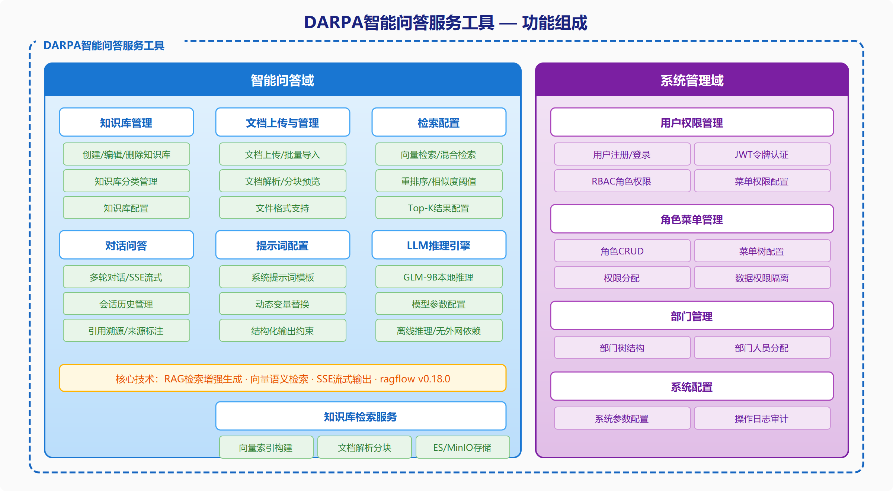

__图 1  软件功能组织图__

各个部件的用途及操作概述见表4。

__表4  部件用途及操作概述__

__序号__

__软件逻辑部件__

__用途__

__操作概述__

1

M1外挂知识库模块

军事文档解析与语义化重构

创建知识库、上传文档、监控解析、管理分块

2

M2 RAG检索增强模块

多文本特征融合混合检索

配置检索策略、调节阈值、验证检索效果

3

M3交互式提示词工程模块

用户意图与知识精准对齐

创建助手、配置提示词、开展对话、查看引用

## 保密性和私密性

a）离线部署安全：系统采用完全离线部署模式，所有服务运行在封闭的Docker容器网络内，无外网连接，杜绝数据外泄风险。

b）用户认证：系统提供基于JWT的用户登录认证机制，用户需输入账号密码方可使用。

c）数据隔离：不同客户项目的数据通过独立的项目目录和数据库实例隔离，互不可见。

d）本地模型：大语言模型（智谱GLM\-9B）本地部署运行，所有问答推理均在服务器本地完成，不向外部发送任何数据。

e）访问控制：系统API接口需通过认证令牌访问，未授权请求将被拒绝。

## 帮助和问题报告

使用本系统过程中如遇问题，可直接参考本手册，也可以通过以下联系方式与系统的开发方联系解决。

a）售后服务电话：357130；

b）软件开发人员联系方式：1）联系电话：357130；2）联系单位：开发方技术支持团队；3）联系人：汤丽群；4）通信地址：海淀区阜成路26号院；5）邮编：100142；

c）投诉监督热线：

# 软件入门

## 软件的首次用户

### 熟悉设备

使用本系统前，请确认以下硬件已就绪：

a）服务器已按表2硬件要求配置完毕，电源和网络线缆连接正常；

b）服务器已安装Docker 24\.0\+和Docker Compose V2，可通过以下命令验证：

docker \-\-version

docker compose version

c）浏览器可正常访问服务器IP地址（端口8899为前端界面，端口8070为RAG引擎管理界面）。

### 访问控制

系统部署前需获取以下授权信息：

a）离线镜像包：由开发方提供的包含全部Docker镜像的tar文件包；

b）项目配置：客户专属的\.env文件和nginx配置文件，由开发方按项目定制；

c）登录凭据：系统管理员账号密码，初始为admin/admin123，首次登录后请立即修改。

## 安装和设置

### 安装

#### 安装前准备

a）将开发方提供的离线交付包（包含docker/完整目录）复制到服务器指定位置，例如/opt/knovaq/；

b）确认Docker环境可用：

docker \-\-version        \# 确认版本 >= 24\.0

docker compose version  \# 确认 Compose V2 已安装

c）确认目录结构完整：

ls /opt/knovaq/docker/

\# 应包含：docker\-compose\.yml  \.env  images/  scripts/  init/  nginx/  gaisoft/

#### 安装步骤

第一步：离线镜像加载。离线环境无需联网下载镜像，通过以下命令从本地tar文件加载。

Linux/macOS执行：

cd /opt/knovaq/docker

bash scripts/offline\-load\.sh

Windows \(PowerShell\)执行：

cd E:\\knovaq\\docker

\.\\scripts\\offline\-load\.ps1

脚本自动扫描docker/images/目录下所有\.tar文件并逐一加载。加载完成后显示"All images loaded"。

第二步：启动系统。

Linux/macOS执行：

cd /opt/knovaq/docker

bash scripts/start\.sh <项目名>

Windows \(PowerShell\)执行：

cd E:\\knovaq\\docker

\.\\scripts\\start\.ps1 <项目名>

其中<项目名>为docker/projects/目录下的客户项目文件夹名称（如demo）。如果使用默认配置，可省略项目名参数。启动过程约需1\-3分钟（首次启动较慢），脚本会依次完成：读取全局\.env配置和项目专属\.env配置→复制项目对应的nginx配置文件→启动所有Docker容器（MySQL→Elasticsearch→Redis→MinIO→ragflow→gaisoft\-server→gaisoft\-frontend）。启动成功后显示"KnovaQ started for project: <项目名>"。

#### 安装后验证

系统启动后，等待约1分钟让所有服务完成初始化，然后通过浏览器访问验证：

__服务__

__访问地址__

__说明__

前端主界面

http://<服务器IP>:8899

用户操作界面

RAG引擎管理

http://<服务器IP>:8070

ragflow管理后台（知识库、助手配置）

a）访问前端主界面http://<服务器IP>:8899，应显示登录页面；

b）使用初始管理员账号登录：用户名admin，密码admin123；

c）登录成功后进入系统主界面，表示安装验证通过。

### 设置

如需修改系统配置（如端口、密码），编辑以下文件后重新启动：

a）全局配置：docker/\.env——修改端口号、数据库密码等；

b）项目配置：docker/projects/<项目名>/\.env——覆盖全局配置中的特定参数。

关键配置参数：

__参数__

__默认值__

__说明__

GAISOFT\_FRONTEND\_PORT

8899

前端界面端口

GAISOFT\_SERVER\_PORT

8088

后端服务端口

RAGFLOW\_HTTP\_PORT

8070

RAG引擎Web端口

MYSQL\_PASSWORD

infini\_rag\_flow

MySQL root密码

REDIS\_PASSWORD

infini\_rag\_flow

Redis密码

注意：修改端口或密码后需重启系统才能生效。修改MySQL密码会丢失已有数据（需删除volume重建）。

## 启动过程

系统正常启动流程（非首次安装）：

\# Linux/macOS

cd /opt/knovaq/docker

bash scripts/start\.sh <项目名>

\# Windows \(PowerShell\)

cd E:\\knovaq\\docker

\.\\scripts\\start\.ps1 <项目名>

脚本自动读取环境配置、复制nginx配置并启动所有容器。启动完成后通过浏览器访问http://<服务器IP>:8899即可使用。

## 停止和挂起工作

\# Linux/macOS

cd /opt/knovaq/docker

bash scripts/stop\.sh

\# Windows \(PowerShell\)

cd E:\\knovaq\\docker

\.\\scripts\\stop\.ps1

执行后系统优雅停止所有服务容器。停止不会删除数据，再次执行start命令即可恢复运行，所有数据保持不变。

## 卸载

如需完全卸载系统并清除所有数据：

cd /opt/knovaq/docker

docker compose down \-v

警告：down \-v会删除所有Docker卷（包括MySQL数据、ES索引、上传文件等），此操作不可恢复。执行前请确认已备份重要数据。

仅停止服务但保留数据：

docker compose down    \# 不加 \-v，数据保留

# 软件使用指南

本章向用户提供使用DARPA智能问答服务工具的完整操作过程。

## 能力

系统三大核心模块的协作关系：用户提问后，M3交互式提示词工程模块构建提示请求，调用M2 RAG检索增强模块从M1外挂知识库模块中检索知识片段，最终由本地大语言模型（智谱GLM\-9B）生成精准答案并返回用户。

M1外挂知识库模块提供知识库全生命周期管理能力：创建/删除/修改知识库，上传PDF/Word/Excel/TXT/图片等多格式军事文档，自动进行文档深度解析、智能语义化分块、元数据标注与过滤、文档解析状态监控。

M2 RAG文档检索增强模块提供多维度检索能力：向量语义检索、混合检索（向量\+关键词多特征融合）、相似度阈值动态调节、检索结果重排序、知识图谱辅助检索、跨语言检索。

M3交互式提示词工程模块提供智能对话能力：聊天助手创建与管理、系统提示词配置、多轮上下文对话、流式响应输出、引用溯源、动态提示模板引擎。

## 约定

a）浏览器要求：推荐使用Chrome浏览器最新版，分辨率建议1920x1080及以上；

b）用户角色：系统管理员（负责系统部署、维护、用户管理）、知识工程师（负责知识库创建、文档上传、检索调优）、普通用户（使用智能问答功能进行知识检索和对话）；

c）界面约定：菜单项统一位于页面顶部导航栏或左侧菜单栏；操作按钮统一位于对应功能区域上方或右侧；列表页面支持翻页浏览，每页默认显示20条记录；必填字段以红色星号（\*）标识；

d）操作术语："点击"为鼠标左键单击；"输入"为在文本框中键入内容；"选择"为在下拉列表中选取选项；"勾选"为在复选框中打勾。

## 处理过程

### 智能问答

智能问答是系统核心功能。用户在对话界面中输入自然语言问题，系统自动从知识库检索相关文档片段，由大语言模型生成精准回答。

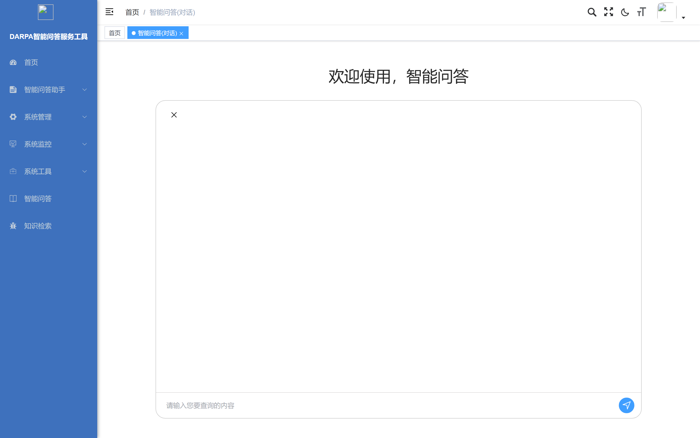

__图 2  智能问答主界面__

操作步骤：第一步，点击顶部导航菜单中的"智能问答"进入问答界面。第二步，在底部输入框中输入问题。第三步，点击"发送"按钮或按Enter键提交问题。第四步，系统开始处理，回答以流式方式逐字显示，回答中包含引用标记。第五步，可在同一对话中继续提问，或点击"新建对话"开始全新会话。

### 知识检索

知识检索功能允许用户对知识库中的文档进行关键词和语义检索，快速定位所需信息。

__图 3  知识检索界面__

### 配置助理

配置助理功能用于创建和管理智能问答助手。每个助手可绑定不同知识库、配置不同提示词，实现特定领域的精准问答。

__图 4  配置助理列表__

新增助理操作：第一步，点击列表上方"新增"按钮，弹出新增助理配置对话框。第二步，在弹窗中填写助手名称、选择LLM模型、编写系统提示词。第三步，勾选需要关联的知识库，点击"确定"保存。

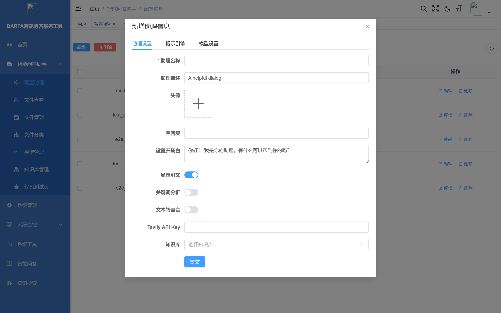

__图 5  新增助理配置弹窗__

### 文件查看

文件查看功能展示知识库中已上传的全部文件资源，支持按条件筛选浏览。

__图 6  文件查看列表__

点击文件记录可查看文件详情和解析结果。

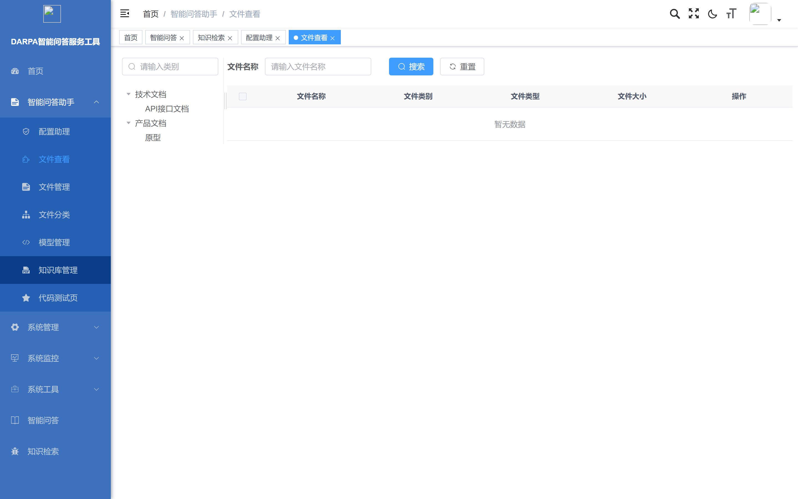

__图 7  文件详情__

### 文件管理

文件管理功能提供知识库文件的增删改操作，包括上传新文件、创建文件夹、文件解析控制等。

__图 8  文件管理列表__

新建文件夹操作：点击"新建文件夹"按钮，弹出创建对话框。输入文件夹名称后点击"确定"创建。

__图 9  新建文件夹弹窗__

### 文件分类

文件分类功能支持创建多级分类目录，按主题或类型组织知识库文档。

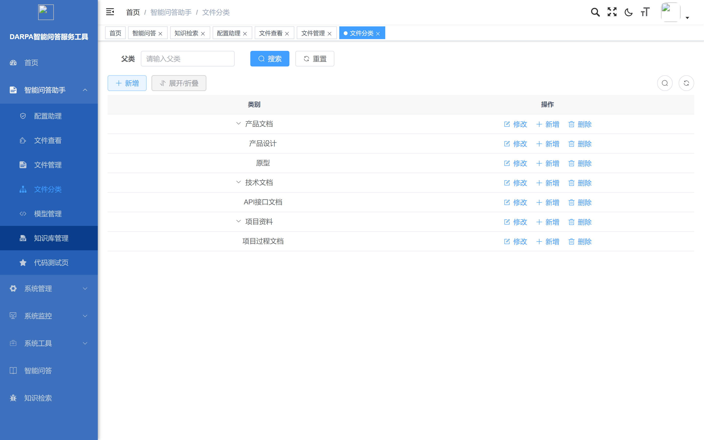

__图 10  文件分类管理__

新增分类操作：选中父级分类节点，点击"新增"按钮，填写分类名称和上级分类后创建。

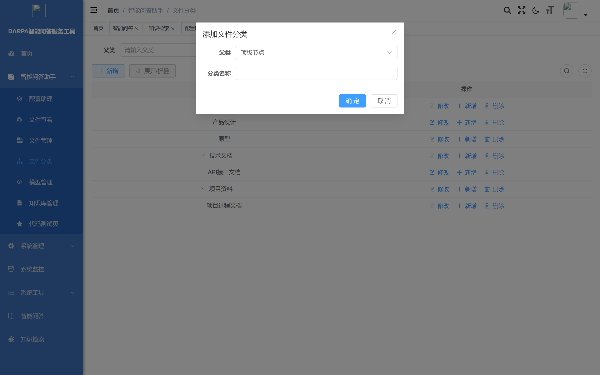

__图 11  新增分类弹窗__

### 模型管理

模型管理功能用于配置系统可用的LLM推理模型和嵌入模型。

__图 12  模型管理列表__

设置默认模型：点击"设置默认模型"按钮，在弹窗中为每种模型类型指定默认模型。

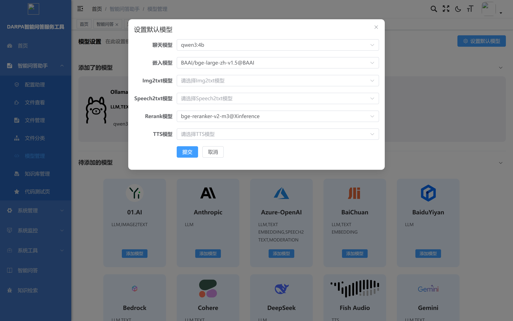

__图 13  设置默认模型弹窗__

### 知识库管理

知识库管理功能是系统的核心管理入口，用于创建、配置和监控知识库。

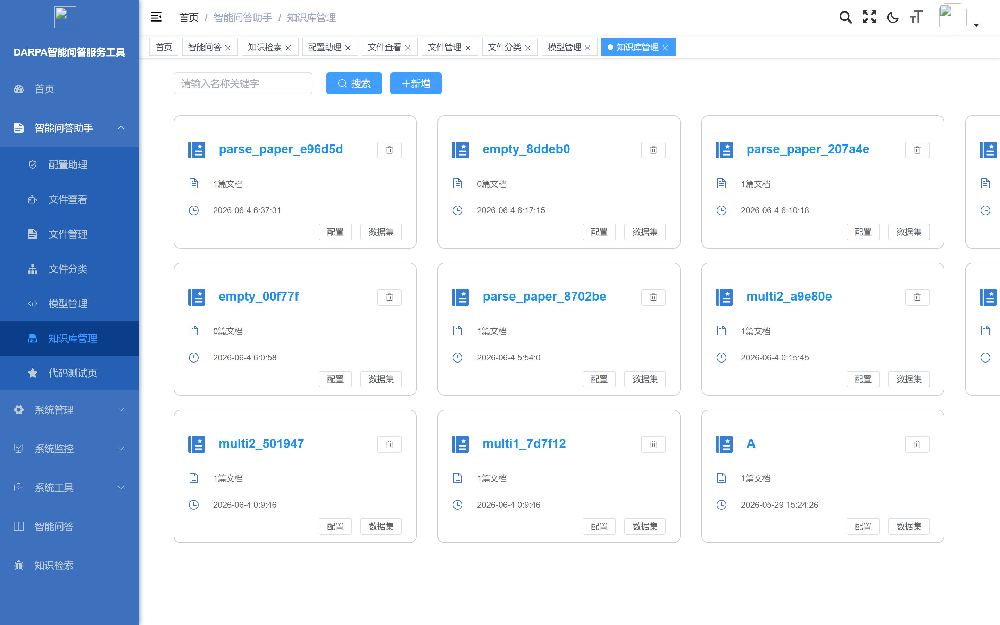

__图 14  知识库管理列表__

新增知识库操作：点击列表上方"新增"按钮，弹出创建对话框。填写知识库名称、描述信息，选择分块方法和嵌入模型，点击"确定"创建。

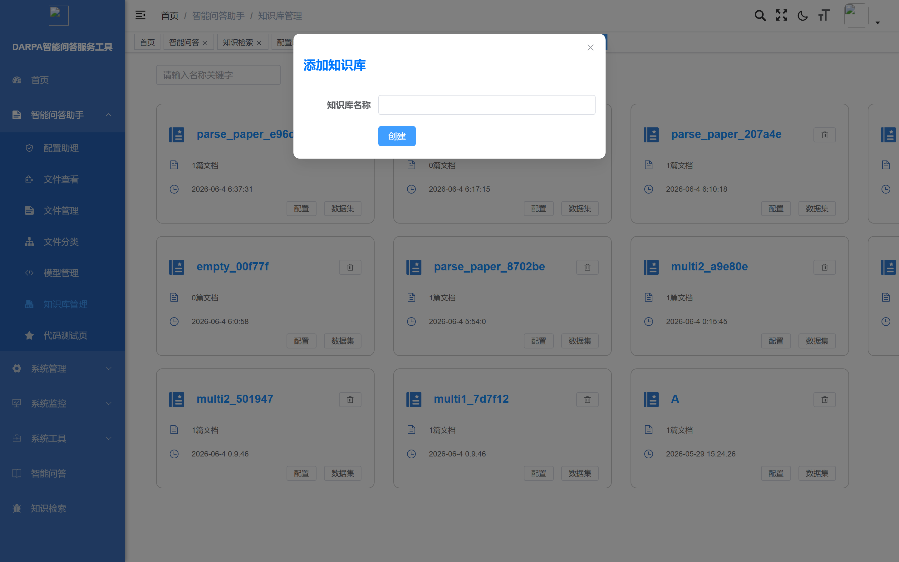

__图 15  新增知识库弹窗__

创建完成后可进入知识库配置页面，查看文档列表和分块统计。

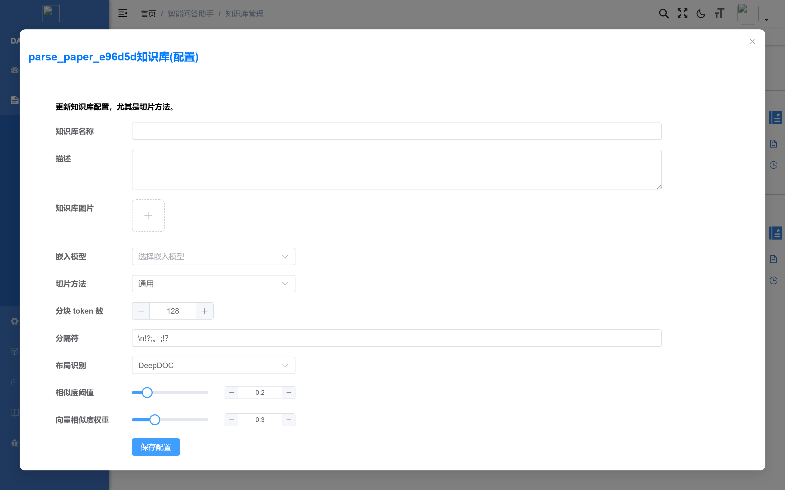

__图 16  知识库配置详情__

### 知识库创建与军事文档上传

功能说明：创建知识库是使用系统的第一步。知识库是管理军事文档和知识片段的容器，所有文档必须归属于某个知识库。

操作步骤：

第一步：打开浏览器，访问RAG引擎管理界面http://<服务器IP>:8070。

第二步：使用管理员账号登录系统。首次使用需注册：点击页面顶部"注册"链接→输入邮箱地址和密码→点击【注册】→使用注册的邮箱和密码登录。

第三步：进入知识库管理页面。登录后，点击页面顶部导航栏中的"知识库"菜单项，进入知识库列表页面。

第四步：创建新知识库。点击知识库列表页面右上角的【创建知识库】按钮，在弹出的创建表单中填写以下信息：

\- 知识库名称：输入知识库的名称，如"DARPA项目文档库"；

\- 知识库描述（可选）：输入简要描述；

\- 分块方法：推荐选择"自动"（系统根据文档结构自动选择最佳分块方式）；

\- 嵌入模型：选择向量化模型，默认使用系统内置模型。

填写完成后点击【确定】，完成知识库创建。

第五步：上传军事文档。在知识库列表中点击刚创建的知识库名称进入详情页→点击【上传文件】按钮→在文件选择对话框中选择需要上传的军事文档文件（支持PDF/Word/Excel/TXT/图片，可一次选择多个文件批量上传）→点击【上传】。上传完成后文件出现在文档列表中。

### 文档解析状态监控

功能说明：上传的文档需要经过自动解析才能被检索使用。解析过程包括文档内容提取、表格识别、图片处理、文本分块、向量化。大型文档解析可能需要数分钟。

操作步骤：

第一步：在知识库列表中点击目标知识库名称进入详情页。

第二步：查看文档状态。文档列表中每条记录的"状态"列显示解析状态：

\- 排队中（黄色）：文档在解析队列中等待；

\- 解析中（蓝色）：文档正在被处理，可能显示进度百分比；

\- 已完成（绿色）：文档解析成功，知识分块已入库，可被检索；

\- 失败（红色）：文档解析出错，需检查文件是否损坏。

第三步：处理解析失败的文档。点击状态为"失败"的文档记录→查看失败原因→常见原因包括文件格式不支持（确认文件为支持的格式）、文件内容为空（检查文件是否损坏或加密）、文件过大（尝试拆分为多个较小文件后重新上传）→处理完成后点击【重新解析】。

### 分块预览与元数据管理

功能说明：文档解析完成后被切分为多个知识分块（chunk），每个分块是检索和问答的基本单元。用户可预览分块内容、编辑元数据，以优化检索效果。

操作步骤：

第一步：在知识库详情页中，点击已解析完成的文档名称或点击文档操作栏中的【分块】按钮，进入该文档的分块列表页面。

第二步：浏览分块内容。分块列表展示文档被切分后的每个知识片段，每个分块显示分块编号、文本内容摘要、所属页码/章节、字符数。点击分块可展开查看完整文本内容。

第三步：编辑分块元数据。点击目标分块右侧的【编辑】按钮，可修改分块内容、添加关键词标签、标注知识类型，点击【保存】确认修改。

第四步：分块过滤与管理。使用页面顶部的过滤条件筛选分块：按关键词过滤、按状态过滤（启用/禁用）、按元数据过滤。可批量操作：勾选多个分块，执行批量启用/禁用/删除。禁用的分块不会被检索到，但不删除原始数据。

### 检索参数配置

功能说明：检索参数决定了系统从知识库中查找相关内容的策略和精度。合理配置检索参数可以显著提升问答质量。

操作步骤：

第一步：进入助手配置页面（参见4\.3\.5创建助手后），找到"检索设置"或"知识库绑定"配置区域。

第二步：配置检索策略。主要配置项：

__参数__

__说明__

__推荐值__

检索方式

选择"向量检索"或"混合检索"

混合检索

相似度阈值

检索结果最低相似度分数

0\.2（初始值）

返回结果数

每次检索返回的最大分块数

6\-10

重排序

是否对结果进行二次精排

开启

检索权重

向量与关键词检索的权重比例

0\.7:0\.3

第三步：调节相似度阈值。阈值范围0\.0\-1\.0，阈值越高返回结果越少但越精确，阈值越低返回结果越多但可能包含不相关内容。建议初始设为0\.2，根据问答效果逐步调整。

第四步：在助手的"检索测试"功能中输入测试问题，查看检索到的知识分块列表及其相似度分数，根据测试结果微调参数。

### 创建问答助手与系统提示词配置

功能说明：问答助手（Chat Assistant）是用户进行智能问答的入口。每个助手绑定特定知识库，并可通过系统提示词定义其角色和行为。

操作步骤：

第一步：在RAG引擎管理界面顶部导航栏点击"助手"或"对话"菜单项，进入助手列表页面。

第二步：点击【创建助手】按钮，在创建表单中填写：助手名称（如"DARPA项目问答助手"）、LLM模型（选择智谱GLM\-9B）、关联知识库（勾选需要绑定的知识库）。

第三步：配置系统提示词。在"系统提示词"（System Prompt）文本区域输入助手的角色定义和行为规范。示例提示词：

你是一个专业的DARPA军事科研项目问答助手。你的职责如下：

1\. 基于提供的知识库内容回答用户关于DARPA项目的问题

2\. 回答必须基于检索到的文档内容，不得自行编造信息

3\. 如果知识库中没有相关内容，明确告知用户

4\. 回答时引用具体的文档来源和章节

5\. 使用专业、准确的语言，避免模糊表述

6\. 对于数据类问题，提供具体的数值和单位

提示词编写要点：明确定义助手的角色和职责边界；指定回答的格式和风格要求；规定信息溯源要求；说明无法回答时的处理方式。

第四步：保存助手配置。点击【保存】完成创建，助手出现在助手列表中，状态为"已启用"。

### 智能问答对话操作

功能说明：智能问答是系统的核心使用场景。用户通过自然语言提问，系统自动从知识库检索相关内容，由大语言模型生成精准回答。

操作步骤：

第一步：在RAG引擎管理界面或前端主界面中，点击目标助手名称进入对话页面。

第二步：在页面底部的输入框中输入问题（如"DARPA XXX项目的关键技术指标是什么？"），点击【发送】或按Enter键提交。

第三步：查看回答。系统开始处理后，回答内容以流式方式逐字显示。回答由正文回答、引用标记（如\[1\]、\[2\]）和引用来源列表组成。

第四步：查看引用溯源。在回答区域下方，点击引用编号或"查看引用"链接，弹出引用详情面板，显示引用的原始文档名称、原文位置、完整文本和相似度分数。

第五步：继续提问。在同一对话中继续输入下一个问题（系统保持上下文连贯），或点击【新建对话】开始全新对话。

### 多轮对话与上下文管理

功能说明：系统支持多轮对话，用户可以在一个对话中连续提问，系统会结合之前的问答上下文理解当前问题。

操作步骤：

第一步：在现有对话中直接输入后续问题，系统自动关联同一对话中的历史问答。

第二步：上下文相关问题示例：第一轮"DARPA XXX项目有哪些参与单位？"→第二轮"该项目的预算是多少？"（系统理解"该项目"上下文）→第三轮"项目启动时间是什么时候？"

第三步：管理对话历史。对话列表显示在页面左侧或导航区域，点击历史对话可查看完整问答记录，点击【删除】可删除不需要的对话记录。

第四步：如需清除上下文，点击【新建对话】按钮开始全新的对话。

### 引用溯源查看

功能说明：引用溯源功能让用户验证回答的可靠性，每个回答中的信息都可以追溯到源文档的具体位置。

操作步骤：

第一步：查看回答中的引用标记。每个回答中，基于知识库生成的语句后方标注引用编号（如\[1\]、\[2\]）。

第二步：点击引用编号，跳转到引用详情。引用详情展示来源文档、内容预览（关键词高亮）、相似度分数和位置信息。

第三步：评估回答可靠性。通过检查引用来源判断回答的准确性和完整性——如果引用内容与回答不符，说明可能存在幻觉，应以引用原文为准；如果所有引用的相似度都很低，说明知识库中可能缺乏相关知识。

### 提示模板定制

功能说明：提示模板允许知识工程师为不同场景定制问答助手的回答风格和行为规范。

操作步骤：

第一步：在助手列表中点击目标助手右侧的【编辑】或【设置】按钮。

第二步：修改"系统提示词"文本区域内容。场景示例：

数据查询型提示词示例：

你是一个精确的数据查询助手。回答要求：

1\. 只提供知识库中明确记载的数据

2\. 所有数据必须附带来源引用

3\. 以表格形式展示对比数据

4\. 不确定的数据标注"\[待确认\]"

分析报告型提示词示例：

你是一个军事科研分析助手。回答要求：

1\. 对多个相关项目进行横向对比分析

2\. 按技术指标、预算、进展等维度组织回答

3\. 给出总结性判断和建议

4\. 标注信息来源和时效性

第三步：调整模型参数。温度（Temperature）推荐0\.1\-0\.3（偏精确），最大输出长度根据需求设置，Top\-P推荐0\.9。

第四步：点击【保存】保存配置，发送测试问题验证提示词效果，根据回答质量反复调整。

### 用户管理

用户管理功能供系统管理员管理系统用户账号，包括新增、编辑、删除用户和分配角色权限。

__图 17  用户管理列表__

新增用户操作：点击列表上方"新增"按钮，在弹窗中填写用户名、昵称、密码、手机号、邮箱，选择所属部门和角色，设置用户状态，点击"确定"创建用户。

__图 18  新增用户弹窗__

### 角色管理

角色管理功能用于定义系统角色和权限策略，控制不同用户的功能访问范围。

__图 19  角色管理列表__

新增角色操作：点击"新增"按钮，填写角色名称、权限标识，勾选角色可访问的菜单权限树，点击"确定"创建。

__图 20  新增角色弹窗__

### 菜单管理

菜单管理功能用于配置系统导航菜单结构，控制各角色可见的功能模块。

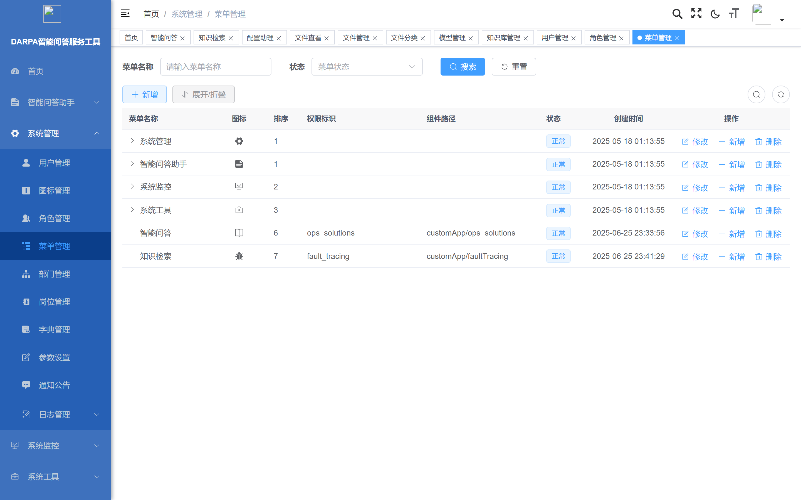

__图 21  菜单管理列表__

### 部门管理

部门管理功能用于维护组织架构中的部门信息，支持树形层级结构。

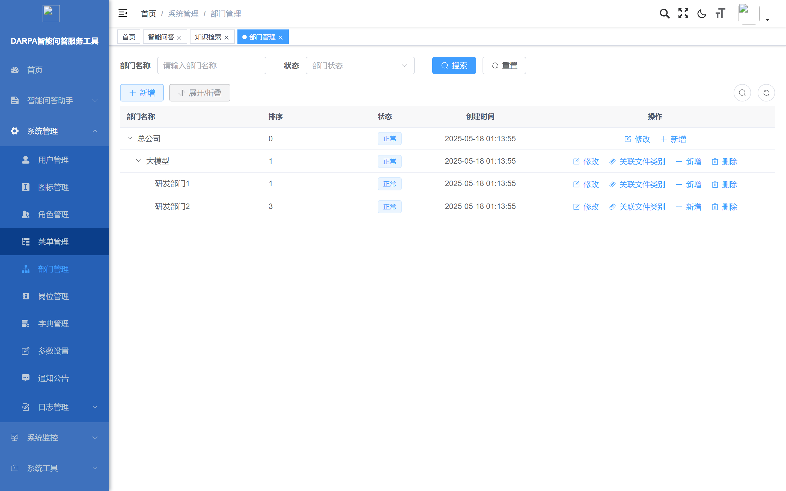

__图 22  部门管理__

### 参数设置

参数设置功能用于管理系统运行参数和配置项。

__图 23  参数设置列表__

### 在线用户监控

在线用户监控功能展示当前系统中处于登录状态的用户会话信息。

__图 24  在线用户监控__

### 服务器监控

服务器监控功能展示系统运行环境的实时状态信息。

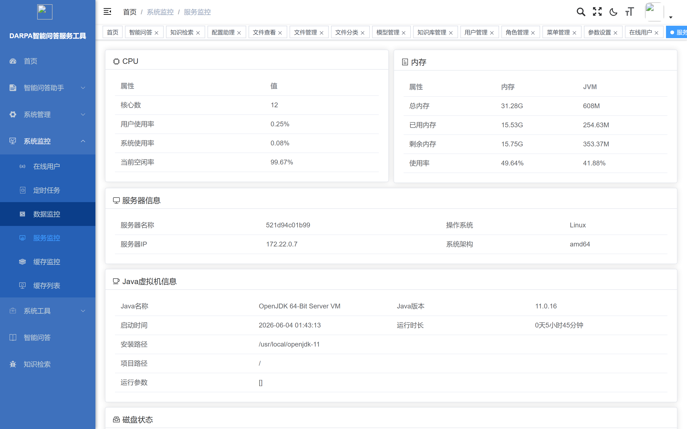

__图 25  服务器监控__

### 操作日志

操作日志功能记录系统中所有用户的关键操作行为，用于审计追溯。

__图 26  操作日志列表__

### 登录日志

登录日志功能记录所有用户登录系统的历史记录。

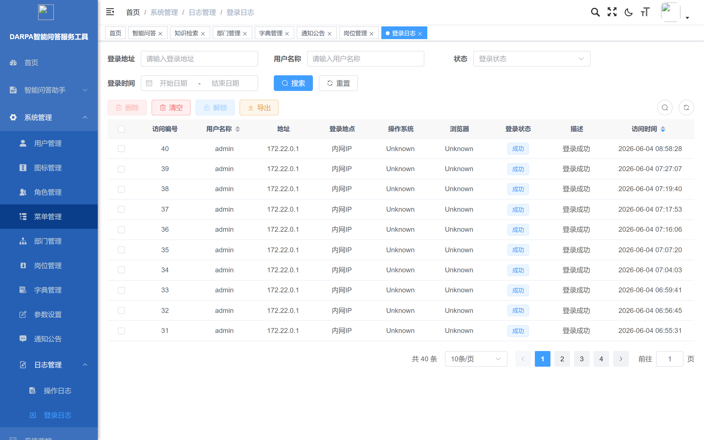

__图 27  登录日志__

### 定时任务

定时任务功能用于管理系统中的计划任务调度。

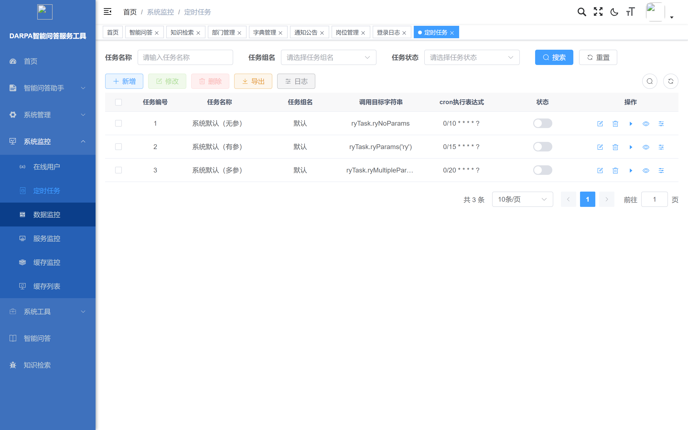

__图 28  定时任务__

## 有关的处理

以下处理过程不直接面向普通用户，由系统管理员在服务器命令行操作。

后端服务更新（修复bug、增加功能时执行）：

\# Linux/macOS

cd /opt/knovaq/docker

bash scripts/build\-mes\.sh <项目名>

\# Windows \(PowerShell\)

cd E:\\knovaq\\docker

\.\\scripts\\build\-mes\.ps1 <项目名>

脚本自动完成：复制最新jar包到docker/gaisoft/jar/目录→重启gaisoft\-server容器。

前端界面更新：

\# Linux/macOS

bash scripts/build\-ui\.sh <项目名>

\# Windows

\.\\scripts\\build\-ui\.ps1 <项目名>

脚本自动完成：清除旧前端文件→复制最新构建产物→重新加载nginx。

离线镜像包制作（在联网环境中制作，供离线环境加载）：

bash scripts/offline\-save\.sh

\# 然后打包：Compress\-Archive \-Path docker \-DestinationPath knovaq\-offline\.zip

## 数据备份

MySQL数据备份：

\# 备份rag\_flow数据库

docker exec ragflow\-mysql mysqldump \-uroot \-p<密码> rag\_flow > rag\_flow\_backup\.sql

\# 备份darpa\_iqas数据库

docker exec ragflow\-mysql mysqldump \-uroot \-p<密码> darpa\_iqas > darpa\_iqas\_backup\.sql

上传文件备份（MinIO数据卷）：

docker run \-\-rm \-v minio\_data:/data \-v $\(pwd\):/backup alpine \\

  tar czf /backup/minio\_backup\.tar\.gz /data

数据恢复：

\# 恢复MySQL

docker exec \-i ragflow\-mysql mysql \-uroot \-p<密码> rag\_flow < rag\_flow\_backup\.sql

\# 恢复MinIO

docker run \-\-rm \-v minio\_data:/data \-v $\(pwd\):/backup alpine \\

  tar xzf /backup/minio\_backup\.tar\.gz \-C /

## 错误、误动作和紧急情况时的恢复

常见故障排查见表5。

__表5  常见故障排查__

__故障现象__

__可能原因__

__处理方法__

浏览器无法访问系统

服务未启动或端口被占

1\.执行docker ps查看容器状态 2\.检查端口 3\.重新执行start

前端页面白屏

nginx配置缺失

确认通过start脚本启动

文档解析失败

文件格式损坏或不支持

检查文件完整性，确认支持格式

问答无响应

LLM模型未加载

检查ragflow容器日志

问答质量差

检索参数不当

调节阈值、更换策略、优化提示词

检索不到内容

知识库未绑定或分块未完成

确认助手绑定知识库，文档已解析

服务频繁重启

内存不足

检查服务器内存（ES默认8GB）

服务健康检查命令：

docker compose ps                              \# 查看所有服务状态

docker logs ragflow\-server \-\-tail 100          \# 查看ragflow日志

docker logs equipment\-server \-\-tail 100        \# 查看后端日志

docker exec ragflow\-mysql mysqladmin ping \-uroot \-p<密码>  \# 检查MySQL

docker exec ragflow\-redis valkey\-cli \-a <密码> ping        \# 检查Redis

## 消息

完成用户功能时可能发生的所有错误消息、诊断消息和信息消息见表6。

__表6  消息列表__

__消息类别__

__消息名称__

__消息内容__

__消息含义__

__需采取的动作__

信息消息

登录成功

登录成功

用户认证通过

正常进入主界面

错误消息

登录失败

用户名或密码错误

登录凭据不正确

检查输入，联系管理员重置

信息消息

上传成功

文件上传成功

文档已上传到知识库

等待系统自动解析

信息消息

解析完成

文档解析完成

文档已成功解析为知识分块

可开始检索和问答

错误消息

解析失败

文档解析失败

文档解析出错

查看故障排查表

警告消息

无结果

未找到相关知识

检索未命中知识库内容

检查知识库绑定和文档解析状态

警告消息

会话过期

会话已过期

JWT令牌过期

重新登录

错误消息

网络异常

网络连接异常

浏览器与服务器断开

检查网络连接

信息消息

启动中

服务启动中，请稍候

系统正在初始化

等待1\-2分钟后刷新页面

## 快速引用指南

__表7  常用操作速查表__

__任务__

__操作路径__

__关键步骤__

登录系统

浏览器访问http://IP:8899

输入admin/admin123→登录

创建知识库

RAG管理→知识库→创建

填写名称/描述→选择分块方法→确定

上传文档

知识库详情→上传文件

选择文件→上传→等待解析

查看解析状态

知识库详情→文档列表

查看状态列

预览分块

文档详情→分块列表

浏览/编辑分块内容和元数据

创建问答助手

RAG管理→助手→创建

填写名称→绑定知识库→配置提示词

配置检索参数

助手设置→检索配置

选择检索方式→设置阈值→开启重排序

开始问答

助手列表→开始对话

输入问题→查看回答和引用

查看引用

回答下方引用列表

点击引用编号→查看源文档

新建对话

对话页面→新建对话

点击【新建】→开始新会话

启动系统

命令行

scripts/start\.sh <项目名>

停止系统

命令行

scripts/stop\.sh

更新后端

命令行

scripts/build\-mes\.sh <项目名>

更新前端

命令行

scripts/build\-ui\.sh <项目名>

# 典型业务流程

## 流程1：军事文档知识入库

适用角色：知识工程师。前置条件：系统已部署启动，用户已登录。

操作流程：创建知识库→配置分块策略→上传军事文档→等待自动解析→检查解析状态→预览分块→确认入库。

详细步骤：

第一步：访问RAG引擎管理界面（http://<服务器IP>:8070），登录后进入"知识库"页面。

第二步：点击【创建知识库】，输入名称（如"DARPA 2024年度项目文档"），选择分块方法为"自动"，点击【确定】。

第三步：进入新建的知识库，点击【上传文件】，选择待处理的军事文档（支持PDF/Word/Excel/TXT/图片），点击【上传】。

第四步：等待系统自动解析。大型PDF文档可能需要2\-5分钟。在文档列表中查看状态：状态变为"已完成"（绿色）表示解析成功；状态变为"失败"（红色）需根据错误信息排查。

第五步：解析完成后，点击文档名称进入分块列表，逐一检查分块质量：分块大小是否合理、分块内容是否完整、关键信息是否被正确识别。

第六步：对质量不佳的分块进行编辑调整，或重新上传优化后的文档。

第七步：知识入库完成，可进入流程2配置检索或进行问答。

## 流程2：领域问答调优

适用角色：知识工程师。前置条件：知识库已创建且文档解析完成。

操作流程：创建助手→配置系统提示词→绑定知识库→配置检索参数→测试问答→评估效果→调整参数→反复迭代。

详细步骤：

第一步：进入"助手"页面，点击【创建助手】，输入助手名称，选择LLM模型（智谱GLM\-9B）。

第二步：在"系统提示词"区域编写提示词，明确助手角色、回答规范、引用要求（参见4\.3\.9模板示例）。

第三步：在"关联知识库"区域勾选需要绑定的知识库。

第四步：配置检索参数：检索方式选择"混合检索"，相似度阈值初始设为0\.2，开启重排序，返回结果数设为8。

第五步：保存助手配置后，进入对话页面。

第六步：使用典型问题进行测试，评估回答质量——准确性（内容是否正确）、完整性（是否覆盖所有方面）、引用性（是否有准确溯源）、语言质量（表述是否清晰专业）。

第七步：根据测试结果调整参数——回答包含无关内容则提高阈值；回答信息不足则降低阈值或增加返回结果数；回答格式不规范则优化提示词；关键文档未被检索到则检查分块质量。

第八步：反复测试和调优，直到问答质量满足要求。

## 流程3：离线环境部署

适用角色：系统管理员。前置条件：目标服务器已安装Docker和Docker Compose，离线交付包已准备。

操作流程：传输交付包→加载离线镜像→配置环境→启动系统→验证运行。

详细步骤：

第一步：将离线交付包（knovaq\-offline\.zip或docker/目录）通过U盘或内网传输到目标服务器。

第二步：解压交付包到目标目录。

第三步：加载Docker离线镜像：执行scripts/offline\-load\.sh，等待显示"All images loaded"。

第四步：检查/修改环境配置。查看\.env文件，如需修改端口或密码则编辑\.env。

第五步：启动系统：执行scripts/start\.sh <项目名>。首次启动需等待2\-3分钟。

第六步：验证系统运行：执行docker compose ps查看容器状态（应全部为Up/healthy）；检查关键服务日志。

第七步：浏览器验证——访问http://<服务器IP>:8899确认前端界面正常；使用admin/admin123登录确认操作正常；访问http://<服务器IP>:8070确认RAG引擎正常。

第八步：部署完成。系统在离线环境下持续运行，无需外网连接。

